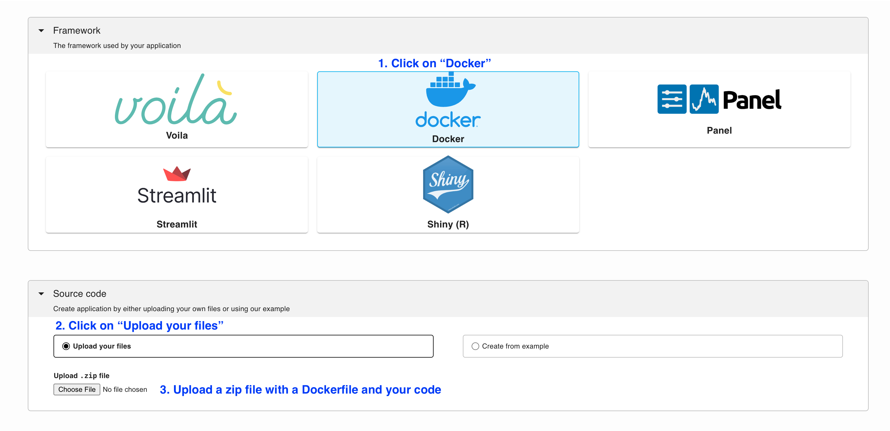

---
myst:
  html_meta:
    description: Deploy a Chainlit app on Ploomber in seconds with this guide.
    keywords: chainlit, deployment, hosting
    property=og:title: Chainlit | Ploomber Docs
    property=og:description: Deploy a Chainlit app on Ploomber in seconds with this guide.
    property=og:image: https://docs.cloud.ploomber.io/en/latest/_static/opengraph-images-chainlit.png
    property=og:url: https://docs.cloud.ploomber.io/en/latest/apps/chainlit.html
---


# Chainlit

To deploy a Chainlit application in Ploomber Cloud you need:

- A [Ploomber Cloud](https://platform.ploomber.io/register?utm_source=chainlit&utm_medium=documentation) account
- A `Dockerfile`
- Your code

## `Dockerfile`

You need to provide a `Dockerfile`, you can use this [template](https://github.com/ploomber/doc/blob/main/examples/chainlit/basic-app/Dockerfile) to get started. The template contains the minimal steps needed for a deployment but you need to modify so it installs any required dependencies and copies your code into the Docker image.

```Dockerfile
FROM python:3.11

COPY app.py app.py
RUN pip install chainlit

# do not change the arguments
ENTRYPOINT ["chainlit", "run", "app.py", "--host=0.0.0.0", "--port=80", "--headless"]
```

## Testing locally

To test your app, you can use `docker` locally:

```sh
# build the docker image
docker build . -t chainlit

# run it
docker run -p 5000:80 chainlit
```

Now, open [http://0.0.0.0:5000/](http://0.0.0.0:5000/) to see your app.


## Deploy

Once you have all your files, create a zip file.

To deploy a Chainlit app from the deployment menu, follow these instructions:




```{tip}
To ensure your app doesn't break on re-deployments, pin your [dependencies.](pin-dependencies)
```

## Password protection

Currently, our [password authentication](../user-guide/password.md) feature doesn't work with Chainlit, however,
we can still use Chainlit's authentication feature.

First, download the [sample code](https://github.com/ploomber/doc/tree/main/examples/chainlit/chainlit-with-password).
The `Dockerfile` remains the same, the only change happens in the `app.py`.

During deployment, you need to provide three [secrets](../user-guide/secrets.md):

```sh
CHAINTLIT_USERNAME="user"
CHAINTLIT_PASSWORD="somepassword"

CHAINLIT_AUTH_SECRET="somerandomstring"
```

`CHAINLIT_AUTH_SECRET` is a random string used to authenticate user tokens, you can
generate one by executing the following command in your terminal:

```sh
python -c 'from secrets import token_hex; print(token_hex(16))'
```

```{note}
You can change `CHAINLIT_AUTH_SECRET`, but it'll log out all your users.
```