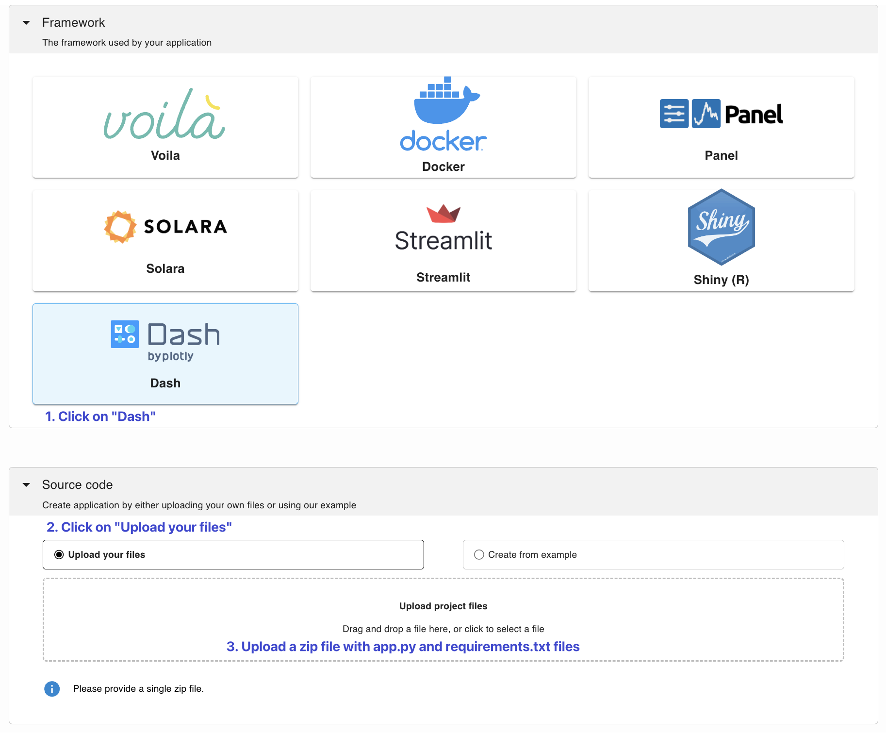
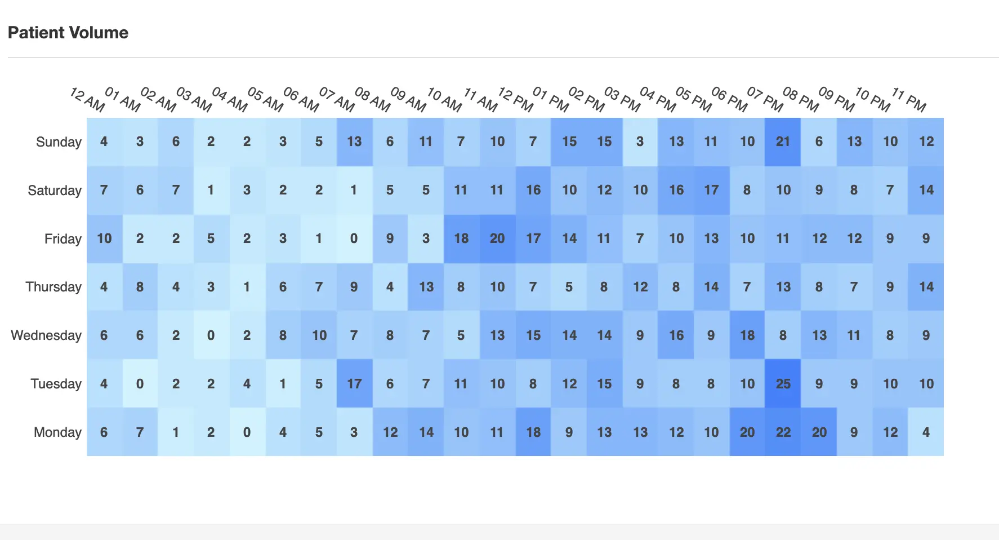

---
myst:
  html_meta:
    description: Deploy a Dash app on Ploomber in seconds with this guide.
    keywords: dash, deployment, hosting
    property=og:title: Dash | Ploomber Docs
    property=og:description: Deploy a Dash app on Ploomber in seconds with this guide.
    property=og:image: https://docs.cloud.ploomber.io/en/latest/_static/opengraph-images-dash.png
    property=og:url: https://docs.cloud.ploomber.io/en/latest/apps/dash.html
---


# Dash

To deploy a [Dash](https://dash.plotly.com/) application you need a [Ploomber Cloud](https://platform.ploomber.io/register?utm_source=dash&utm_medium=documentation) account and at least two files zipped up:

1. Your application file (`app.py`)
2. A dependencies file (`requirements.txt`)

## Required files

You can use this [template](https://github.com/ploomber/doc/blob/main/examples/dash) to get started. 

In the `requirements.txt` file, add all the dependencies that you need for your application to run. The application logic should exist in an `app.py` file and be initialized in this way:

```python
# name your app "app"
app = Dash(__name__)
# add this line below
server = app.server
```

```{note}
Dash applications will run with Python 3.11. Refer [section](customize-deployment)
```

Dash applications will run with Python 3.11. Refer [section](customize-deployment)

## Testing locally

To test the Dash application, you can run the following commands locally:

```sh
# build the docker image
pip install -r requirements.txt

# Start the dash application
gunicorn app:server run --bind 0.0.0.0:5000
```

Now, open [http://0.0.0.0:5000/](http://0.0.0.0:5000/) to see your app.

## Deploy

`````{tab-set}

````{tab-item} Web
__Deploy from the menu__

Once you have all your files, create a zip file.

To deploy a Dash app from the deployment menu, select the Dash option and follow the instructions:


````

````{tab-item} Command-line
__Try an example__

To download and deploy an example Dash application start by installing Ploomber Cloud and setting your API key:

```sh
pip install ploomber-cloud
ploomber-cloud key YOUR-KEY
```

```{tip}
If you don't have an API key yet, follow the [instructions here.](../quickstart/apikey.md)
```

Now, download an example. It will prompt you for a location to download the app. To download in the current directory, just press enter.

```sh
ploomber-cloud examples dash/clinical-analytics
```

```{note}
A full list of Dash example apps is available [here.](https://github.com/ploomber/doc/tree/main/examples/dash)
```

You should see a confirmation with instructions on deploying your app. Now, navigate to your application:

```sh
cd location-you-entered/clinical-analytics
```

__Deploy from the CLI__

Initialize and deploy your app with:

```sh
ploomber-cloud init
ploomber-cloud deploy --watch
```

````
`````

```{tip}
To ensure your app doesn't break on re-deployments, pin your [dependencies.](pin-dependencies)
```

(customize-deployment)=
## Customize deployment

To customize the Python version or base image for deployment, you may use [Docker deployment](./docker.md).
Here's a sample `Dockerfile` for deploying the application:

```text
FROM python:3.11-slim-bookworm

WORKDIR /app

COPY requirements.txt /app/

RUN pip install -r requirements.txt --no-cache-dir

COPY . /app

CMD ["gunicorn", "app:server", "run", "--bind", "0.0.0.0:80"]
```


## Features

Ploomber Cloud supports many features to help you build Dash applications quickly!

- Integration with [GitHub](../user-guide/github.md)
- Safely store [secrets](../user-guide/secrets.md) such as API keys
- Add [password protection](../user-guide/password.md) to your app
- Usage [analytics](../user-guide/analytics.md) such as unique visitors, total requests, etc.
- Spin up [larger resources](../user-guide/resources.md) (CPUs and RAM)
- Spin up [GPUs](../user-guide/gpu.md)
- Add custom [domains or subdomains](../user-guide/custom-domains.md) to your application
- [Task queues](task-queues) to scale applications to more users


## Examples

::::{grid} 2 2 3 3
:class-container: text-center
:gutter: 2

:::{grid-item-card} Basic app
:link: https://github.com/ploomber/doc/tree/main/examples/dash/simple-app

:::


:::{grid-item-card} Clinical analytics
[](https://github.com/ploomber/doc/tree/main/examples/dash/clinical-analytics)
+++
[Live demo](https://delicate-cake-9107.ploomberapp.io)
:::

::::