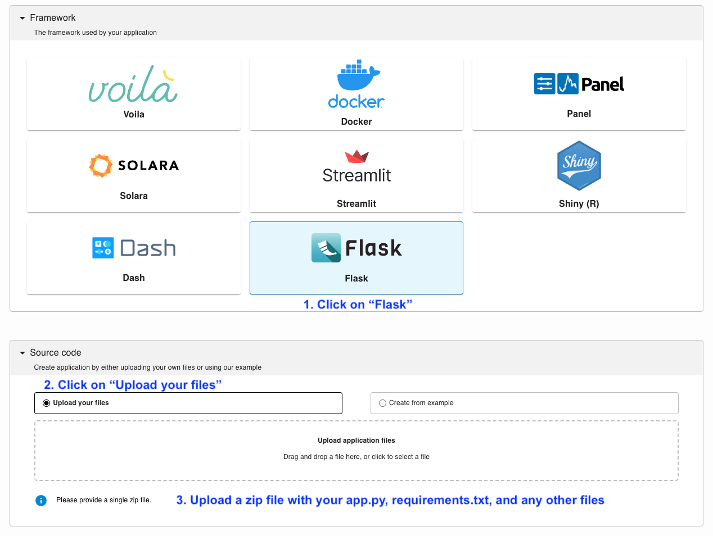

---
myst:
  html_meta:
    description: Deploy a Flask app on Ploomber in seconds with this guide.
    keywords: flask, deployment, hosting
    property=og:title: Flask | Ploomber Docs
    property=og:description: Deploy a Flask app on Ploomber in seconds with this guide.
    property=og:image: https://docs.cloud.ploomber.io/en/latest/_static/opengraph-images-flask.png
    property=og:url: https://docs.cloud.ploomber.io/en/latest/apps/flask.html
---


# Flask

To deploy a Flask application in Ploomber Cloud you need:

- A [Ploomber Cloud](https://platform.ploomber.io/register?utm_source=flask&utm_medium=documentation) account
- Your application file (`app.py`)
- A dependencies file (`requirements.txt`)

```{important}
In your app, you **must initialize your app like this**:

~~~python
# app.py: must assign the app to a variable named "app"!
app = Flask(__name__)
~~~
```

## Testing locally

To test your app, you can use `gunicorn` locally:

```sh
# Install requirements
pip install -r requirements.txt

# Start the flask application
gunicorn app:app run --bind 0.0.0.0:5000
```

Now, open [http://0.0.0.0:5000/](http://0.0.0.0:5000/) to see your app.


## Deploy

`````{tab-set}

````{tab-item} Web
__Deploy from the menu__

Once you have all your files, create a zip file.

To deploy a Flask app from the deployment menu, follow these instructions:


````

````{tab-item} Command-line
__Try an example__

To download and deploy an example Flask application start by installing Ploomber Cloud and setting your API key:

```sh
pip install ploomber-cloud
ploomber-cloud key YOUR-KEY
```

```{tip}
If you don't have an API key yet, follow the [instructions here.](../quickstart/apikey.md)
```

Now, download an example. It will prompt you for a location to download the app. To download in the current directory, just press enter.

```sh
ploomber-cloud examples flask/basic-app
```

```{note}
A full list of Flask example apps is available [here.](https://github.com/ploomber/doc/tree/main/examples/flask)
```

You should see a confirmation with instructions on deploying your app. Now, navigate to your application:

```sh
cd location-you-entered/basic-app
```

__Deploy from the CLI__

Initialize and deploy your app with:

```sh
ploomber-cloud init
ploomber-cloud deploy --watch
```

````
`````

```{tip}
To ensure your app doesn't break on re-deployments, pin your [dependencies.](pin-dependencies)
```

## Features

Ploomber Cloud supports many features to help you build Flask applications quickly!

- Integration with [GitHub](../user-guide/github.md)
- Safely store [secrets](../user-guide/secrets.md) such as API keys
- Add [password protection](../user-guide/password.md) to your app
- Usage [analytics](../user-guide/analytics.md) such as unique visitors, total requests, etc.
- Spin up [larger resources](../user-guide/resources.md) (CPUs and RAM)
- Spin up [GPUs](../user-guide/gpu.md)
- Add custom [domains or subdomains](../user-guide/custom-domains.md) to your application
- [Task queues](task-queues) to scale applications to more users


## Examples

::::{grid} 2 2 3 3
:class-container: text-center
:gutter: 2

:::{grid-item-card} Basic app
:link: https://github.com/ploomber/doc/tree/main/examples/flask/basic-app
A basic Flask app.
:::

:::{grid-item-card} User auth
[](https://github.com/ploomber/doc/tree/main/examples/flask/login)
+++
[Live demo](https://empty-haze-3369.ploomberapp.io)
:::

:::{grid-item-card} ML inference
:link: https://github.com/ploomber/doc/tree/main/examples/flask/machine-learning

:::

::::
