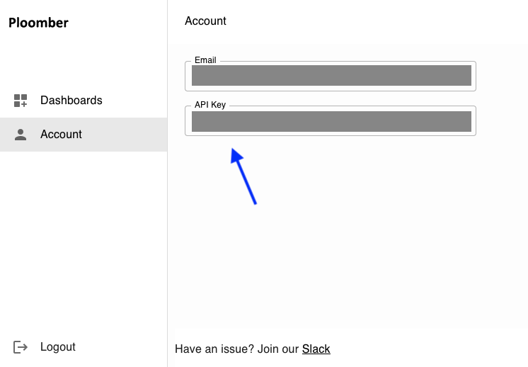
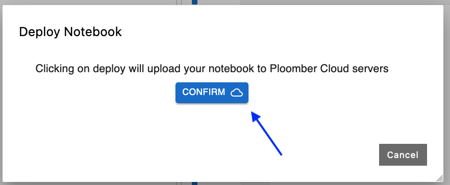
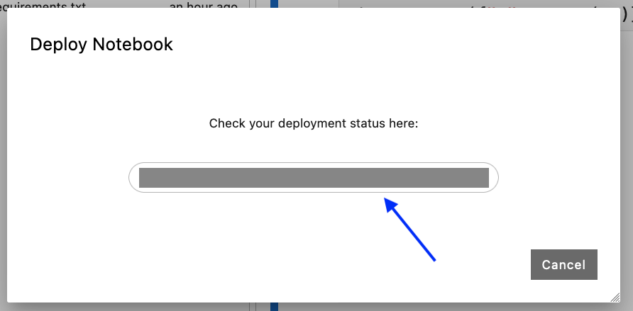

# JupyterLab plugin (Voilà)

```{important}
The plugin **is not** compatible with JupyterLab `4.x`, ensure you're running `3.x`: `pip install "jupyterlab<4"`

This guide was tested with `jupysql-plugin==0.1.6`
```

You can also use the JupyterLab plugin to deploy dashboards from JupyterLab.

## Installation

```sh
pip install jupysql-plugin
```

Once installed, a `Deploy Notebook` button will show up in the top bar:


```{tip}
If the button doesn't show up, restart JupyterLab.
```

## Create sample notebook and `requirements.txt`

Create a sample notebook so you can deploy it. For example, you can add the following print statement:

```python
import pandas as pd

print("Ploomber Cloud is amazing!")

pd.DataFrame({"x": range(10)})
```

Now, create a `requirements.txt` file in the same directory as the notebook and enter:

```
pandas
```

Your project should look like this:


## Get an API key

Now, go back to the notebook and click on `Deploy Notebook`. You'll be prompted for an API key:


To get one, you need to [sign up](../quickstart/signup.md).

Once you create an account, go to [your account](https://www.platform.ploomber.io/account) to retrieve your API Key:




Copy it (ensure you copy it entirely!) and paste it in JupyterLab, then click on `Confirm`. JupyterLab will ask for confirmation to deploy, click on `Confirm`:



Finally, you'll get a URL where you can track the deployment progress. The format is as follows:

```
https://www.platform.ploomber.io/dashboards/{project-id}/{deployment-id}
```



