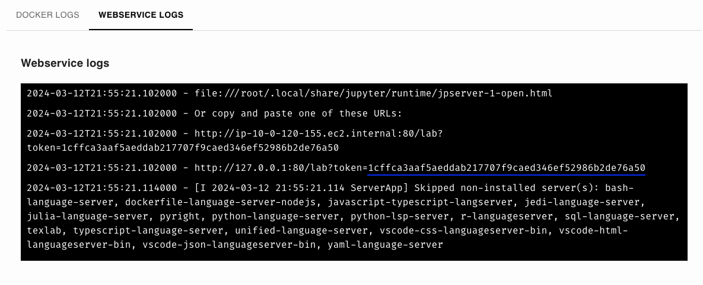
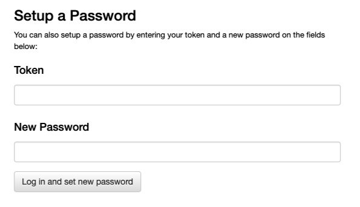
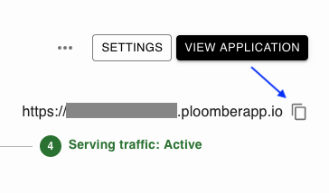
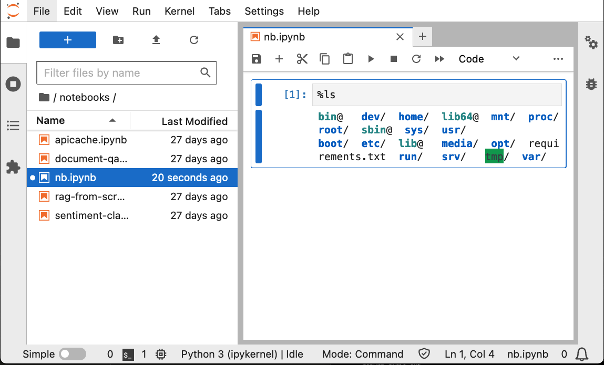
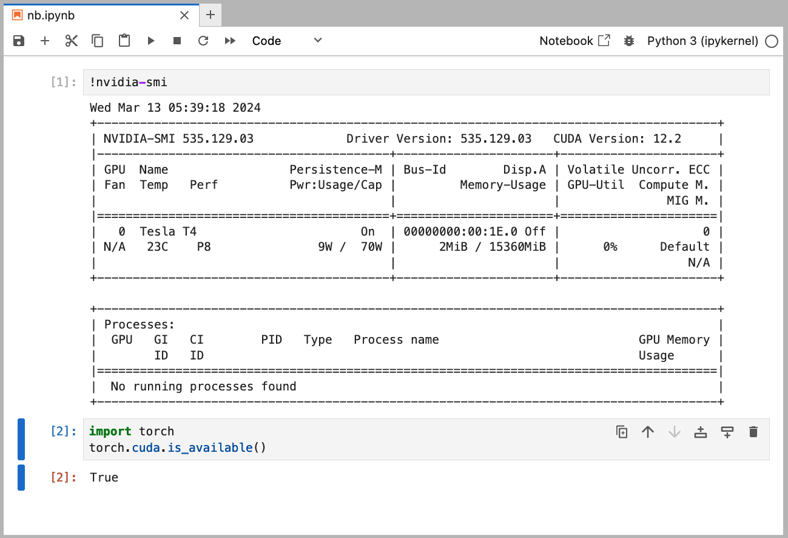

---
myst:
  html_meta:
    description: Deploy JupyterLab on Ploomber in seconds with this guide.
    keywords: jupyter, jupyterlab, notebooks, deployment, hosting
    property=og:title: JupyterLab | Ploomber Docs
    property=og:description: Deploy JupyterLab on Ploomber in seconds with this guide.
    property=og:image: https://docs.cloud.ploomber.io/en/latest/_static/opengraph-images-jupyterlab.png
    property=og:url: https://docs.cloud.ploomber.io/en/latest/apps/jupyterlab.html
---


# JupyterLab


```{important}
If you're on a free account, always back up your work because your app can be terminated if inactive. If you need JupyterLab deployed with production settings, contact us [contact@ploomber.io](mailto:contact.ploomber.io)
```

`````{tab-set}

````{tab-item} Web
__Deploy from the menu__

You can deploy JupyterLab to Ploomber Cloud and use it as a development environment. First, create an [account](https://platform.ploomber.io/register?utm_source=jupyterlab&utm_medium=documentation).

Then, download the files from the
[example](https://github.com/ploomber/doc/tree/main/examples/docker/jupyterlab) (GPU version [available here](https://github.com/ploomber/doc/tree/main/examples/docker/jupyterlab-gpu)), create a `.zip` file and deploy it using the Docker option:


````

````{tab-item} Command-line

To download and deploy JupyterLab start by installing Ploomber Cloud and setting your API key:

```sh
pip install ploomber-cloud
ploomber-cloud key YOUR-KEY
```

```{tip}
If you don't have an API key yet, follow the [instructions here.](../quickstart/apikey.md)
```

Now, download the JupyterLab example. It will prompt you for a location to download the app. To download in the current directory, just press enter.

```sh
ploomber-cloud examples docker/jupyterlab
```

You should see a confirmation with instructions on deploying your app. Now, navigate to your application:

```sh
cd location-you-entered/jupyterlab/
```

__Deploy from the CLI__

Initialize and deploy your app with:

```sh
ploomber-cloud init
ploomber-cloud deploy --watch
```

You can view the deployed application by logging in to your Ploomber Cloud account.

````
`````


Once the deployment finishes, go to `WEBSERVICE LOGS` and copy the token:



Then, open the application by clicking on `VIEW APPLICATION`:


Then, scroll down, paste the token, and set a password (write it down!):



And you're ready to use JupyterLab!

## Real-time collaboration

Collaboration is configured by default! Share your URL with a colleague (it'll be using either `id.ploomber.app` or `id.ploomberapp.io`), the password, and open the same notebook, you'll get Google Doc-like collaboration!


(remote-kernel)=
## Remote kernel

In the previous example, we showed how to run JupyterLab in Ploomber Cloud, this implies
running both the user interface and the server (which manages the kernels used to execute code).

An alternative approach is to only deploy the server, and allow you to connect to
the server from your local JupyterLab installation. This has a few benefits:

- Open local notebooks and execute them using remote resources (e.g., a [GPU](../user-guide/gpu.md))
- Use JupyterLab extensions installed locally
- Install packages once and allow your team to use them without installing them locally
- Allow multiple users to share the same environment while isolating their files

To deploy a Jupyter server, download the files from the
[example](https://github.com/ploomber/doc/tree/main/examples/docker/jupyter-kernel-gateway), create a `.zip` file and deploy it using the Docker option:


Before clicking on `CREATE`, you need to create an authentication token, run the
following locally (you can define an alternative token, but this is more secure):

```python
python -c 'import secrets; print(secrets.token_urlsafe())'
```

Copy the printed value (store it somewhere safe) and save it as a [secret](../user-guide/secrets.md), with
the name `KG_AUTH_TOKEN`, now click on `CREATE`.

Once the application is running, copy the URL (either `someid.ploomber.app` or `someid.ploomberapp.io`):



We can connect to the remote kernel. Install JupyterLab locally:

```sh
pip install jupyterlab
```

And initialize it with your either `someid.ploomber.app` or `someid.ploomberapp.io` URL and the token you set earlier:

```sh
GATEWAY_HOST=someid.ploomberapp.io # Should match your app domain (ploomber.app OR ploomberapp.io)
TOKEN=sometoken
jupyter lab --gateway-url=$GATEWAY_HOST --GatewayClient.auth_token=$TOKEN
```

If all goes well, you'll be able to create a new notebook:



Note that the files listed on the left bar won't match what  your notebook sees, that's because the left bar shows your local filesystem, but the kernel is running remotely.

(jupyter-remote-gpu)=
## Remote GPUs

If you want to connect to [GPUs](../user-guide/gpu.md), use [this example](https://github.com/ploomber/doc/tree/main/examples/docker/jupyter-kernel-gateway-gpu), follow the instructions from [the Remote Kernel](remote-kernel) section, and add GPUs to your app when deploying it.

If all went well, you'll be able to execute `!nvidia-smi` to see the available GPU and `torch` with CUDA:



