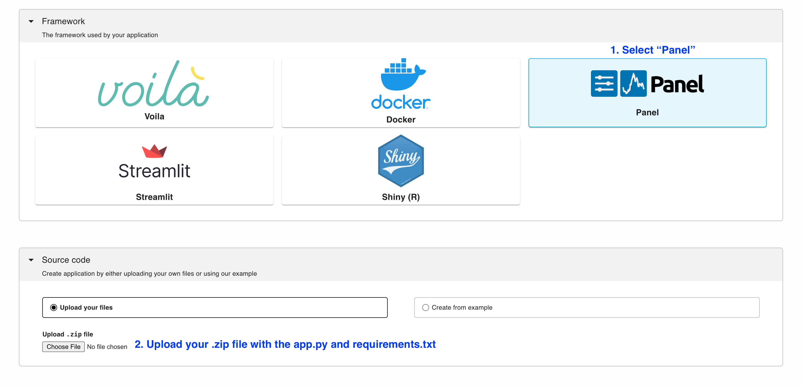
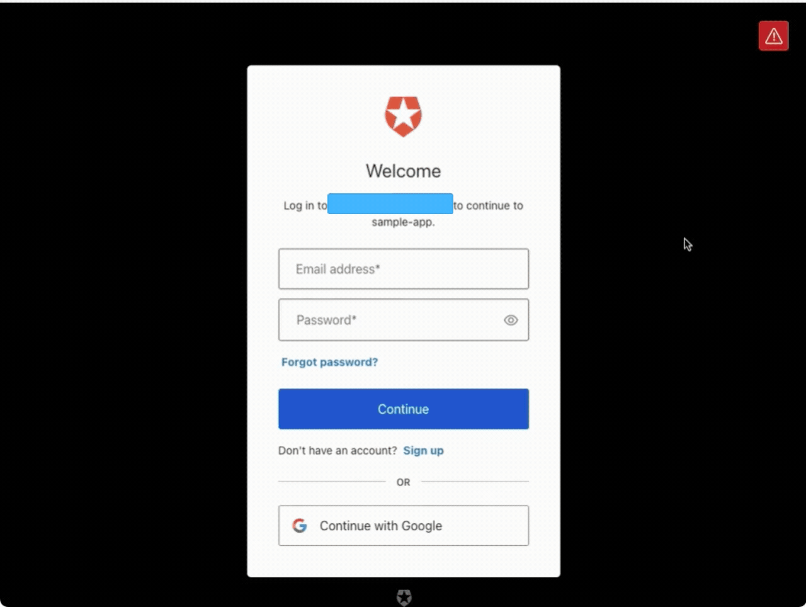
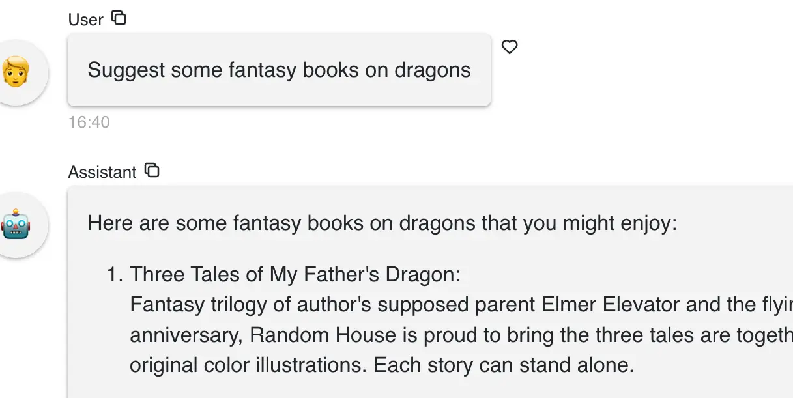
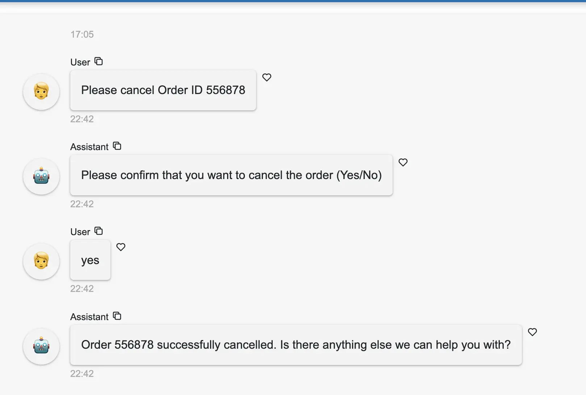
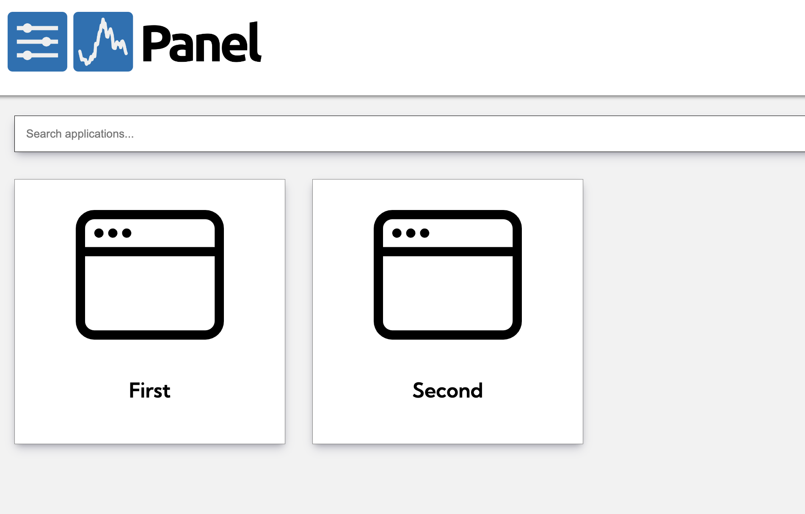

---
myst:
  html_meta:
    description: Deploy a Panel app on Ploomber in seconds with this guide.
    keywords: panel, deployment, hosting
    property=og:title: Panel | Ploomber Docs
    property=og:description: Deploy a Panel app on Ploomber in seconds with this guide.
    property=og:image: https://docs.cloud.ploomber.io/en/latest/_static/opengraph-images-panel.png
    property=og:url: https://docs.cloud.ploomber.io/en/latest/apps/panel.html
---

# Panel

Ploomber Cloud supports [Panel](https://github.com/holoviz/panel). For information on how to develop Panel apps, [please check the documentation](https://panel.holoviz.org/).

To deploy an app, first create an [account](https://platform.ploomber.io/register?utm_source=panel&utm_medium=documentation).

Once you have an account, you need at least two files:

1. Your application file (`app.py`)
2. A dependencies file (`requirements.txt`)

Note that the application will run with Python 3.11. Refer to this [section](../faq/faq.md#customize-deployment) for customized deployments.
[Here](https://github.com/ploomber/doc/tree/main/examples/panel/docker-based) is a sample Docker-based `Panel` application.


## Application file

Your `app.py` must be a Panel application. An example is available [here.](https://github.com/ploomber/doc/blob/main/examples/panel/data-viz/app.py)

## Dependencies

To deploy a new project, list your dependencies in a (`requirements.txt`). For example, if you're using [JupySQL](https://jupysql.ploomber.io), pandas and matplotlib, your `requirements.txt` file will look like this:

```
# sample requirements.txt
jupysql
pandas
matplotlib
```

## Testing locally

To test your Panel app, create a virtual environment and install the packages:

```bash
pip install -r requirements.txt
```

Then run the following command to start the application:

```bash
panel serve app.py
```

## Deploy

`````{tab-set}

````{tab-item} Web
__Deploy from the menu__

Once you have all your files, create a zip file.

To deploy a Panel app from the deployment menu, follow these instructions:



To learn more about deploying Panel applications on Ploomber Cloud [click here](https://panel.holoviz.org/how_to/deployment/ploomber.html)
````

````{tab-item} Command-line
__Try an example__

To download and deploy an example Panel application start by installing Ploomber Cloud and setting your API key:

```sh
pip install ploomber-cloud
ploomber-cloud key YOUR-KEY
```

```{tip}
If you don't have an API key yet, follow the [instructions here.](../quickstart/apikey.md)
```

Now, download an example. It will prompt you for a location to download the app. To download in the current directory, just press enter.

```sh
ploomber-cloud examples panel/data-viz
```

```{note}
A full list of Panel example apps is available [here.](https://github.com/ploomber/doc/tree/main/examples/panel)
```

You should see a confirmation with instructions on deploying your app. Now, navigate to your application:

```sh
cd location-you-entered/data-viz
```

__Deploy from the CLI__

Initialize and deploy your app with:

```sh
ploomber-cloud init
ploomber-cloud deploy --watch
```

````
`````


```{tip}
To ensure your app doesn't break on re-deployments, pin your [dependencies.](pin-dependencies)
```

## Production deployments

Ploomber has features to help you deploy production-ready Panel apps

### Authentication

Our [integration with Auth0](auth0-integration) allows you to easily add authentication
to any Panel app. There's no need to modify your Panel app code, only pass your
Auth0 configuration parameters. Check out the [sample app.](https://github.com/ploomber/doc/tree/main/examples/panel/app-with-auth0)



## Features

Ploomber Cloud supports many features to help you build Panel applications quickly!

- Integration with [GitHub](../user-guide/github.md)
- Safely store [secrets](../user-guide/secrets.md) such as API keys
- Usage [analytics](../user-guide/analytics.md) such as unique visitors, total requests, etc.
- Spin up [larger resources](../user-guide/resources.md) (CPUs and RAM)
- Spin up [GPUs](../user-guide/gpu.md)
- Add custom [domains or subdomains](../user-guide/custom-domains.md) to your application
- [Task queues](task-queues) to scale applications to more users


## Examples

::::{grid} 2 2 3 3
:class-container: text-center
:gutter: 2

:::{grid-item-card} Book recommender
[](https://github.com/ploomber/doc/tree/main/examples/panel/book-recommender)
+++
[Live demo](https://gentle-frost-8296.ploomberapp.io)
:::

:::{grid-item-card} Chat with PDF
:link: https://github.com/ploomber/doc/tree/main/examples/panel/chat-with-pdf

:::

:::{grid-item-card} Stock interpreter
:link: https://github.com/ploomber/doc/tree/main/examples/panel/stock-market-chatbot

:::

:::{grid-item-card} Customer Chatbot
[](https://github.com/ploomber/doc/tree/main/examples/panel/customer-chatbot)
+++
[Live demo](https://black-poetry-5215.ploomberapp.io)
:::

:::{grid-item-card} Multi Page App
[](https://github.com/ploomber/doc/tree/main/examples/panel/multi-page-app)
:::


::::
