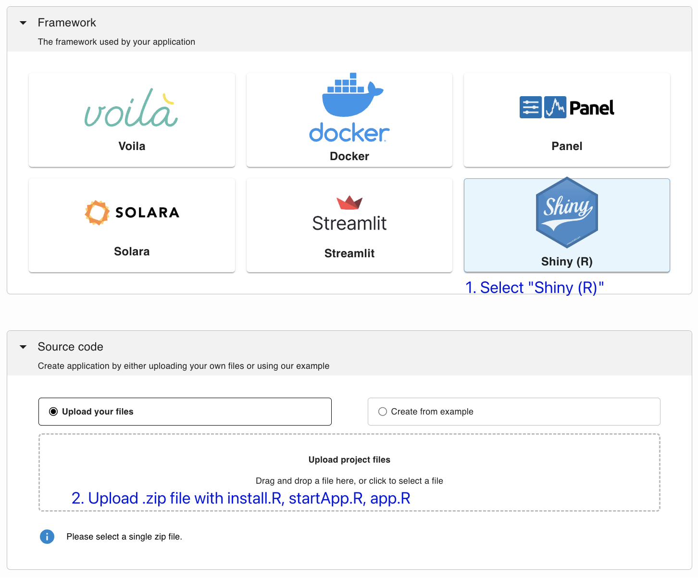

---
myst:
  html_meta:
    description: Deploy a Shiny app on Ploomber in seconds with this guide.
    keywords: shiny, deployment, hosting
    property=og:title: Shiny | Ploomber Docs
    property=og:description: Deploy a Shiny app on Ploomber in seconds with this guide.
    property=og:image: https://docs.cloud.ploomber.io/en/latest/_static/opengraph-images-shiny-r.png
    property=og:url: https://docs.cloud.ploomber.io/en/latest/apps/shiny-r.html
---

# Shiny (R)

To deploy a [Shiny](https://shiny.posit.co/py/docs/overview.html) R application to Ploomber Cloud you need:

- A [Ploomber Cloud](https://platform.ploomber.io/register?utm_source=shiny-r&utm_medium=documentation) account
- A `startApp.R` file (a script to start the App)
- An `install.R` file (a script to install dependencies)
- An `app.R` file (your Shiny code)

## Required files

You can use this [template](https://github.com/ploomber/doc/blob/main/examples/shiny-r/shiny-r-data-visualization) to get started. The `startApp.R` will remain the same, but you need to modify `install.R` and `app.R`.

In the `install.R` file, add all the dependencies that you need for your application to run. And put your application logic in the `app.R` file.


## Testing locally

To test your Shiny app, you can run the following commands locally:

```sh
# Install dependencies
Rscript install.R

# Start the application
Rscript startApp.R
```

## Deploy

`````{tab-set}

````{tab-item} Web
__Deploy from the menu__

Once you have all your files, create a zip file.

To deploy a Shiny app from the deployment menu, select the Shiny (R) option and follow the instructions:


````

````{tab-item} Command-line
__Try an example__

To download and deploy an example Shiny-R application start by installing Ploomber Cloud and setting your API key:

```sh
pip install ploomber-cloud
ploomber-cloud key YOUR-KEY
```

```{tip}
If you don't have an API key yet, follow the [instructions here.](../quickstart/apikey.md)
```

Now, download an example. It will prompt you for a location to download the app. To download in the current directory, just press enter.

```sh
ploomber-cloud examples shiny-r/shiny-r-data-visualization
```

```{note}
A full list of Shiny-R example apps is available [here.](https://github.com/ploomber/doc/tree/main/examples/shiny-r)
```

You should see a confirmation with instructions on deploying your app. Now, navigate to your application:

```sh
cd location-you-entered/shiny-r-data-visualization
```

__Deploy from the CLI__

Initialize and deploy your app with:

```sh
ploomber-cloud init
ploomber-cloud deploy --watch
```

````
`````

## Troubleshooting

Some R packages depend on C libraries, which are not installed by default. For example,
the [`igraph` R package](https://r.igraph.org/) depends on the
[GLPK](https://www.gnu.org/software/glpk/) library. If you try to run `library(igraph)`
without installing GLPK, you'll see this error:

```
Error: package or namespace load failed for ‘igraph’ in dyn.load(file, DLLpath = DLLpath, ...):
unable to load shared object '/usr/local/lib/R/site-library/igraph/libs/igraph.so':
libglpk.so.40: cannot open shared object file: No such file or directory
```

To fix this, you can use the Docker deployment option and install GLPK, here's
an [example](https://github.com/ploomber/doc/tree/main/examples/shiny-r/igraph). To
learn more, see the [Docker deployment instructions.](docker.md)

If you need help installing certain libraries, email us at [contact@ploomber.io](mailto:contact@ploomber.io)


## Examples

::::{grid} 2 2 3 3
:class-container: text-center
:gutter: 2

:::{grid-item-card} App with igraph
:link: https://github.com/ploomber/doc/tree/main/examples/shiny-r/igraph
:::

:::{grid-item-card} Data visualization
:link: https://github.com/ploomber/doc/tree/main/examples/shiny-r/shiny-r-data-visualization

:::


::::
