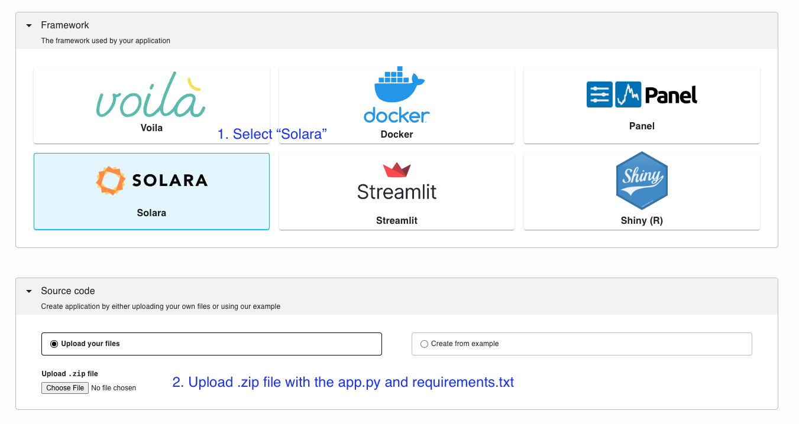

# Solara

Ploomber Cloud supports [Solara](https://solara.dev/). For information on how to develop Solara apps, [please check the documentation](https://solara.dev/docs).

To deploy a Solara app you need at least two files zipped up:

1. Your application file (`app.py`)
2. A dependencies file (`requirements.txt`)

```{note}
We currently only support Solara deployments via a `app.py` file, not via `.ipynb` files
```

## Dependencies

To deploy a new project, list your dependencies in a (`requirements.txt`). For example, if you're using [JupySQL](https://jupysql.ploomber.io), pandas and matplotlib in the solara application, your `requirements.txt` file will look like this:

```
# sample requirements.txt
solara
jupysql
pandas
matplotlib
```

## Testing locally

To test your Solara app, create a virtual environment and install the packages:

```bash
pip install -r requirements.txt
```

Then run the following command to start the application:

```bash
solara run app.py
```

## Deploy

`````{tab-set}

````{tab-item} Web
__Deploy from the menu__

Once you have all your files, create a zip file.

To deploy a Solara app from the deployment menu, follow these instructions:


````

````{tab-item} Command-line
__Try an example__

To download and deploy an example Solara application start by installing Ploomber Cloud and setting your API key:

```sh
pip install ploomber-cloud
ploomber-cloud key YOUR-KEY
```

```{tip}
If you don't have an API key yet, follow the [instructions here.](../quickstart/apikey.md)
```

Now, download an example. It will prompt you for a location to download the app. To download in the current directory, just press enter.

```sh
ploomber-cloud examples solara/gpt-4-tokenizer
```

```{note}
A full list of Solara example apps is available [here.](https://github.com/ploomber/doc/tree/main/examples/solara)
```

You should see a confirmation with instructions on deploying your app. Now, navigate to your application:

```sh
cd location-you-entered/gpt-4-tokenizer
```

__Deploy from the CLI__

Initialize and deploy your app with:

```sh
ploomber-cloud init
ploomber-cloud deploy --watch
```

````
`````