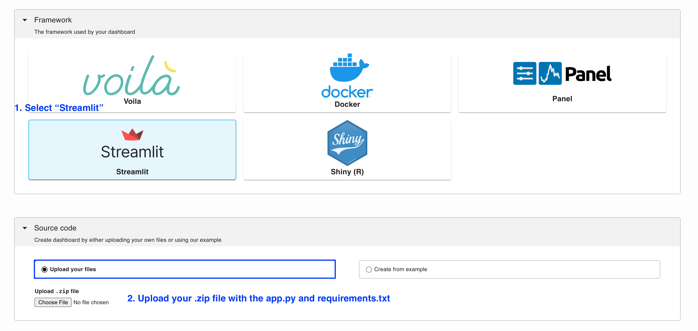

---
myst:
  html_meta:
    description: Deploy a Streamlit app on Ploomber in seconds with this guide.
    keywords: streamlit, deployment, hosting
    property=og:title: Streamlit | Ploomber Docs
    property=og:description: Deploy a Streamlit app on Ploomber in seconds with this guide.
    property=og:image: https://docs.cloud.ploomber.io/en/latest/_static/opengraph-images-streamlit.png
    property=og:url: https://docs.cloud.ploomber.io/en/latest/apps/streamlit.html
---

# Streamlit

Deploy a [Streamlit](https://streamlit.io/) app on Ploomber in seconds with this guide.

First, create an [account](https://platform.ploomber.io/register?utm_source=streamlit&utm_medium=documentation).

To deploy a Streamlit app you need at least two files:

1. Your application file (`app.py`)
2. A dependencies file (`requirements.txt`)

## Application file

Your `app.py` must be a Streamlit application. An example is available [here.](https://github.com/ploomber/doc/blob/main/examples/streamlit/data-viz/app.py)

## Dependencies

To deploy a new project, list your dependencies in a (`requirements.txt`). You must include the streamlit package. If you're using pandas and numpy together, your `requirements.txt` file will look like this:

```
# sample requirements.txt
streamlit
pandas
numpy
```

## Testing locally

To test your Streamlit app, create a virtual environment and install the packages:

```bash
pip install -r requirements.txt
```

Then run the following command to start the application:

```bash
streamlit run app.py
```

## Deploy

`````{tab-set}

````{tab-item} Web
__Deploy from the menu__

Once you have all your files, create a zip file.

To deploy a Streamlit app from the deployment menu, follow these instructions:


````

````{tab-item} Command-line
__Try an example__

To download and deploy an example Streamlit application start by installing Ploomber Cloud and setting your API key:

```sh
pip install ploomber-cloud
ploomber-cloud key YOUR-KEY
```

```{tip}
If you don't have an API key yet, follow the [instructions here.](../quickstart/apikey.md)
```

Now, download an example. It will prompt you for a location to download the app. To download in the current directory, just press enter.

```sh
ploomber-cloud examples streamlit/data-viz
```

```{note}
A full list of Streamlit example apps is available [here.](https://github.com/ploomber/doc/tree/main/examples/streamlit)
```

You should see a confirmation with instructions on deploying your app. Now, navigate to your application:

```sh
cd location-you-entered/data-viz
```

__Deploy from the CLI__

Initialize and deploy your app with:

```sh
ploomber-cloud init
ploomber-cloud deploy --watch
```

````
`````


```{tip}
To ensure your app doesn't break on re-deployments, pin your [dependencies.](pin-dependencies)
```

## Features

Ploomber Cloud supports many features to help you build Streamlit applications quickly!

- Integration with [GitHub](../user-guide/github.md)
- Safely store [secrets](../user-guide/secrets.md) such as API keys
- Add [password protection](../user-guide/password.md) to your app
- Spin up [larger resources](../user-guide/resources.md) (CPUs and RAM)
- Spin up [GPUs](../user-guide/gpu.md)
- Add custom [domains or subdomains](../user-guide/custom-domains.md) to your application
- [Task queues](task-queues) to scale applications to more users

## Examples

::::{grid} 2 2 3 3
:class-container: text-center
:gutter: 2

:::{grid-item-card} Basic app
:link: https://github.com/ploomber/doc/tree/main/examples/streamlit/basic-app
:::

:::{grid-item-card} Data visualization
:link: https://github.com/ploomber/doc/tree/main/examples/streamlit/data-viz

:::


::::
