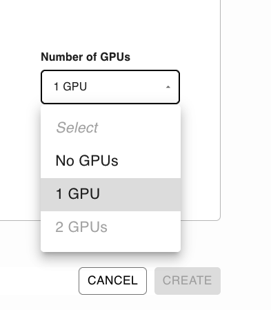

---
myst:
  html_meta:
    description: Deploy a vLLM server on Ploomber in seconds with this guide.
    keywords: vllm, deployment, hosting
    property=og:title: vLLM | Ploomber Docs
    property=og:description: Deploy a vLLM server on Ploomber in seconds with this guide.
    property=og:image: https://docs.cloud.ploomber.io/en/latest/_static/opengraph-images-vllm.png
    property=og:url: https://docs.cloud.ploomber.io/en/latest/apps/vllm.html
---

# vLLM

```{important}
vLLM requires a GPU, which is only available to PRO users.
```

You can deploy a GPU-powered vLLM server on Ploomber Cloud quickly. First, ensure you create a [Ploomber Cloud](https://platform.ploomber.io/register?utm_source=vllm&utm_medium=documentation) account. 

## Deploy


`````{tab-set}
````{tab-item} Command-line
__Use the CLI template__

Install the Ploomber Cloud client and set your API key:

```sh
pip install ploomber-cloud --upgrade
ploomber-cloud key YOUR-KEY
```

Then, start the template:

```sh
ploomber-cloud templates vllm
```

You'll be promped for a model. The default is `facebook/opt-125m`, which is a small
model that you can use for testing. You can use other more powerful
models such as `google/gemma-2b-it` or any other model compatible with vLLM.
Check out the available options in [vLLM's documentation](https://docs.vllm.ai/en/latest/models/supported_models),
and pass one of the values under the `Example HuggingFace Models` column.

```
Model to serve via vLLM [facebook/opt-125m]: google/gemma-2b-it
```

If your model is gated (i.e., requires accepting its license), you'll be prompted 
for an HuggingFace token, the token should hace acccess to the model.

```
Model google/gemma-2b-it is gated! Provide an HF_TOKEN
Enter your HF_TOKEN: hf_SOMETOKEN
API KEY saved to .env file
Generated API key: gJ647cZTyvMQvwIpJFpQZwFJg7d8amaHTn7PtvrBOEw
Dockerfile and requirements.txt created
Initializing new project...
Your app 'some-id-1234' has been configured successfully!
```

You'll see an API key, keep this safe, you'll use this to access vLLM. Finally,
you'll be asked to confirm the deployment:

```
Do you want to deploy now? [Y/n]: y
test-vllm.py created, once vLLM is running, test it with python test-vllm.py
...
The deployment process started! Track its status at: https://www.platform.ploomber.io/applications/some-id-1234/another-id
```

Open the link to track progress, once the app is ready, test vLLM by running
the sample script. This is an example output produced by `google/gemma-2b-it`:

```sh
python test-vllm.py
```

```txt
Prompt: Python is...
vLLM response:

a) a computer programing language
b) a financial instrument
c
```

````


````{tab-item} Web
__Deploy from the menu__


Download the files from the [vLLM example.](https://github.com/ploomber/doc/tree/main/examples/docker/vllm-gpu) and create a `.zip` file.

```{important}
Modify the last line in the `Dockerfile` to serve whatever model you want.
```

Then, follow the Docker deployment instructions:


Then, ensure you set an API key to protect your server by adding a `VLLM_API_KEY` secret (in the `Secrets` section).

To generate a value, you can run this in the terminal:

```sh
python -c 'import secrets; print(secrets.token_urlsafe())'
```

```{important}
If your model requires you to accept a license, you also need to pass a valid
`HF_TOKEN` in the secrets section so vLLM can download the weights.
```

Finally, ensure you select a GPU.



Deployment will take ~10 minutes since Ploomber has to build your Docker image, deploy the server and download the model.

The server will be ready to take requests when the `WEBSERVICE LOGS` show something like this:

```
2024-03-28T01:09:58.367000 - INFO: Uvicorn running on http://0.0.0.0:80 (Press CTRL+C to quit)
```


````
`````

## Testing

Once your server is running, you can test it with the following script:

```python
# NOTE: remember to run: pip install openai
from openai import OpenAI

# we haven't configured authentication, so we just pass a dummy value
openai_api_key = "PUT_YOUR_API_KEY_HERE"

# modify this value to match your host, remember to add /v1 at the end
openai_api_base = "https://autumn-snow-1380.ploomberapp.io/v1"

client = OpenAI(
    api_key=openai_api_key,
    base_url=openai_api_base,
)

# NOTE: change model to the model you're using
completion = client.completions.create(model="facebook/opt-125m",
                                       prompt="JupySQL is",
                                       max_tokens=20)
print(completion.choices[0].text)
```

```{note}
The previous snippet is using the `openai` Python package since vLLM exposes a server
that mimics OpenAI's API; however, you don't have to use it. You can also use an http
library like `requests`.
```

## Examples

::::{grid} 2 2 3 3
:class-container: text-center
:gutter: 2

:::{grid-item-card} Basic example
:link: https://github.com/ploomber/doc/tree/main/examples/docker/vllm-gpu
Basic example using a small model (`facebook/opt-125m`), doesn't need `HF_TOKEN`
:::

:::{grid-item-card} `gemma-2b-it`
:link: https://github.com/ploomber/doc/tree/main/examples/docker/vllm-gpu-gemma-2b-it
Deploys `google/gemma-2b-it`. It requires an `HF_TOKEN` associated with an account that has
accepted the license for `google/gemma-2b-it`
:::


:::{grid-item-card} `gemma-2b-it` + `outlines`
:link: https://github.com/ploomber/doc/tree/main/examples/docker/vllm-outlines-gpu-gemma-2b-it
Deploys `google/gemma-2b-it` using
[`outlines`](https://github.com/outlines-dev/outlines). It requires an `HF_TOKEN`
associated with an account that has accepted the license for `google/gemma-2b-it`
:::

::::

