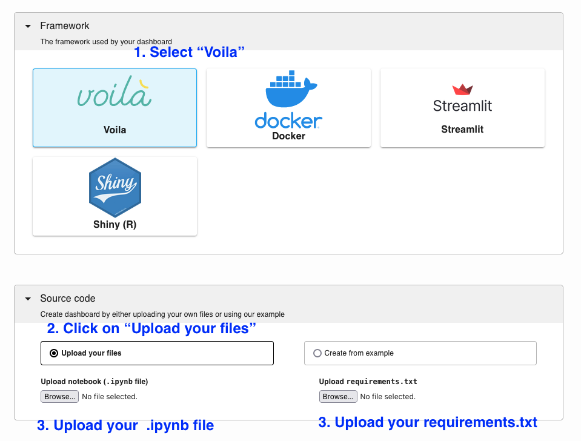

---
myst:
  html_meta:
    description: Deploy a Voilà app on Ploomber in seconds with this guide.
    keywords: voila, deployment, hosting
    property=og:title: Voilà | Ploomber Docs
    property=og:description: Deploy a Voilà app on Ploomber in seconds with this guide.
    property=og:image: https://docs.cloud.ploomber.io/en/latest/_static/opengraph-images-voila.png
    property=og:url: https://docs.cloud.ploomber.io/en/latest/apps/voila.html
---

# Voilà

To deploy an app first create an [account](https://platform.ploomber.io/register?utm_source=voila&utm_medium=documentation).


## Voila applications

To deploy an application you need two files:

1. A Jupyter notebook file (`.ipynb`)
2. A dependencies file (`requirements.txt`)

For information on how to write Voilà applications, [please check the documentation](https://voila.readthedocs.io/en/stable/).

Click here to see [some examples.](../examples/voila.md)

## Dependencies

To deploy a new project, list your dependencies in a (`requirements.txt`). For example, if you're using [JupySQL](https://jupysql.ploomber.io), pandas and matplotlib, your `requirements.txt` file will look like this:

```
# sample requirements.txt
jupysql
pandas
matplotlib
```

## Deploy

`````{tab-set}

````{tab-item} Web
__Deploy from the menu__

Once you have all your files, create a zip file.

To deploy a Voilà app from the deployment menu, follow these instructions:


````

````{tab-item} Command-line
__Try an example__

To download and deploy an example Voila application start by installing Ploomber Cloud and setting your API key:

```sh
pip install ploomber-cloud
ploomber-cloud key YOUR-KEY
```

```{tip}
If you don't have an API key yet, follow the [instructions here.](../quickstart/apikey.md)
```

Now, download an example. It will prompt you for a location to download the app. To download in the current directory, just press enter.

```sh
ploomber-cloud examples voila/chat-with-csv
```

You should see a confirmation with instructions on deploying your app. Now, navigate to your application:

```sh
cd location-you-entered/chat-with-csv
```

__Deploy from the CLI__

Initialize and deploy your app with:

```sh
ploomber-cloud init
ploomber-cloud deploy --watch
```

````
`````


```{tip}
To ensure your app doesn't break on re-deployments, pin your [dependencies.](pin-dependencies)
```


## Examples

::::{grid} 2 2 3 3
:class-container: text-center
:gutter: 2

:::{grid-item-card} Animated visualization
:link: https://github.com/ploomber/doc/tree/main/examples/voila/animated-viz

:::

:::{grid-item-card} Chat with CSV
:link: https://github.com/ploomber/doc/tree/main/examples/voila/chat-with-csv

:::

:::{grid-item-card} GDAL + geopandas
:link: https://github.com/ploomber/doc/tree/main/examples/voila/gdal

:::

:::{grid-item-card} Image mask generator
:link: https://github.com/ploomber/doc/tree/main/examples/voila/image-mask-generator

:::

:::{grid-item-card} ML predictions
:link: https://github.com/ploomber/doc/tree/main/examples/voila/ml

:::


:::{grid-item-card} Interactive data viz
:link: https://github.com/ploomber/doc/tree/main/examples/voila/mosaic

:::

:::{grid-item-card} Object removal
:link: https://github.com/ploomber/doc/tree/main/examples/voila/object-removal

:::


::::
