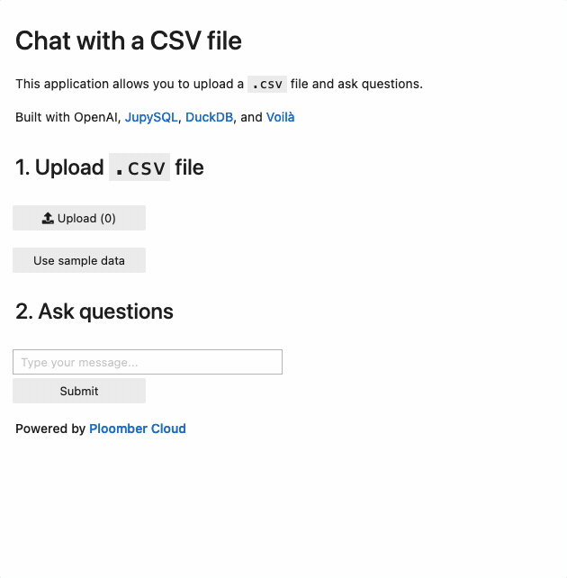
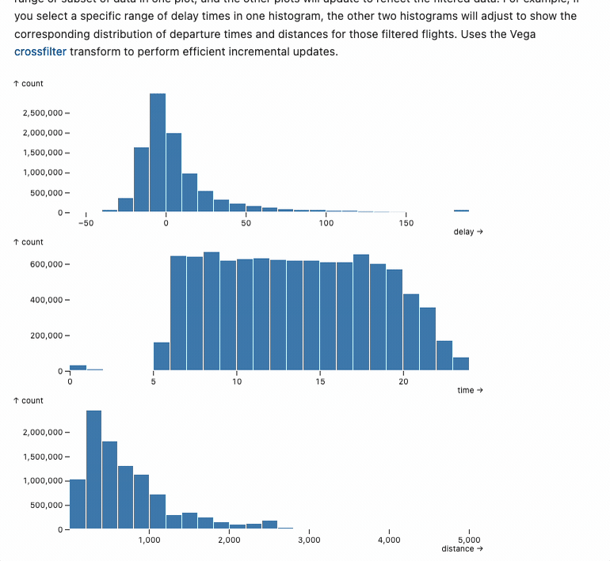

# Voilà

[Voilà](https://github.com/voila-dashboards/voila) is an open-source framework that turns Jupyter notebooks into standalone web applications.

If you combine it with the `ipywidgets` library, you can quickly build web applications from Jupyter using Python!

## Examples

### Chat with a CSV

Use [JupySQL](https://github.com/ploomber/jupysql), [DuckDB](https://duckdb.org/) and OpenAI to create a chat application that allows you to query a `.csv` file with natural language.

- [Source code](https://github.com/ploomber/doc/tree/main/examples/voila/chat-with-csv)
- Live demo

### Data visualization

Use [JupySQL](https://github.com/ploomber/jupysql), [DuckDB](https://duckdb.org/), and [Mosaic](https://uwdata.github.io/mosaic/) to create interactive data visualizations using a dataset with 10M rows.

- [Source code](https://github.com/ploomber/doc/tree/main/examples/voila/mosaic)
- [Live demo](https://frosty-truth-8136.ploomberapp.io/)