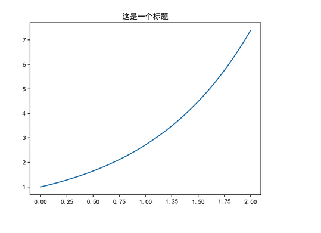
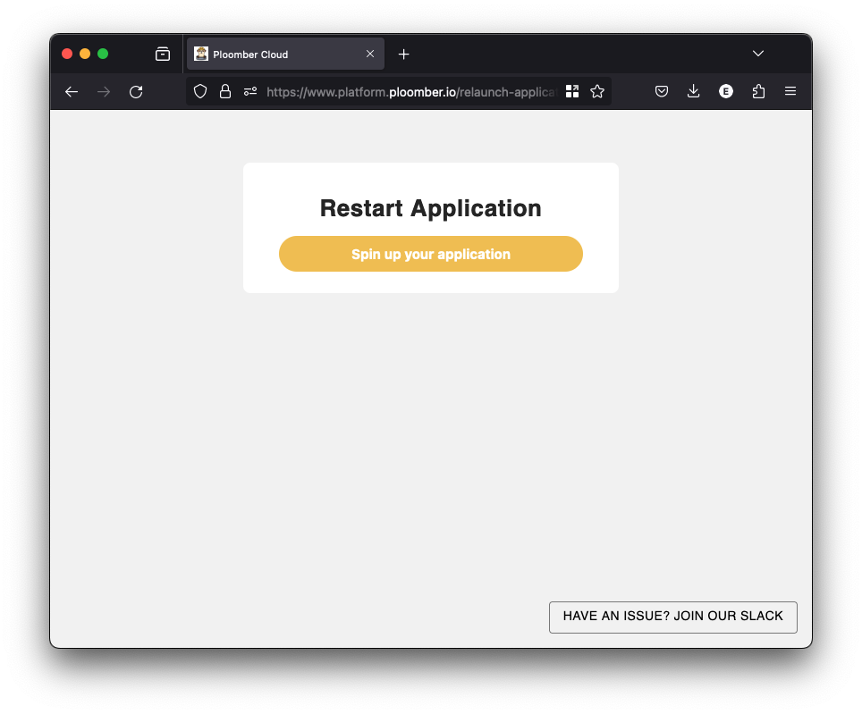
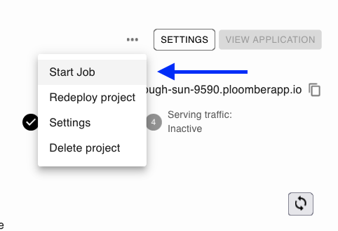

# FAQ

## Installing PyTorch

If you're deploying Docker apps using a free account, your build might fail if it takes too many resources. To fix it, you can install the CPU-only version of PyTorch. Add the following to your `Dockerfile` *before* any packages that have PyTorch as a dependency

```Dockerfile
# install the cpu-only torch (or any other torch-related packages)
# you might modify it to install another version
RUN pip install torch==2.1.1 torchvision==0.16.1 --index-url https://download.pytorch.org/whl/cpu

# any packages that depend on pytorch must be installed after the previous RUN command
```

## Installing OpenCV

If you're using OpenCV and your application gets stuck during deployment, ensure you check the `Webservice logs`, if you're using a base image that doesn't have all dependencies required by OpenCV, you might run into issues like this one:

> libGL.so.1: cannot open shared object file

If that's the case, run the following before installing OpenCV, note that this requires your base image to use `apt` as its package manager. We recommend you using the `python:3.11` base image.

```Dockerfile
RUN apt-get update && apt-get install ffmpeg libsm6 libxext6  -y
```

## Installing geopandas/fiona/GDAL

If you want to deploy an application that uses `geopandas`, you can simply add it
to your `requirements.txt` file:

```
geopandas
```

This will work as long as you're deploying any of the officially supported frameworks
or if you're using the Docker deployment option and using the `python:3.11` base image.
Here's a sample [Voilà app](https://github.com/ploomber/doc/tree/main/examples/voila/geopandas).

`geopandas` can be tricky to install because it depends on `fiona`, which depends
on GDAL, fortunately, `fiona` [bundles GDAL](https://fiona.readthedocs.io/en/stable/README.html#installation)
which simplifies installation, this allows `geopandas` to work by adding it to the `requirements.txt` file.

The caveat of this method is that the bundled GDAL is not fully-featured and omits
many GDAL's optional drivers. If you require a full-fledged GDAL version on your
application, you can do it by using the Docker deployment option and installing
GDAL in your Docker image. [Here's a sample app.](https://github.com/ploomber/doc/tree/main/examples/voila/gdal)

(pin-dependencies)=
## Pinning dependencies

When deploying an app, you need to add your dependencies in a `requirements.txt` file,
here's an example:

```
pandas
numpy
matplotlib
```

However, this `requirements.txt` might break your app during a re-deployment if any of
the packages changes their API. To prevent that, you can
pin your dependencies once your app is running locally.

Rename `requirements.txt` to `requirements.unpinned.txt`, and
then generate a new `requirements.txt` with:

```sh
pip freeze > requirements.txt
```

This will produce a new `requirements.txt` file with specific versions
for each package, ensuring that upgrades to the dependencies don't break your app.

(private-packages)=
## Including Private Packages

### UI & CLI
To use a private packages, you'll have to do it via Docker:

1. Copy your framework's base Dockerfile to project root ([Streamlit](https://github.com/ploomber/doc/blob/main/examples/streamlit/docker-based/Dockerfile), [Dash](https://github.com/ploomber/doc/blob/main/examples/dash/docker-based/Dockerfile), other framework Dockerfile can be find in our [examples](https://github.com/ploomber/doc/tree/main/examples))

2. Clone your `package` to root directory (`git clone https://githib.com/org/package.git`), and **remove it from your `requirements.txt`**

3. Update Dockerfile:
```Dockerfile
FROM python:3.11-slim

WORKDIR /app

# ~~~~~~~~~~~~~ NEW ~~~~~~~~~~~~~~~~
COPY package/ package/
RUN pip install -e package/
# ~~~~~~~~~~~~~~~~~~~~~~~~~~~~~~~~~~

COPY requirements.txt /app/
RUN pip install -r requirements.txt --no-cache-dir

COPY . /app/

CMD ["streamlit", "run", "app.py"]
```

4. Zip your project and deploy it (CLI users, simply do: `ploomber-cloud deploy`)

### GitHub Workflow
For GitHub deployments, we need to add a package download step before the deployment step. Other steps remain same as UI/CLI method.

For this, you'll need to generate a personnal access token with access to the targeted repo.
- [How to generate a Personnal Access Token](https://docs.github.com/en/authentication/keeping-your-account-and-data-secure/managing-your-personal-access-tokens)
- [How to securely give CI access to private Git repos using a **Machine User**](https://github.com/orgs/gruntwork-io/discussions/784#discussioncomment-7644683)

```yaml
jobs:
  deploy-to-ploomber-cloud:
    runs-on: ubuntu-latest
    defaults:
      run:
        working-directory: ./server
    steps:
      - uses: actions/checkout@v2
      - name: Set up Python
        uses: actions/setup-python@v2
        with:
          python-version: '3.11'
      - name: Install dependencies
        run: |
          python -m pip install --upgrade pip
          pip install ploomber-cloud
      # ~~~~~~~~~~~~~ NEW ~~~~~~~~~~~~~~~~
      - name: Download private package
        run: |
          # Clone private repository
          git clone https://${{ secrets.GH_TOKEN }}@github.com/org/package.git
          # /!\ Remove your package from requirements.txt
      # ~~~~~~~~~~~~~~~~~~~~~~~~~~~~~~~~~~
      - name: Deploy
        env:
          PLOOMBER_CLOUD_KEY: ${{ secrets.PLOOMBER_CLOUD_KEY }}
        run: |
          ploomber-cloud deploy --watch-incremental
```

```{note}
Add `GH_TOKEN` secret in repository settings with permission to clone private package.
```

## Displaying Chinese characters

If you're using matplotlib and want to display Chinese characters in your plots,
you might encounter issues. Most likely, you're missing a font that allows you
to display the characters. Check out this
[example](https://github.com/ploomber/doc/tree/main/examples/docker/matplotlib-chinese),
to test it, deploy it using the [Docker option.](../apps/docker.md)



(stopping-apps)=
## Stopping applications

If you're a community user (or a Pro user with >3 apps) you apps will be stopped if
they don't receive traffic.

When this happens, your app will show a screen like this:



When clicking on `Spin up your application` your app will restart and be available
in ~1 minute.

You can also start your application from the dashboard:




```{note}
If you see an error after restarting, wait for a few seconds. If the issue still
persists, contact us at [contact@ploomber.io](mailto:contact@ploomber.io)
```

(customize-deployment)=
## Customize deployment

You may want to deploy your application using [Docker](../apps/docker.md) for customizing the process. 
Here's a few additional features that `Docker` deployment allows:

* Installing packages that are not available via pip, e.g., `Shiny R`.
* Downloading specific modules, e.g., `Spacy` models.
* Changing the Python version.
* Customizing the Docker base image.
* Adding a cache layer

(micropip-package-installation-error)=
## `Package installation error`

If you encounter a "Package installation error" in the [editor](https://editor.ploomber.io), it means
a package cannot be installed because it's incompatible with the browser-based
environment. The error looks like this:

~~~
Package installation error: PythonError: Traceback (most recent call last):
  File "/lib/python3.12/site-packages/micropip/_commands/install.py", line 146, in install
    raise ValueError(
ValueError: Can't find a pure Python 3 wheel for: 'PACKAGE'
See: https://pyodide.org/en/stable/usage/faq.html#why-can-t-micropip-find-a-pure-python-wheel-for-a-package
~~~

This happens because the editor runs Python code in your browser using WebAssembly
(WASM). Not all Python packages can run in WASM - they need to be "pure Python"
packages without any compiled code.

The error can occur in two situations:

1. When trying to install a package you explicitly listed in `requirements.txt`
2. When trying to install a dependency of one of your required packages

While we're working to support more packages, the current workaround is to run your
code locally instead of in the browser-based editor.


(webr-installation-error-not-found)=
## `Requested package PACKAGE not found in webR binary repo.`

If you see this in the [editor](https://editor.ploomber.io), it means
a package cannot be installed because it's incompatible with the browser-based
environment. The error looks like this:

~~~
Warning in webr::install(pkg_name) :
Requested package PACKAGE not found in webR binary repo.
~~~

This happens because the editor runs R code in your browser using WebAssembly
(WASM), however, not all R packages can run in WASM.

While we're working to support more packages, the current workaround is to run your
code locally instead of in the browser-based editor.

(webr-installation-error-load-failed)=
## `Error: package or namespace load failed for PACKAGE`

If you see this in the [editor](https://editor.ploomber.io), it means
a package cannot be installed because at least one of its dependencies is incompatible
with the browser-based environment. The error looks like this:

~~~
Error: package or namespace load failed for PACKAGE in loadNamespace(j <- i[[1L]], c(lib.loc, .libPaths()), versionCheck = vI[[j]]):
~~~

This happens because the editor runs R code in your browser using WebAssembly
(WASM), however, not all R packages can run in WASM.

While we're working to support more packages, the current workaround is to run your
code locally instead of in the browser-based editor.
