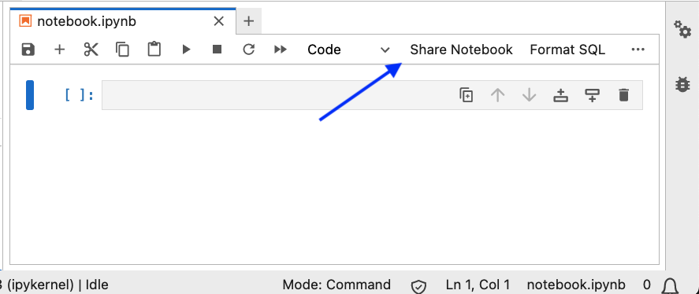
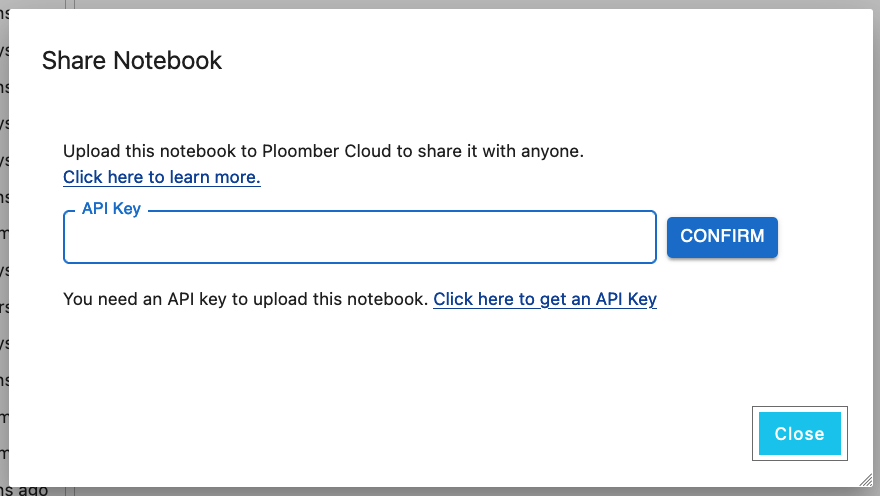
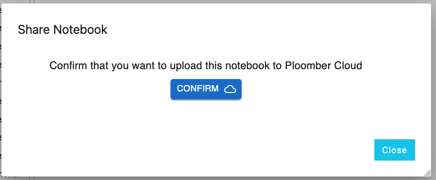
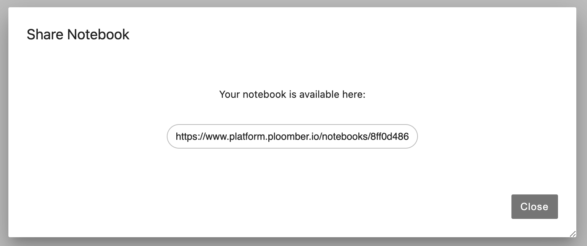

# Sharing notebooks

You can use Ploomber Cloud to quickly share notebooks from JupyterLab with one click.


First, install the JupyterLab extension:

```sh
pip install ploomber-extension
```

Then, start JupyterLab and open a notebook. You'll see a "Share notebook" button:



If this is your first time sharing a notebook, you'll be prompted for an API key:



If you are already logged into Ploomber Cloud, you can get an API key from [here](https://www.platform.ploomber.io/account). Otherwise see instructions for [signing up.](../quickstart/signup.md)


Enter your API key and click on "Confirm", then confirm that you want to upload the notebook:



Once you confirm, you'll see a link, click on it to copy it and share it with anyone!



To see the notebooks you've uploaded, [click here.](https://www.platform.ploomber.io/notebooks)

