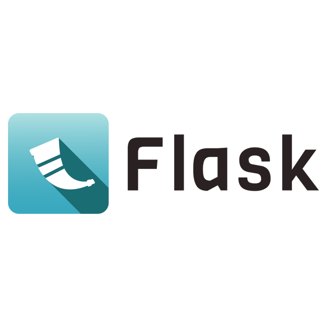
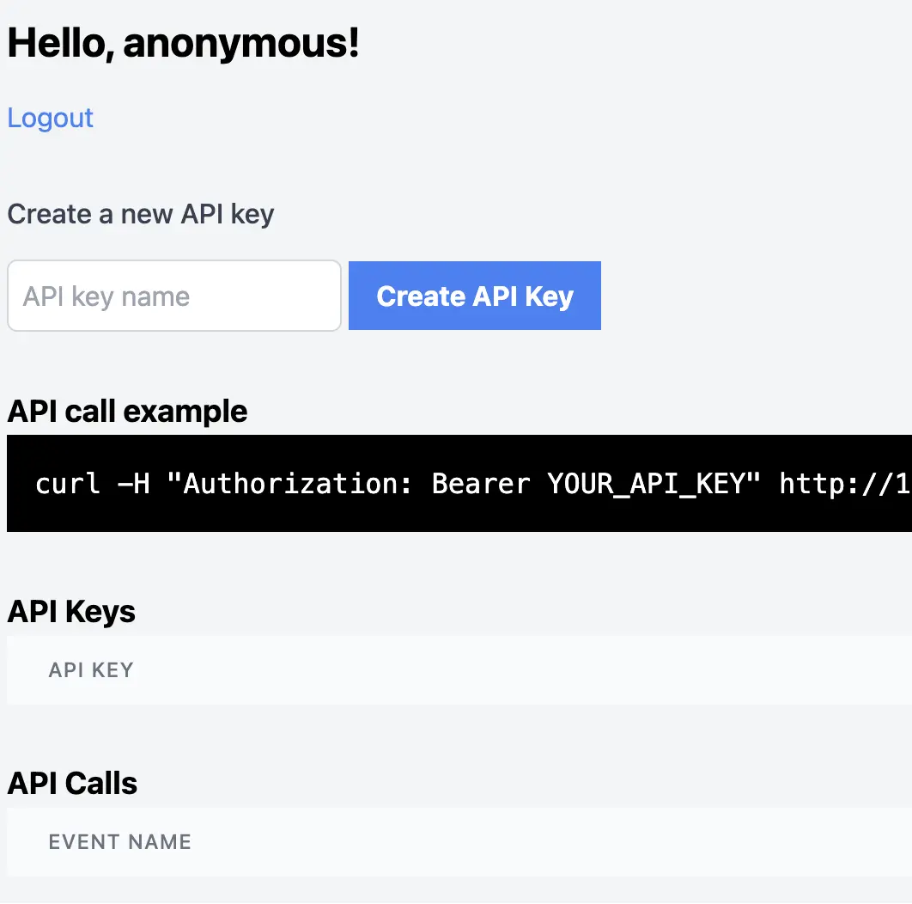
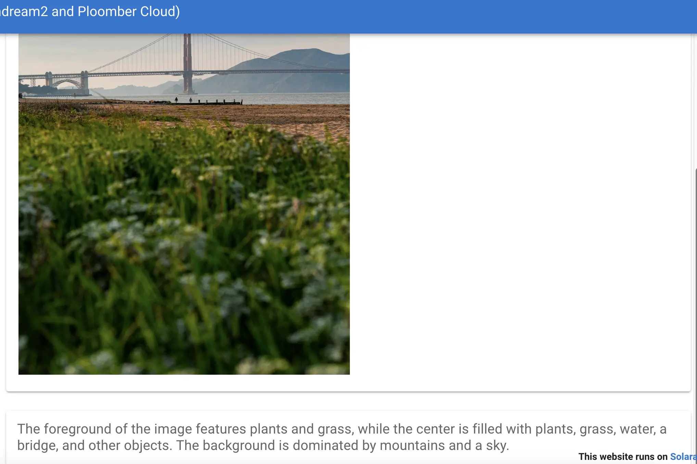
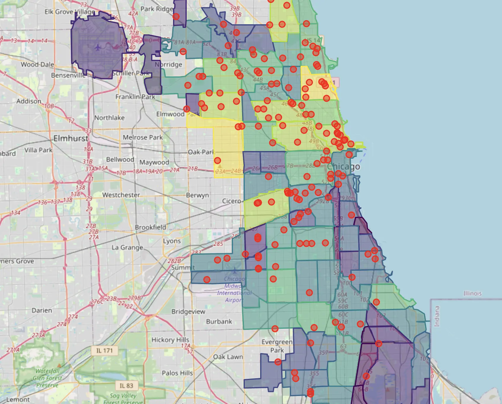

---
myst:
  html_meta:
    description: Ploomber is a cloud platform to deploy AI, Machine Learning and data applications. Deploy with drag and drop, or via Git.
    keywords: hosting, deployment, ai, machine learning, data
    property=og:title: Ploomber Docs
    property=og:description: Ploomber is a cloud platform to deploy AI, Machine Learning and data applications. Deploy with drag and drop, or via Git.
    property=og:image: https://docs.cloud.ploomber.io/en/latest/_static/opengraph-images-root.png
    property=og:url: https://docs.cloud.ploomber.io/en/latest
---

# Ploomber Cloud

Ploomber Cloud allows you to easily deploy apps. **Select a framework** to learn more:

::::{grid} 2 2 3 3
:class-container: text-center
:gutter: 2

:::{grid-item-card}
:link: apps/streamlit
:link-type: doc

:::

:::{grid-item-card}
:link: apps/shiny-r
:link-type: doc

:::

:::{grid-item-card}
:link: apps/panel
:link-type: doc

:::

:::{grid-item-card}
:link: apps/fastapi
:link-type: doc

:::

:::{grid-item-card}
:link: apps/flask
:link-type: doc

:::

:::{grid-item-card}
:link: apps/dash
:link-type: doc

:::

:::{grid-item-card}
:link: apps/voila
:link-type: doc

:::

:::{grid-item-card}
:link: apps/solara
:link-type: doc

:::

::::

## Use cases

::::{grid} 2 2 3 3
:class-container: text-center
:gutter: 2

:::{grid-item-card} Chatbots

+++
[Live demo](https://gentle-frost-8296.ploomberapp.io)
:::

:::{grid-item-card} Analytical dashboards

+++
[Live demo](https://delicate-cake-9107.ploomberapp.io)
:::

:::{grid-item-card} REST API

+++
[Live demo](https://empty-haze-3369.ploomberapp.io)
:::

:::{grid-item-card} Machine Learning inference
:link: https://github.com/ploomber/doc/tree/main/examples/flask/machine-learning

:::

:::{grid-item-card} Machine Learning monitoring
:link: https://github.com/ploomber/doc/tree/main/examples/shiny/ml-monitoring

:::

:::{grid-item-card} Computer Vision
:link: https://github.com/ploomber/doc/tree/main/examples/solara/describe-image-frontend

:::

:::{grid-item-card} Geospatial analysis
:link: https://github.com/ploomber/doc/tree/main/examples/voila/gdal

:::

::::

