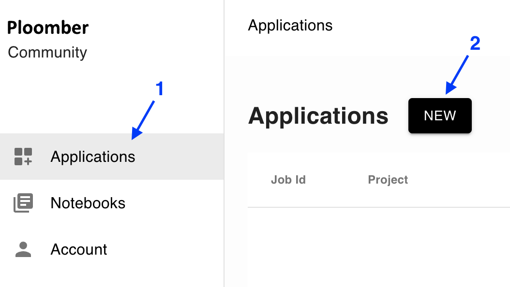
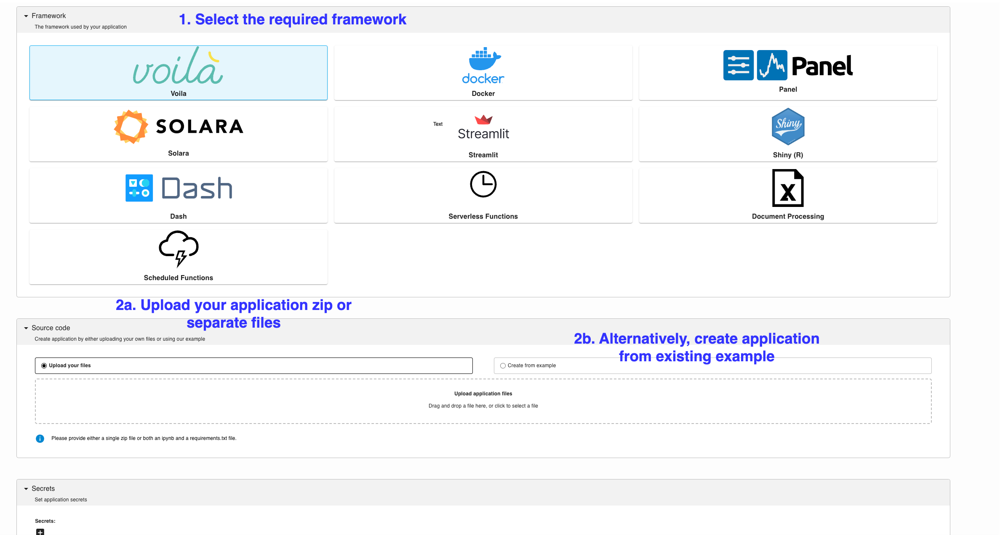
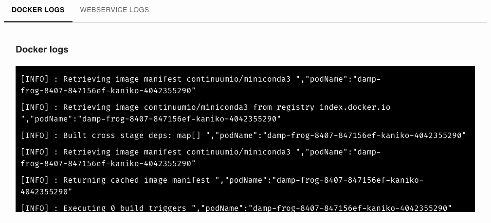
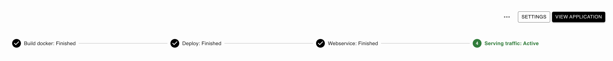
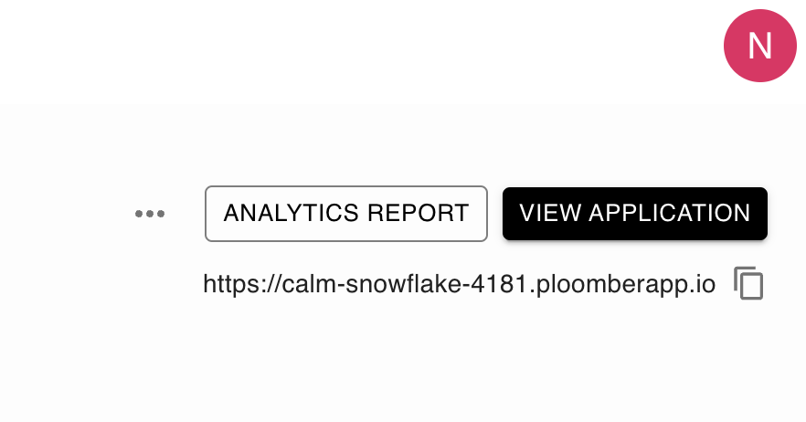

# Deploy an app

```{tip}
You can also deploy from the [terminal](../user-guide/cli.md) or [GitHub](../user-guide/github.md)
```

## 1. Click on "Applications" -> "New"




## 2. Fill out the form




## 3. Wait for the deployment to finish

You'll see two tabs. First, you'll see the `DOCKER LOGS`, which show the progress of installing your applications's dependencies:



You can track progress completion from the status bar:




At the beginning the `VIEW APPLICATION` button in the top right will be greyed out, once deployment finalizes, you'll be able to click on it to see your app!


