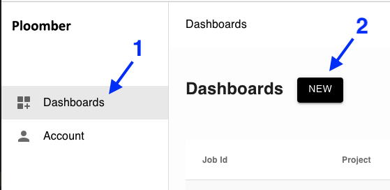
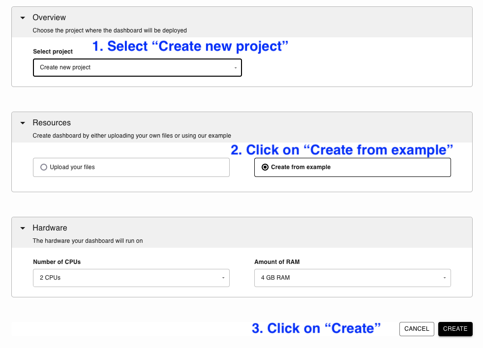
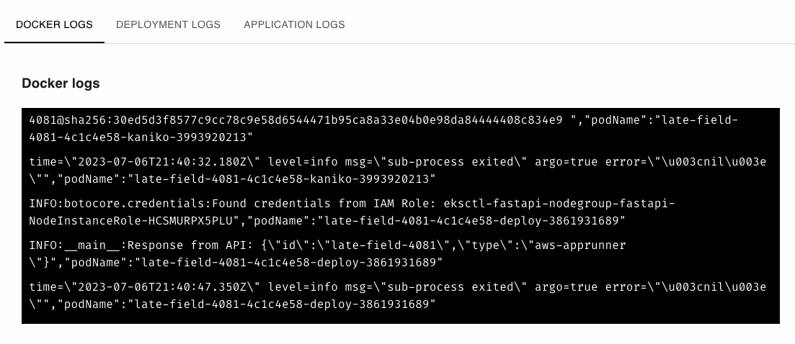
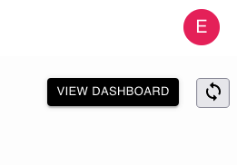

# Deploy a dashboard

## 1. Click on "Dashboards" -> "New"




## 2. Fill out the form




## 3. Wait for the deployment to finish

You'll see three tabs. First, you'll see the `DOCKER LOGS`, which show the progress of installing your dashboards's dependencies:



After a minute or so, you'll start to see the `DEPLOYMENT LOGS`, which will show you the deployment progress. The first deployment takes about 2 minutes.

When you see something like this in the `DEPLOYMENT LOGS`:

```
Deployment with ID : {some id} completed successfully.
```

It means your application has finished deployment. Scroll up and click on "View Dashboard" to to open your dashboard!



Whenever someone opens your dashboard, you'll see new log entries in `APPLICATION LOGS`.