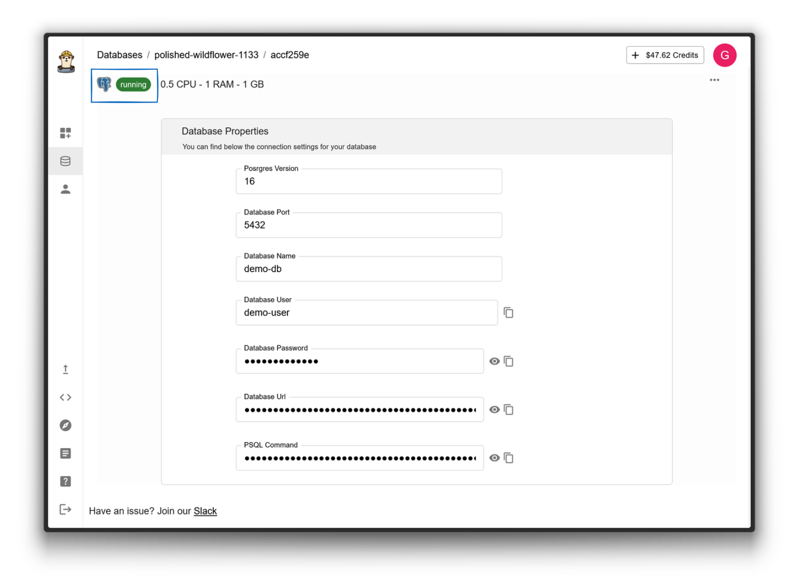

# Deploy a Database

This guide walks you through deploying and connecting to a PostgreSQL database. You'll learn how to create a database instance and connect to it using either the command line or a graphical interface.

## Table of Contents
- [Create a Database](#1-create-a-database)
- [Configure Database Settings](#2-configure-database-settings)
- [Wait for Deployment](#3-wait-for-deployment)
- [Connect to Your Database](#4-connect-to-your-database)
  - [Using Command Line (CLI)](#using-command-line-cli)
  - [Using pgAdmin (GUI)](#using-pgadmin-gui)

(1-create-a-database)=
## 1. Create a Database
Navigate to the "Database" section and click the "New" button to start the creation process.


(2-configure-database-settings)=
## 2. Configure Database Settings
Configure your database by providing the following information:
- Database name
- Username
- Password
- Hardware specifications (optional)


> ⚠️ **Important Security Note**  
> Create a strong password that includes:
> - Uppercase and lowercase letters
> - Numbers
> - Special characters
> 
> Store this password in a secure location - you'll need it to connect to your database.

(3-wait-for-deployment)=
## 3. Wait for Deployment
The deployment process typically takes about 1 minute. You'll see a progress indicator, and once complete, your database status will change to "Running".



(4-connect-to-your-database)=
## 4. Connect to Your Database
Choose one of the following methods to connect to your database:

(using-command-line-cli)=
### Using Command Line (CLI)

1. **Install the PostgreSQL client**
   ```sh
   # Ubuntu/Debian
   sudo apt-get install postgresql-client

   # macOS
   brew install libpq
   brew link --force libpq

   # Windows
   # Download from https://www.postgresql.org/download/windows/
   ```

2. **Connect using PSQL**
   Copy the connection command from the UI and paste it into your terminal:
   ```sh
   psql -h {DATABASE-URL} -U {USERNAME} {DATABASE_NAME}
   Password for user ...: {DATABASE_PASSWORD}
   ```
   

3. **Test your connection**
   Try creating a sample table:
   ```sql
   -- Create a users table
   CREATE TABLE users (
       id SERIAL PRIMARY KEY,
       username VARCHAR(100) UNIQUE NOT NULL,
       email VARCHAR(255) UNIQUE NOT NULL,
       created_at TIMESTAMP WITH TIME ZONE DEFAULT CURRENT_TIMESTAMP
   );

   -- Add a test user
   INSERT INTO users (username, email) 
   VALUES ('testuser', 'test@example.com');

   -- Verify the data
   SELECT * FROM users;
   ```

(using-pgadmin-gui)=
### Using pgAdmin (GUI)

1. Launch pgAdmin on your computer
2. In the browser panel, right-click "Servers" → "Create" → "Server..."
3. Configure your connection:
   | Tab | Field | Value |
   |-----|-------|-------|
   | General | Name | Your choice |
   | Connection | Host | Your database URL |
   | Connection | Port | 5432 |
   | Connection | Database | Your database name |
   | Connection | Username | Your database username |
   | Connection | Password | Your database password |
4. Click "Save" to establish the connection
5. Your database will appear in the server list

