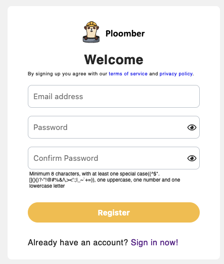
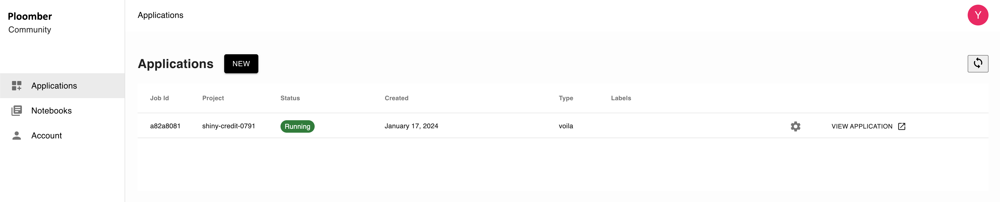

# Sign up

## 1. Enter email and password

To create a free account, go to the [sign up page](https://platform.ploomber.io/register).

## 2. Confirm your email

You'll get a confirmation email (if you don't find it, check your spam folder!). Click on the link to confirm your email.

## 3. Sign in

Submit your credentials in the [sign in page](http://platform.ploomber.io/signin).

## 4. You're done!

Now learn how to deploy your first [dashboard!](dashboard.md)