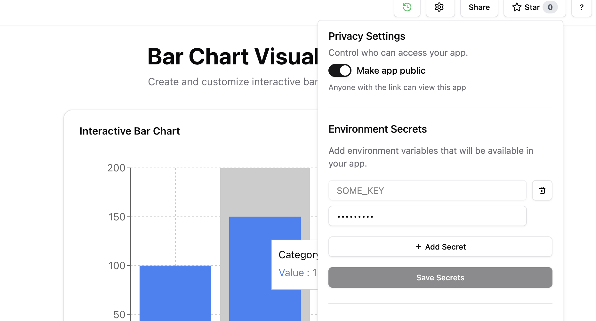

# AI Editor


```{note}
Try the AI editor [here.](https://editor.ploomber.io)
```

## Generating an app from a prompt

In the [editor home page](https://editor.ploomber.io), type your app description and
click on `Create app`. If you prefer to start from scratch, click on `Blank no-code editor`.

## Editing apps

You can modify apps by sending relevant prompts after the initial prompt:


<video width="100%" controls autoplay loop muted>
  <source src="../_static/videos/editor/edit-app.webm" type="video/webm">
  Your browser does not support the video tag.
</video>


## Revisions

Every message from the user creates a new revision of the app. You can select the required revision from the revisions history.


## Secrets

You can add secrets needed by your app in the app settings:



## Sharing

To share your app, click on `Share`. You'll be able to generate a shareable link and also set an expiry for the same.

