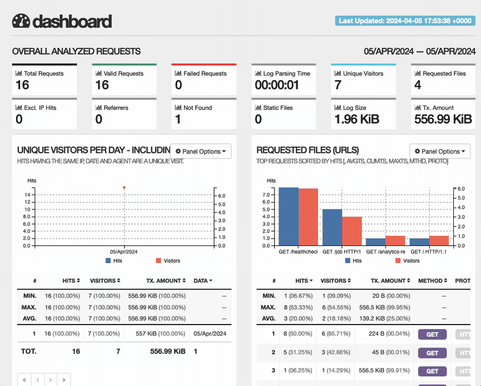
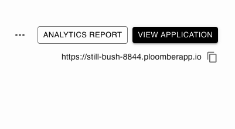

# Analytics

```{important}
Analytics is only available to customers in the Teams plan. While in beta, it'll
also be available to Pro customers.
```



The real-time analytics report allows you to get detailed information on your
application. Once your application is running, click on the `ANALYTICS REPORT` button
in the app's detailed view:



The report updates in real-time; try making some requests to your app to see it!

## Sections

### OVERALL ANALYZED REQUESTS

Offers a summary of your analytics, such as total requests, valid requests,
invalid requests, and unique visitors, among others.

### UNIQUE VISITORS PER DAY

Provides a chart and traffic statistics: hits and unique visitors.

### REQUESTED FILES (URLs)

Allows you to understand application usage by showing statistics on which URLs are
the most used.


### NOT FOUND URLs (404s)

It shows you information on resources that couldn't be located in your application. This
the section can help you find broken links your users are trying to access.

### VISITOR HOSTNAMES AND IPs

Gives you statistics on requests by IPs.

### OPERATING SYSTEMS

Hits and visitors by operating system (macOS, Linux, Windows)

### BROWSERS

Summarizes requests by browser (Firefox, Chrome, etc.)

### REFERRING SITES

Shows which websites are linking to your application.

### HTTP STATUS CODES

Aggregates HTTP status codes by type; you can see successful requests (2xx code),
client errors (4xx code), redirections (3xx), etc.