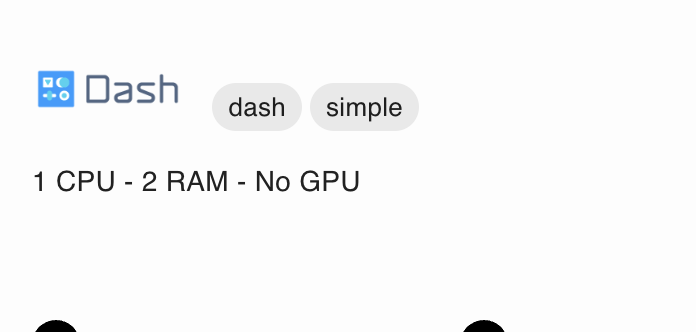

# Command-line interface

You can deploy applications using the command-line interface. First, install the package:

```sh
pip install ploomber-cloud
```

Then, set your API key ([learn how to get it](../quickstart/apikey.md)):

```sh
ploomber-cloud key YOURKEY
```

You can also set your API key by setting the environment variable:

```sh
export PLOOMBER_CLOUD_KEY=YOURKEY
```

```{tip}

`pc` is a shortcut for `ploomber-cloud`. Example: `pc key`
```

(init)=
## Initialize a new app

If you want to create a new app, run the `init` command:

```sh
ploomber-cloud init
```

This will prompt you for the project type (if this is a Docker-based project and you already have a `Dockerfile`, it'll ask you for confirmation).

Once the command exits, you can deploy:

```sh
ploomber-cloud deploy
```

The `deploy` command will print a URL that you can visit to track deployment progress. If you would like to track progress in the command line,
add the `--watch` flag.

```sh
ploomber-cloud deploy --watch
```

## Configure an existing project

If you want to deploy an existing project run the `init` command with the `--from-existing` flag:

```sh
ploomber-cloud init --from-existing
```

This will prompt you to choose from a list of your existing projects.

Upon your choice, the command will generate a `ploomber-cloud.json` with your project's info. For example, if my app ID is `cool-tree-1860` and I'm deploying a `docker` app:


```json
{
    "id": "cool-tree-1860",
    "type": "docker"
}
```

Then, execute:


```sh
ploomber-cloud deploy
```

## Force initialize an app

You might want to re-initialize your project in case the `ploomber-cloud.json` file has got corrupted or doesn't contain the valid keys.

Then run the `init` command with the `--force` flag:

```sh
ploomber-cloud init --force
```

This will replace the existing `ploomber-cloud.json` with a new one, with a different `id` field.

It can also be combined with the `--from-existing` for re-initializing from an existing project:

```sh
ploomber-cloud init --from-existing --force
```

## Delete an app

For deleting a particular app run the `delete` command with the `--project-id` flag:

```sh 
ploomber-cloud delete --project-id <project-id>
```

You can also delete a project without passing the ID by running the delete command from within the initialized project folder:

```sh 
ploomber-cloud delete
```

To delete all apps:

```sh 
ploomber-cloud delete --all
```

It should display a confirmation message:

```
Are you sure you want to delete all projects?
This action is irreversible and cannot be undone.
Pressing forward with this will result in a loss of all project data and configurations.
If you're unsure or wish to reconsider, please cancel immediately by pressing Ctrl + C. [y/N]: 
```

Confirm with `y` to delete all projects in your account.

## Deploying an example

Ploomber Cloud hosts example applications for many different frameworks. To download and deploy one, run `ploomber-cloud examples`:

```sh
ploomber-cloud examples
```

Follow the prompts to choose a framework and specific example name. You may also specify a directory in which to download the example.

Once the application is downloaded, it's ready to deploy! For example, if you downloaded the `basic-app` example for `Flask` in the current directory:

```sh
ploomber-cloud key YOUR-KEY
cd basic-app
ploomber-cloud init
ploomber-cloud deploy --watch
```

If you already know which example you want, you can download it while avoiding prompts with `ploomber-cloud examples framework/example-name`:

```sh
ploomber-cloud examples flask/basic-app
```

A full list of example applications is available [here](https://github.com/bryannho/doc/tree/main/examples)


## Monitor a deployment

An application deployment can be monitored by using the `watch` command by passing a `project_id` and an optional `job_id`:

```sh
ploomber-cloud watch --project-id <project-id> --job-id <job-id>
```

You should be able to find the parameters from the deployment message. Here's an example:

```
The deployment process started! Track its status at: https://www.platform.ploomber.io/applications/muddy-art-3373/8d1067be
```

Here, `project-id` is `muddy-art-3373` and `job-id` is `8d1067be`.

## Configure an application using a template

You can configure an application using a pre-defined template by running the command `ploomber-cloud templates <template-name>`.
Note that currently only the template `vllm` is supported. 
This command should be run in an empty folder. [Click here](../apps/vllm.md) to learn more about deploying vLLM.

## Configure GitHub action

If your project is hosted on GitHub, you can configure an action for triggering project deployment everytime code changes are pushed.

For configuring a GitHub action through CLI run the command:

```sh 
ploomber-cloud github
```

On confirming with `y` the CLI will create a `ploomber-cloud.yaml` file in the path `.github/workflows`. 
[Click here](../user-guide/github.md#configure-action-through-cli) to learn more about configuring a GitHub action.


## Defining secrets

If your project uses secrets, you can define them in an `.env` file.

```{important}
**Do not** upload your `.env` file to Github, this will expose your secrets. If you want to define secrets safely using Github, see [here.](../user-guide/github.md#secrets)
```

In your main project directory, create an `.env` file. Open it in your code editor, and enter your secrets. It should look like this:

```
MY_SECRET_1=value_1
MY_SECRET_2=value_2
```

Now make sure your project has been [initialized](init), and deploy it:

```sh
ploomber-cloud deploy
```

The command-line interface will automatically read and encrypt your secrets and include them in the deployment.
For security reasons, your `.env` file is replaced with an empty file at runtime. Ploomber only stores your encrypted secrets.

To learn how to read your secrets from within your application, see [Reading secrets.](../user-guide/secrets.md#reading-secrets)

```{note}
By default, secrets are read from an `.env` file, but they may also be read from your [environment variables.](../user-guide/github.md#secrets)
```

## Configure resources

You can customize the amount of `CPUs`, `RAM`, and `GPUs` that your project will use with this command:

```sh
ploomber-cloud resources
```

If your `ploomber-cloud.json` file already has a `resources` section, you can reconfigure with the `--force` flag:

```sh
ploomber-cloud resources --force
```

### Carrying over resources

When you initialize a project using `--force` or `--from-existing`, your resources are carried over.

`ploomber-cloud init --force` will carry over the resources from the `ploomber-cloud.json` file.

`ploomber-cloud init --from-existing` and `ploomber-cloud init --from-existing --force` will carry over the resources that the project was most recently deployed with.

If you run any of these commands, be sure to double check your resources by checking the `ploomber-cloud.json` or running `ploomber-cloud resources`.
You can easily reconfigure them with:

```sh
ploomber-cloud resources --force
```

## Add labels

You can add labels to your project by running: 

```sh 
ploomber-cloud labels --add label_1 -a label_2
```

The labels will be added to the `ploomber-cloud.json` file like so:

```json
{
    "id": "broken-night-1393",
    "type": "dash",
    "labels": [
        "dash",
        "simple"
    ]
}
```

Labels can be added either after `ploomber-cloud init` or `ploomber-cloud deploy`. Once the project is deployed the labels will reflect in the UI:



When you initialize a project using `--force`, the labels already configured will be carried over.

### Delete labels

To delete a label you can run:

```sh 
ploomber-cloud labels --delete label_1 -d label_2
```

You can also add and delete labels at the same time:

```sh 
ploomber-cloud labels --add label_1 --delete label_2
```

### View labels

To view all labels added to your project simply run:

```sh 
ploomber-cloud labels
```