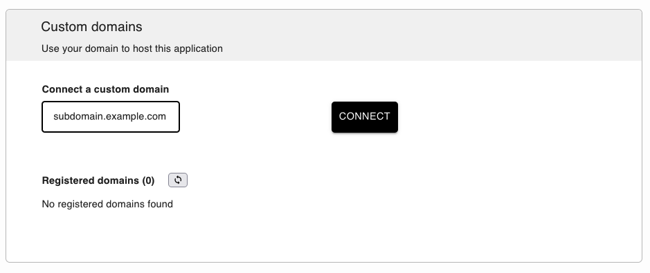
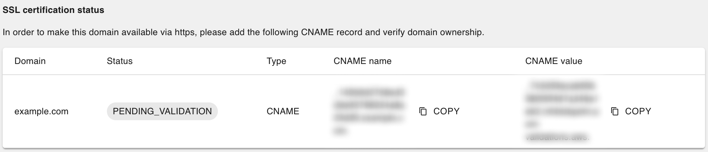

# Custom domains/subdomains

```{important}
Custom domains/subdomains are a [paid feature.](../pricing/overview.md)
```

By default, applications are available under `project-id.ploomberapp.io`, where `project-id` is a randomly generated string.

You can customize the [`project-id`](custom-ploomber-subdomain) or [bring your own domain](custom-domain).

(custom-ploomber-subdomain)=
## `{custom}.ploomberapp.io`

If you would like a custom `ploomberapp.io` subdomain, like `my-custom-app.ploomberapp.io`, you can add it during application setup:


```{warning}
The custom name is **only visible** during setup, so write it down. We're working on a fix.
```


(custom-domain)=
## Adding a custom domain/subdomain

### Adding a custom subdomain

To deploy an app at `subdomain.yourdomain.com`, you first need to ensure it's deployed and available (the **VIEW APPLICATION** button should be enabled)


```{warning}
If your application is not ready and publicly available, the button will be disabled and you won't be able to connect a custom domain to it.
```

Go to the application settings page by clicking on the **SETTINGS** button. Next, in the **Custom domains** section, enter your domain name and click **CONNECT**.




A new section will display. **Disregard its contents**, and follow these instructions.

Add the following records:

1. `CNAME` record: set `subdomain` as the host (e.g., if you want to serve from `subdomain.example.com` set `subdomain`) and set the value to `{yourapp}.ploomberapp.io`.
2. `CNAME` record: with the shown **CNAME name** and **CNAME value** (as displayed in the **SSL certification status** section, see below)



To modify your DNS records, follow these instructions (they apply to Namecheap but they're similar for other DNS providers):

1. Log in to your [Namecheap account](https://www.namecheap.com/)

2. Click `Domain List` tab and then click `Manage` button next to your domain


3. Click `Advanced DNS`


4. Add the relevant DNS records, and click `Save all changed`.


```{important}
DNS record changes might take up to 48 hours to take effect. In the meantime, your application will be accessible from the `ploomberapp.io` URL
```


### Adding a custom domain

To deploy an app at `yourdomain.com`, you first need to ensure it's deployed and available (the **VIEW APPLICATION** button should be enabled)


```{warning}
If your application is not ready and publicly available, the button will be disabled and you won't be able to connect a custom domain to it.
```

Go to the application settings page by clicking on the **SETTINGS** button. Next, in the **Custom domains** section, enter your domain name and click **CONNECT**.


There are two ways to connect a custom domain. Depending on where you want to store your DNS records, choose the method that suits you:

* **CNAME record** (default) - You add a CNAME and ALIAS record in your DNS provider
* **Nameservers** - We host your DNS records


#### Method 1: CNAME record

After typing your domain and clicking on **CONNECT**, a window like this will display:


These are the three records you need to add:

1. `CNAME` record: `www` as host and `{yourapp}.ploomberapp.io` as value
2. `ALIAS` record: `@` host `{yourapp}.ploomberapp.io` as value
3. `CNAME` record: with the shown **CNAME name** and **CNAME value** (as displayed in the **SSL certification status** section, see below)


To modify your DNS records, follow these instructions (they apply to Namecheap but they're similar for other DNS providers):

1. Log in to your [Namecheap account](https://www.namecheap.com/)

2. Click `Domain List` tab and then click `Manage` button next to your domain


3. Click `Advanced DNS`


4. Add the relevant DNS records, and click `Save all changed`.

You should be able to see something like this:


```{important}
DNS record changes might take up to 48 hours to take effect. In the meantime, your application will be accessible from the `ploomberapp.io` URL
```

#### Method 2: Nameservers

First, let's change the connection method to nameservers, by clicking `nameservers`.


Now, update the name server settings for your domain in your hosting account with the newly provided name servers.


##### How to change your domain's nameservers?

In most cases, changing your nameserver is a simple and easy process. 

We will cover the instructions for changing your nameservers on Namecheap. While it may be a slightly different process, the basic steps remain the same for any other domain registrar.

1. Log in to your [Namecheap account](https://www.namecheap.com/)

2. Click `Domain List` tab and then click `Manage` button next to your domain


3. Scroll down to the `Nameservers` section and select `Custom DNS`


4. Add your nameservers and click `Save`


### HTTPS and SSL

Once your custom domain/subdomain has been verified, you'll be able to see it under Registered domains as `ISSUED`, and your custom domain will have an SSL certification.


