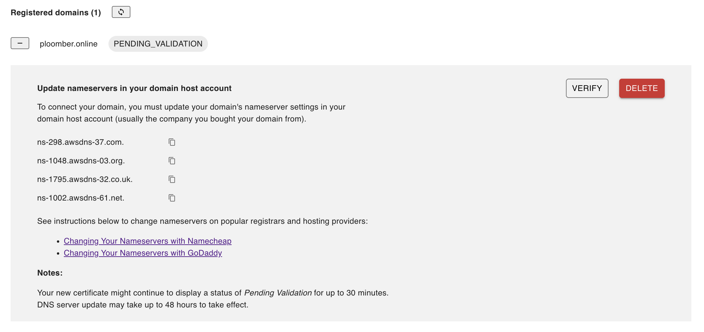

# Custom domains

When you publish your application for the first time, your web address (i.e., URL) is in the following format: `project-id.plooberapp.io`

If you already own a domain, you can easily bring it to your Ploomber account by changing its name servers. With this connection method, Ploomber hosts your DNS, while your domain remains registered with its current host.

## Adding a custom domain

### Before you begin

If you haven't done it yet, start by [setting up a Ploomber cloud application](./../quickstart/app.md).

Once your application is ready, you'll be able to access it by clicking the `VIEW APPLICATION` button in the application status page.


```{warning}
If your application is not ready and publicly available, the button will be disabled and you won't be able to connect a custom domain to it.
```

### To add the domain

Go to the application settings page by clicking the settings button.

Next, in **Custom domains** section, enter your domain name and click `Connect`.


To complete the process, update the name server settings for your domain in your hosting account with the newly provided name servers




### How to change your domain's nameservers?

In most cases, changing your nameserver is a simple and easy process. 

We will cover the instructions for changing your nameservers on Namecheap. While it may be a slightly different process, the basic steps remain the same for any other domain registrar.

1. Log in to your [Namecheap account](https://www.namecheap.com/)

2. Click `Domain List` tab and then click `Manage` button next to your domain


3. Scroll down to the `Nameservers` section and select `Custom DNS`


4. Add your nameservers and click `Save`


```{note}
It can take up to 48 hours for nameserver changes to take effect. Please be patient if your website isn’t showing up at your domain right away.
```

### HTTPS and SSL

All Ploomber applications include the HTTPS and SSL protocols, ensuring that communication between your visitors and your site is entirely secure. Once your custom domain has been verified, you'll be able to see it under Registered domains as `issued`, and your custom domain will have an SSL certification.


