# Custom domains and subdomains

When you publish your application for the first time, your web address (i.e., URL) is in the following format: `project-id.plooberapp.io`

Ploomber offers options to customize the [subdomain](#custom-subdomain) or the [full domain](#custom-domain).

If you already own a domain, you can easily bring it to your Ploomber account by updating your DNS records, or by changing its nameservers.

(custom-subdomain)=
## Adding a custom subdomain

```{note}
Custom project names are a [paid feature.](../pricing/overview.md)
```

If you would like a custom subdomain, like `my-custom-app.ploomberapp.io`, you can add a custom name during application setup:

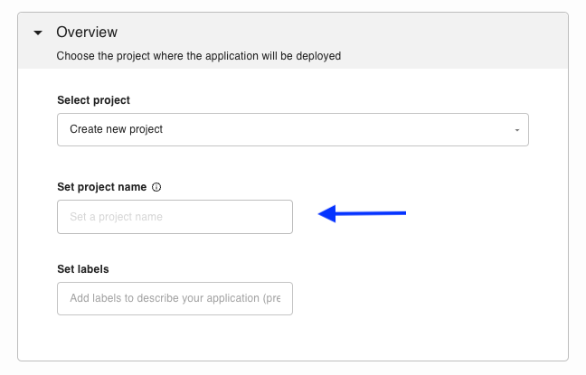

Customizing the project name only changes the `x` portion in `x.ploomberapp.io`.

If you would like a fully customized domain, see [Adding a custom domain](#custom-domain).


(custom-domain)=
## Adding a custom domain

### Before you begin

If you haven't done it yet, start by [setting up a Ploomber cloud application](./../quickstart/app.md).

Once your application is ready, you'll be able to access it by clicking the `VIEW APPLICATION` button in the application status page.

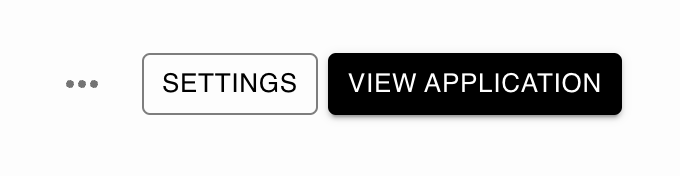

```{warning}
If your application is not ready and publicly available, the button will be disabled and you won't be able to connect a custom domain to it.
```

### To add the domain

Go to the application settings page by clicking the settings button.

Next, in **Custom domains** section, enter your domain name and click `Connect`.

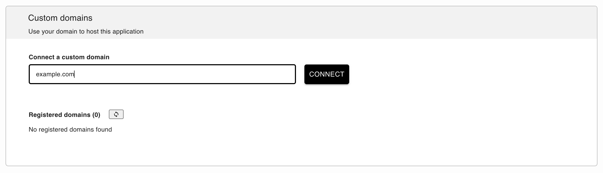

### Choose your connection method

There are two ways to connect a custom domain. Depending on where you want to store your DNS records, choose the method that suits you:

* **Pointing** (default) - You add a CNAME and ALIAS record in your DNS provider
* **Nameservers** - We host your DNS records


#### Method 1: Pointing

To complete the process, you need to add the following DNS records in your domain host account. If these records already exist, you need to replace them with the newly provided DNS records.

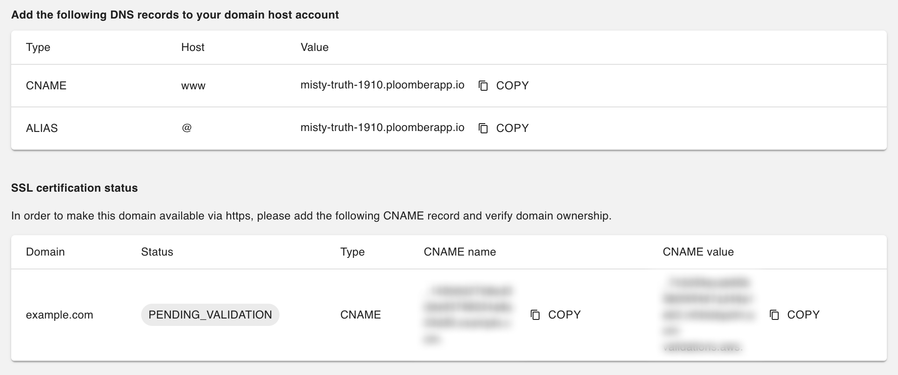

```{note}
Please make sure to add the SSL record so we'll be able to request the SSL certificate for you.
```

##### How to change your DNS records?

In most cases, changing your DNS records is a simple and easy process. 

We will cover the instructions for updating your records on Namecheap. While it may be a slightly different process, the basic steps remain the same for any other domain registrar.

1. Log in to your [Namecheap account](https://www.namecheap.com/)

2. Click `Domain List` tab and then click `Manage` button next to your domain

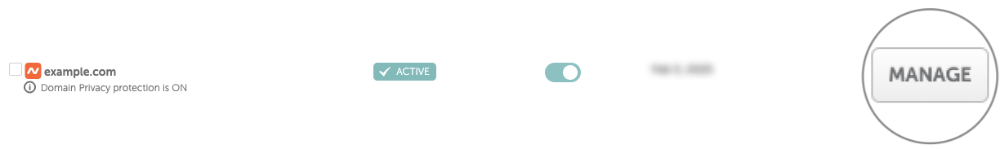

3. Click `Advanced DNS`

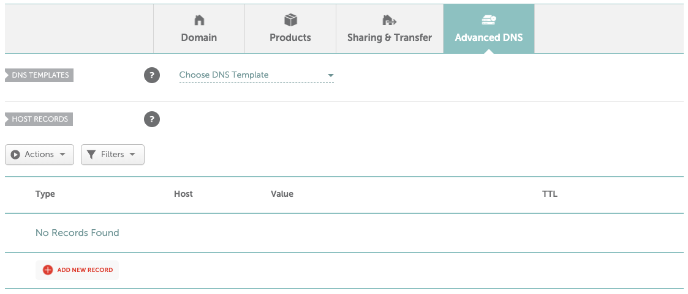

4. Add the relevant DNS records, and click `Save all changed`.

You should be able to see something like this:

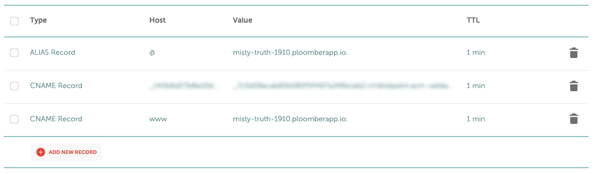


You've completed the process, and now it's time to be patient. Allow up to 48 hours for your domain's updated DNS records to propagate, enabling your application to become accessible worldwide.

#### Method 2: Nameservers

First, let's change the connection method to nameservers, by clicking `nameservers`.

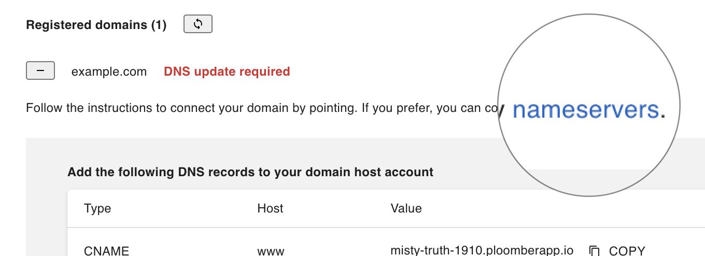


Now, update the name server settings for your domain in your hosting account with the newly provided name servers.

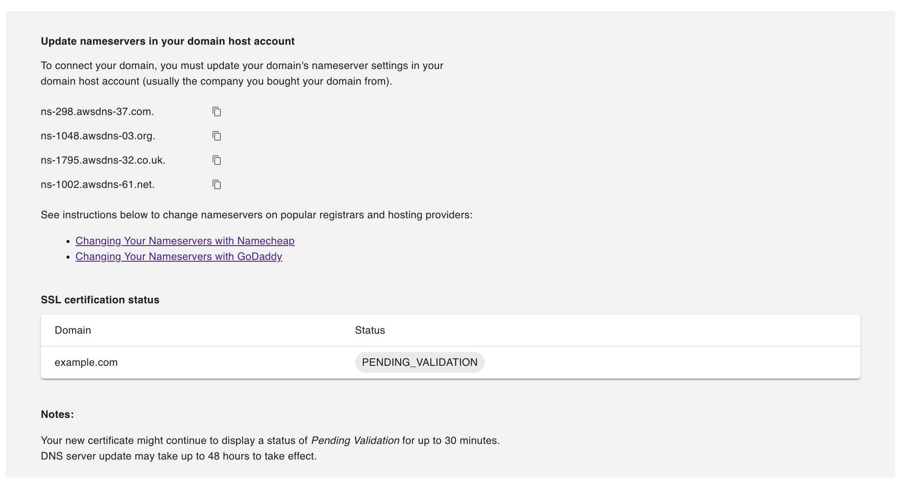


##### How to change your domain's nameservers?

In most cases, changing your nameserver is a simple and easy process. 

We will cover the instructions for changing your nameservers on Namecheap. While it may be a slightly different process, the basic steps remain the same for any other domain registrar.

1. Log in to your [Namecheap account](https://www.namecheap.com/)

2. Click `Domain List` tab and then click `Manage` button next to your domain


3. Scroll down to the `Nameservers` section and select `Custom DNS`

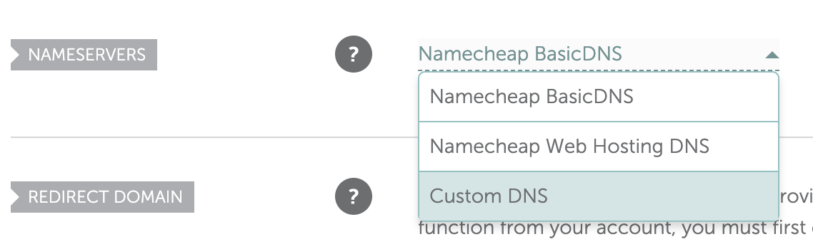

4. Add your nameservers and click `Save`

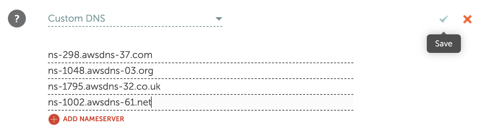


```{note}
It can take up to 48 hours for nameserver changes to take effect. Please be patient if your website isn’t showing up at your domain right away.
```

#### HTTPS and SSL

All Ploomber applications include the HTTPS and SSL protocols, ensuring that communication between your visitors and your site is entirely secure. Once your custom domain has been verified, you'll be able to see it under Registered domains as `ISSUED`, and your custom domain will have an SSL certification.

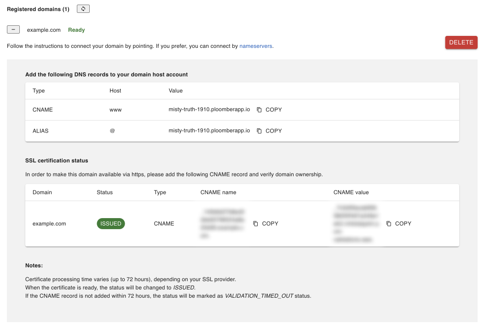

