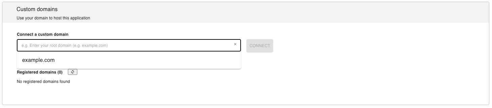
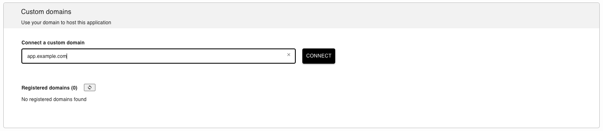
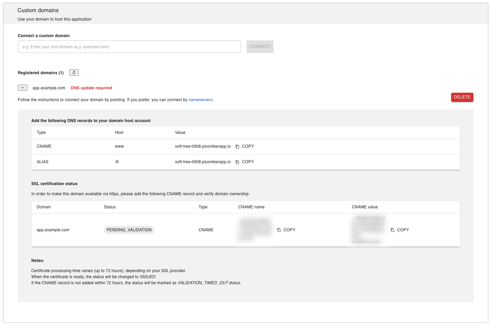
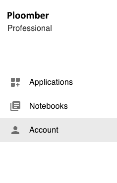
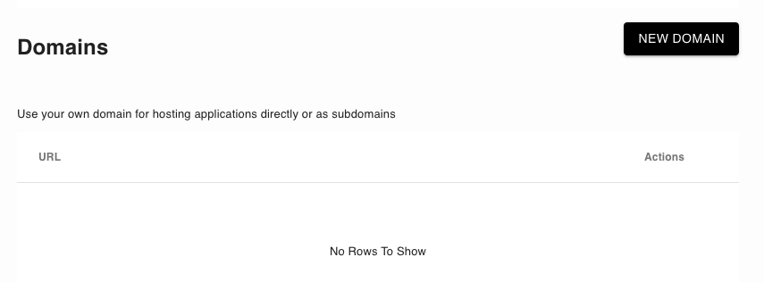
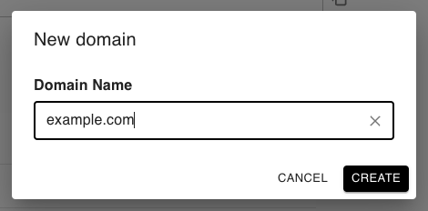
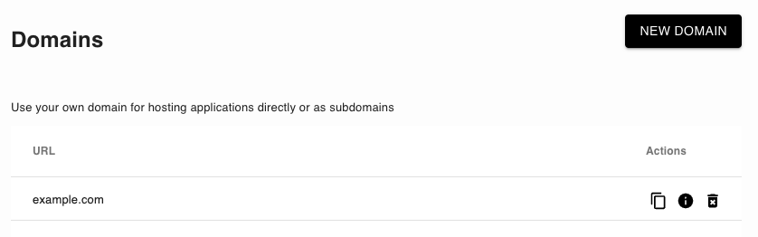
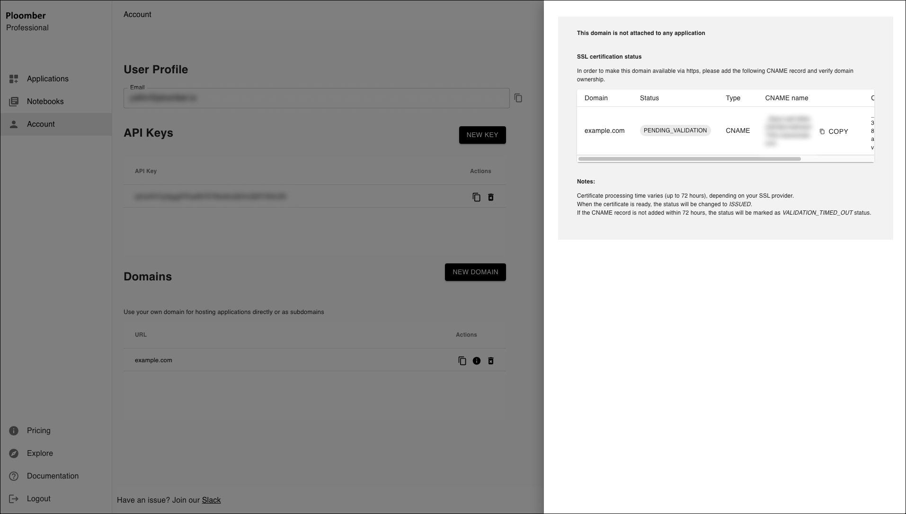

# Custom domains/subdomains

```{important}
Custom domains/subdomains are a [paid feature.](../pricing/overview.md)
```

By default, applications are available under `project-id.ploomberapp.io`, where `project-id` is a randomly generated string.

You can customize the [`project-id`](custom-ploomber-subdomain) or [bring your own domain](custom-domain).

(custom-ploomber-subdomain)=
## `{custom}.ploomberapp.io`

If you would like a custom `ploomberapp.io` subdomain, like `my-custom-app.ploomberapp.io`, you can add it during application setup:


(custom-domain)=
## Adding a custom domain/subdomain

(new-custom-domain-with-app)=
### Adding a custom domain

To deploy an app at `yourdomain.com`, you first need to ensure it's deployed and available (the **VIEW APPLICATION** button should be enabled)


```{warning}
If your application is not ready and publicly available, the button will be disabled and you won't be able to connect a custom domain to it.
```

Go to the application settings page by clicking on the **SETTINGS** button. Next, in the **Custom domains** section, enter your domain name and click **CONNECT**.


Once you click on **CONNECT**, a window like this will display:


These are the three records you need to add:

1. `CNAME` record: `www` as host and `{yourapp}.ploomberapp.io` as value
2. `ALIAS` record: `@` host `{yourapp}.ploomberapp.io` as value
3. `CNAME` record: with the shown **CNAME name** and **CNAME value** (as displayed in the **SSL certification status** section, see below)


(update-dns-records)=
### Updating DNS records

```{note}
If you have issues modifying your DNS records, send us an email ([contact@ploomber.io](mailto:contact@ploomber.io)) and we'll help you
```

To modify your DNS records, follow these instructions (they apply to Namecheap but they're similar for other DNS providers):

1. Log in to your [Namecheap account](https://www.namecheap.com/)

2. Click `Domain List` tab and then click `Manage` button next to your domain


3. Click `Advanced DNS`


4. Add the relevant DNS records, and click `Save all changed`.

You should be able to see something like this:


```{important}
DNS record changes might take up to 48 hours to take effect. In the meantime, your application will be accessible from the `ploomberapp.io` URL
```


### Adding a custom subdomain

To deploy an app at `subdomain.yourdomain.com`, you first need to ensure the main domain you want to link to (e.g., `yourdomain.com`) is [registered properly](new-custom-domain-no-app).

Once we have the main domain registered, we can go to the application settings page by clicking on the **SETTINGS** button. 


Next, in the **Custom domains** section, click the text field and you should see your new domain there. It means the domain is available, and you can host your application on a subdomain of it.




```{warning}
If you don't see your main domain in there, it means something went wrong and you probably won't be able to use a subdomain. In this case, please contact us via [contact@ploomber.io](mailto:contact.ploomber.io) or our public [slack channel](https://ploomber.io/community/)
```


1. Select the domain, type your subdomain (e.g., `app.example.com`), and click connect



2. Once the subdomain is registered successfully, please complete the process by [updating your DNS records](update-dns-records)




(new-custom-domain-no-app)=
### New custom domain without an app 

Users have the option to create custom domains without associating them directly with any specific application. This option allows users to host multiple applications under different subdomains, such as `app1.example.com`, `app2.example.com`, and `app3.example.com`, while the main domain, `example.com`, remains independent of any hosted application.

1. Go to `Account` section 



2. In the `Domains` section, you can view your registered domains. Currently, there are no registered domains.
To add a new domain, click on `NEW DOMAIN` and wait for the popup.



3. Type your main domain, e.g., `example.com` and click `CREATE`



4. Once it's done you should be able to see your new domain under `Domains`



5. Update your DNS records

First, open the information panel by clicking this icon next to your domain: 



As you can see, the domain has been created, and there is no attached application.
To make the domain availble via SSL, we need to add one DNS record as described in the information panel.

Please follow these instructions on how to [update your DNS records](update-dns-records).
