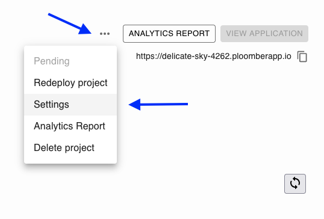
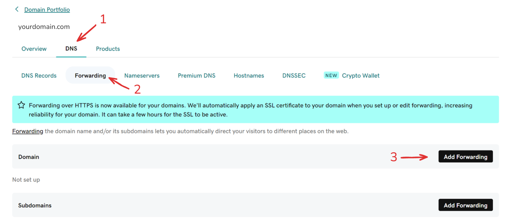
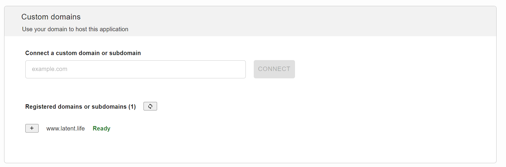
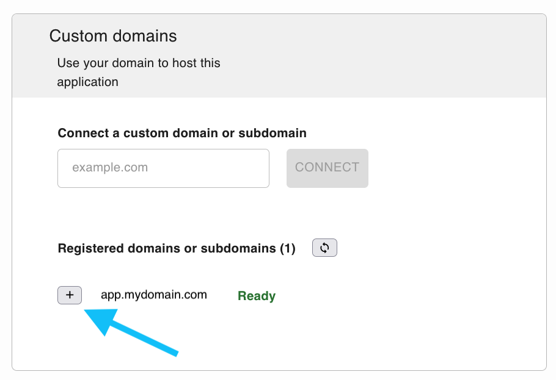
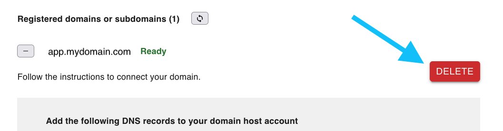
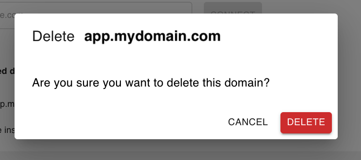
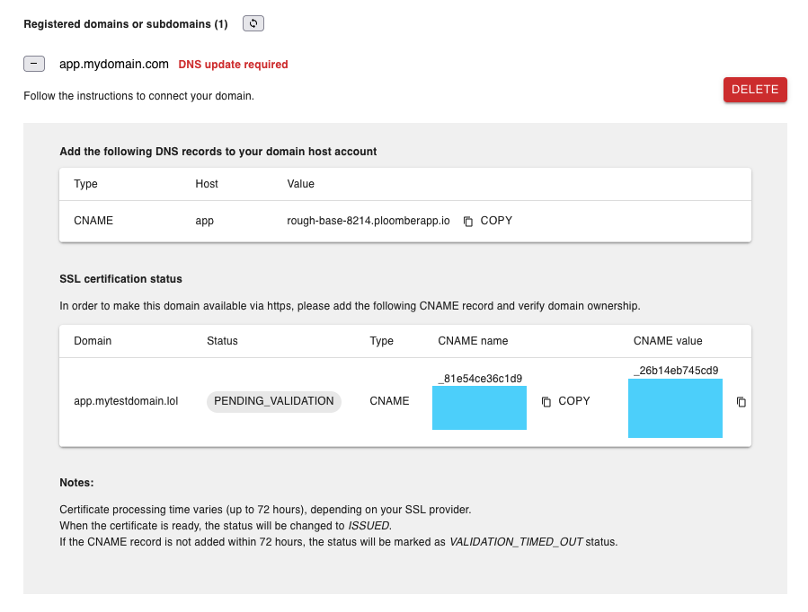
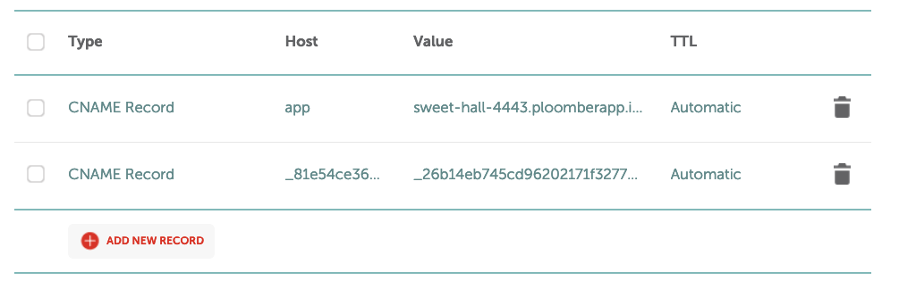
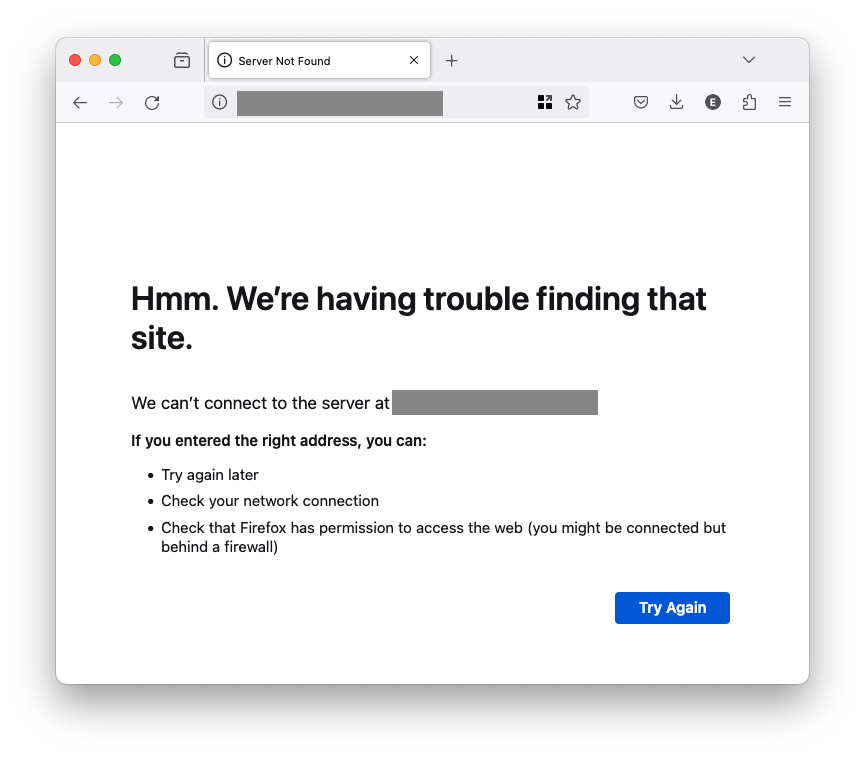
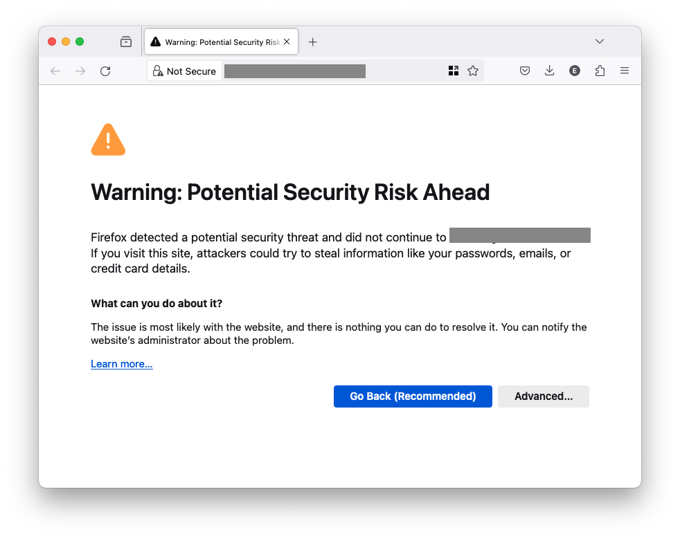

# Custom domains/subdomains

```{important}
Custom domains/subdomains are only available to customers in the Pro, Teams and Enterprise plans.
```

Each application gets a unique URL in the format `project-id.ploomber.app` or `project-id.ploomberapp.io`, where project-id is an automatically generated identifier.

```{important}
We are slowly migrating all new applications to `ploomber.app`, but some existing apps are still on `ploomberapp.io`.
```

You can customize the [`project-id`](custom-ploomber-subdomain) or bring your [own domain](custom-domain) or [custom subdomain](custom-subdomain).

(custom-ploomber-subdomain)=
## `{custom}.ploomber.app` and `{custom}.ploomberapp.io`

If you would like a custom `ploomber.app` or `ploomberapp.io` subdomain, like `my-custom-app.ploomberapp.io`, you can add it during application setup:


(custom-domain)=
## Adding a custom domain

To deploy an app at `yourdomain.com`, ensure it's deployed and available (the **VIEW APPLICATION** button should be enabled):


```{warning}
If your application is not ready and publicly available, the button will be disabled and you won't be able to connect a custom domain to it.
```

Go to the application settings page by clicking on `...` and then, on the **SETTINGS** button:



Next, in the **Custom domains** section, enter your domain, and click **CONNECT**:


A new window will display showing the DNS records you need to add ([see the updating your DNS records](update-dns-records) section for instructions):


```{important}
We are slowly migrating all new applications to `ploomber.app`, but some existing apps are still on `ploomberapp.io`. Make sure your DNS records match the domain associated with your application.
```

You must add three DNS records:

1. A `ALIAS` record: `@` as host, and `yourapp.ploomberapp.io` (or `yourapp.ploomber.app`) as value (replace `yourapp` with your actual app ID)
2. A `CNAME` record: `www` as host, and `yourapp.ploomberapp.io` (or `yourapp.ploomber.app`) as value (replace `yourapp` with your actual app ID)
3. A `CNAME` record: with the shown **CNAME name** and **CNAME value** (as displayed in the **SSL certification status** section)

```{important}
Some DNS providers don't support `ALIAS` records. If that's your case, you might try adding a `CNAME` record. If you
need assistance, [contact us](mailto:contact@ploomber.io)
```

(godaddy-redirect)=
### GoDaddy Redirection

Since GoDaddy doesn't support Alias, as well as a non-IP for the CNAME root domain, you will need to configure a subdomain with www.yourdomain.com and redirect the traffic from your top domain (`yourdomain.com`) to it. To do so:

1. Create a `www` [custom subdomain](custom-subdomain).
2. Update your DNS according to the instructions for this new subdomain `www.yourdomain.com`.
3. Set up a Forwarding Rule to your Subdomain, of type `Permanent (301)` redirect.




```{important}
For this to work, make sure to generate a new **subdomain** for your `www.yourdomain.com`, since the SSL certificate generated for the top domain doesn't cover the www subdomain in case of a redirect.
```

So when looking at the current domain configured for your application, you should see `www.yourdomain.com` and not `yourdomain.com`, as seen below:




(custom-subdomain)=
## Adding a custom subdomain

To deploy an app at `subdomain.yourdomain.com`, you first need to ensure it's deployed and available (the **VIEW APPLICATION** button should be enabled)


```{warning}
If your application is not ready and publicly available, the button will be disabled and you won't be able to connect a custom subdomain to it.
```

Go to the application settings page by clicking on `...` and then, on the **SETTINGS** button:


Next, in the **Custom domains** section, enter the subdomain, for example: `subdomain.yourdomain.com`.


Then, click `CONNECT`:


A new window will display showing the DNS records you need to add ([see the updating your DNS records](update-dns-records) section for instructions):


You must add two records:

1. `CNAME` record: the subdomain you want to add as the host (e.g., if you want to connect `subdomain.yourdomain.com`, then, you must enter `subdomain`) and `yourapp.ploomberapp.io` (or `yourapp.ploomber.app` dependending on your application domain) as value (where `yourapp` is the ID assigned to your application)
2. `CNAME` record: with the shown **CNAME name** and **CNAME value** (as displayed in the **SSL certification status** section)


(update-dns-records)=
## Updating DNS records

```{note}
If you have issues modifying your DNS records, send us an email ([contact@ploomber.io](mailto:contact@ploomber.io)) and we'll help you. You might also check the [troubleshooting](troubleshooting-dns) section.
```

To modify your DNS records, follow these instructions (they apply to Namecheap but they're similar for other DNS providers):

1. Log in to your [Namecheap account](https://www.namecheap.com/)

2. Click `Domain List` tab and then click `Manage` button next to your domain


3. Click `Advanced DNS`


4. Add the relevant DNS records, and click `Save all changed`.

You should be able to see something like this:


```{important}
Depending on your DNS provider (e.g. namecheap), you might need to modify the CNAME
record displayed for the SSL certificate. You'll see something like this
in the CNAME name: `LONGSTRING.example.com.` or `LONGSTRING.subdomain.example.com.`,
if you encounter errors, remove the root domain from the value. (see this
[stack overflow](https://stackoverflow.com/a/63246970/709975) question to learn more)
```


```{important}
DNS record changes might take up to 48 hours to take effect. In the meantime, your application will be accessible from the `ploomber.app` or `ploomberapp.io` URL
```

## Moving an existing domain/subdomain to another app

If you configured an app with a custom domain/subdomain and you want to move to another
app, follow these instructions.

First, go to the app that has the domain/subdomain configured and click on the `+` button:



Click on `DELETE`:



Confirm deletion:



Now, go to the new app and register the domain/subdomain, this will display the DNS
records:



Finally, update your DNS records. In this example, we've migrated a subdomain
(`app.mydomain.com`), you
can see that this requires me to add 2 DNS records. This is how my DNS records
look:





Since I've configured the old app (`sweet-hall-4443`) with the given subdomain, I'll have to update the
existing CNAME record where `Host=app` (the first record), so it matches the ID of my
new app (`rough-base-8214`).

(troubleshooting-dns)=
## Troubleshooting DNS errors

These are the most common errors.

### Server Not Found



You'll see this error if you're missing the DNAME record that points from your domain (or subdomain) to the  `ID.ploomber.app` or `ID.ploomberapp.io` URL (depending on your application domain), ensure you add it. Give it some time since DNS records take some time to update. If issues persist, contact us at [contact@ploomber.io](mailto:contact@ploomber.io).


### Potential Security Risk Ahead



If you see this error (or a related one), it's most likely because you're missing the CNAME record to emit the SSL certificate:


Ensure you add it and give it some time since DNS records take some time to update. If issues persist, contact us at [contact@ploomber.io](mailto:contact@ploomber.io).

## Configuring a CAA record

Note that Ploomber Cloud uses AWS for generating and issuing certificates. If you are using a DNS registrar that doesn't allow Amazon to issue certificates from their side (e.g., Hostinger), you need to configure Certification Authority Authorization (CAA) DNS records.
A Certification Authority Authorization ([CAA](https://docs.aws.amazon.com/acm/latest/userguide/setup-caa.html)) DNS record specifies that AWS Certificate Manager (ACM) is allowed to issue a certificate for your domain or subdomain.

Here are the records that you need to add:

```text
Type: CAA
Name: @
Flag: 0
Tag: issue
CA domain: "amazon.com"
TTL: 60
```

```text
Type: CAA
Name: @
Flag: 0
Tag: issuewild
CA domain: "amazon.com"
TTL: 60
```
