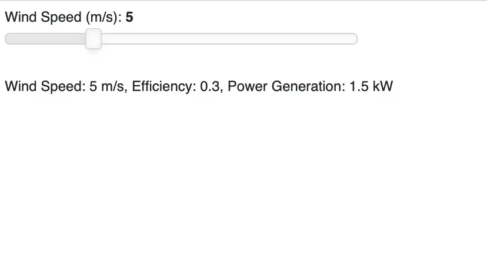

# Dockerfile Essentials

You may deploy your application as a [Docker](../apps/docker.md) application for more flexibility. Refer to this [section](../faq/faq.md#customize-deployment) to learn how Docker deployments can help.

Here are some tips on writing a good `Dockerfile` for Python applications:

* **Use a Minimal Base Image**: Whenever possible, opt for a minimal base image to reduce the size of your Docker image, e.g., `python:3.11-slim-bookworm`.
* **Set the Working Directory**: Use the `WORKDIR` instruction to set the working directory inside the Docker image. This simplifies subsequent commands and ensures that relative paths are resolved correctly.
* **Leverage layer caching**: Docker caches each step (or layer) to speed up subsequent builds. When a step changes, the cache will be invalidated not only for that particular step but all succeeding steps. It's important to keep the files that frequently change towards the end of the Dockerfile. Since the dependencies are unlikely to change very often, installing the dependencies step should be added before copying the application files. Here's an example:

```Dockerfile
COPY requirements.txt /srv/
RUN pip install -r requirements.txt --no-cache-dir

COPY . /srv
```
* **Prefer `COPY` over `ADD`**: According to Docker's official documentation, it is recommended to prioritize the use of `COPY` over `ADD` due to its clearer and simpler functionality.
* **Array Over String Syntax**: As per the [Docker documentation](https://docs.docker.com/compose/faq/#why-do-my-services-take-10-seconds-to-recreate-or-stop) make sure you're using the exec form of `CMD` and `ENTRYPOINT` in your Dockerfile. So, `CMD ["voila", "--port=80", "--no-browser", "app.ipynb", "--Voila.ip='0.0.0.0'"]` is preferable over `CMD "voila --port=80 --no-browser app.ipynb --Voila.ip='0.0.0.0'"`.
* **CMD vs ENTRYPOINT**: Both these instructions define what command gets executed when running a container. The `ENTRYPOINT` specifies a command that will always be executed when the container starts. The `CMD` specifies arguments that will be fed to the `ENTRYPOINT`. For more details refer to the [documentation](https://docs.docker.com/reference/dockerfile/#understand-how-cmd-and-entrypoint-interact).
* **Do not store secrets in images**: Do not add secrets to your Dockerfiles in plaintext, e.g., `ENV DATABASE_PASSWORD "SomethingSuperSecret"`. Refer to the guide on [secrets](./secrets.md) to learn about securely setting secrets.

## Examples

::::{grid} 2 2 3 3
:class-container: text-center
:gutter: 2

:::{grid-item-card} Panel
[](https://github.com/ploomber/doc/tree/main/examples/panel/docker-based)
:::

:::{grid-item-card} Streamlit
:link: https://github.com/ploomber/doc/tree/main/examples/streamlit/docker-based

:::

:::{grid-item-card} Solara
:link: https://github.com/ploomber/doc/tree/main/examples/solara/docker-based

:::

:::{grid-item-card} Voila
[](https://github.com/ploomber/doc/tree/main/examples/voila/docker-based)
:::


::::
