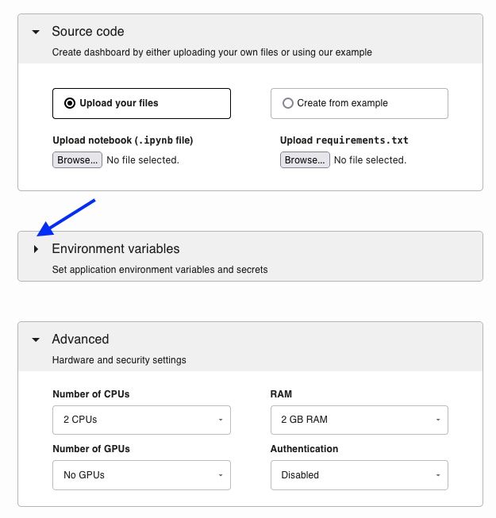
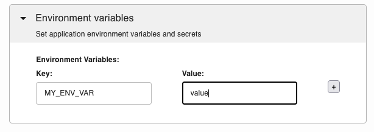
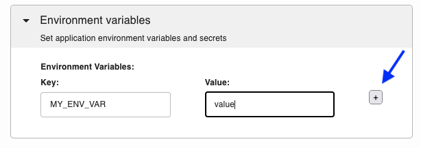

# Environment variables

If your application requires environment variables, you can define them when
deploying it. To expand the section click on the triangle to the left:





Then, add the environment variables keys and values:



To add more, click on the button to the right:




```{Note}
You can also define environment variables using the [command-line interface.](./cli.md#-defining-environment-variables)
```

## Reading variables

To read the variables, use the following Python code:

```python
from os import environ

value = environ.get("MY_ENV_VAR")

if value is None:
    print("MY_ENV_VAR is undefined!")
else:
    print(f"MY_ENV_VAR: {value}")
```


A complete example is available [here.](https://github.com/ploomber/doc/blob/main/examples/voila/env-variable/app.ipynb)