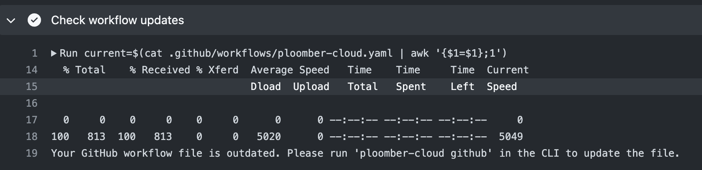

# GitHub deployment

You can use GitHub Actions to deploy your project on each push.

(set-key)=
## Set Github secret

First, you need to get your [API key](../quickstart/apikey.md). Once you have the API
key, you need to store it as a GitHub secret in your repository:


## Initialize project

Then, install the CLI:

```sh
# install package
pip install ploomber-cloud
```

And set the API key locally:

```sh
ploomber-cloud key YOURKEY
```

Now, configure your project:

```sh
ploomber-cloud init
```

`init` will create a `ploomber-cloud.json` file. For more information on the `init` command, see [](../user-guide/cli.md)

(monitor)=
## Configure and monitor Github actions

Now, configure GitHub actions by adding [this YAML file](https://github.com/edublancas/cloud-template/blob/main/.github/workflows/ploomber-cloud.yaml) in `.github/workflows/ploomber-cloud.yaml`

Finally, commit and push the new files:

```sh
# commit ploomber cloud and github actions config files
git add ploomber-cloud.json .github/workflows/ploomber-cloud.yaml
git commit -m 'configure github actions deployment'
git push
```

Once you push, you can monitor progress from GitHub. First, go to the actions section:


Then, click on the most recent run, and you'll see the logs:


In the logs, you will see updates on the progress of the deployment. You'll also see a URL to your project dashboard where you can check its status.
Once the deployment has succeeded, it will return a URL to view your deployed project.

If you would prefer to track progress only through the project dashboard, you can remove `--watch` from the `deploy` command in your `ploomber-cloud.yaml`:

```yaml
 - name: Deploy
        env:
          PLOOMBER_CLOUD_KEY: ${{ secrets.PLOOMBER_CLOUD_KEY }}
        run: |
          ploomber-cloud deploy # removed '--watch' here
```

Removing `--watch` means deployment updates won't be output to the logs, but you will still be able to track its progress through the URL.

Without `--watch`, the logs will look like this:


If the workflow template has been updated you will be notified the same in the logs:



A complete sample project is [available here.](https://github.com/edublancas/cloud-template)

## Configure action through CLI

If your project is already hosted on GitHub, running `ploomber-cloud github` inside your repository folder will prompt for configuring a GitHub action for project deployment.
On confirming with `y` the CLI will create a `ploomber-cloud.yaml` file in the path `.github/workflows`.
Ensure that the Ploomber Cloud API Key is set as described in [this section](set-key).

```bash
Please confirm that you want to generate a GitHub workflow file [y/N]: y
'ploomber-cloud.yaml' file created in the path .github/workflows.
Please add, commit and push this file along with the 'ploomber-cloud.json' file to trigger an action.
For details on configuring a GitHub secret please refer: https://docs.cloud.ploomber.io/en/latest/user-guide/github.html
```

In order to trigger an action for deploying the project using GitHub actions you need to add, commit and push this file along with the `ploomber-cloud.json`.

Once done, you can monitor progress as discussed [above](monitor).

In case the [workflow template](https://github.com/edublancas/cloud-template/blob/main/.github/workflows/ploomber-cloud.yaml) has been updated, running `ploomber-cloud github` will prompt user to confirm updating the file:

```bash
Please confirm that you want to update the GitHub workflow file [y/N]:
```

On confirming with `y` the CLI will replace the workflow file with the updated one.

Additionally, users are also notified of GitHub workflow file creation or updation as needed while initializing or deploying a project.

If no workflow file is present, running `ploomber-cloud init` or `ploomber-cloud deploy` display the following information:

```bash
You may create a GitHub workflow file for deploying your application by running 'ploomber-cloud github'.
To learn more about GitHub actions refer: https://docs.cloud.ploomber.io/en/latest/user-guide/github.html
```

If workflow needs update a relevant message will be displayed:

```bash
Please confirm that you want to update the GitHub workflow file [y/N]:
```

Please review the workflow file and update if needed.

