# GitHub deployment

You can use GitHub Actions to deploy your project on each push.

(set-key)=
## Set GitHub secret

First, you need to get your [API key](../quickstart/apikey.md). Once you have the API
key, you need to store it as a GitHub secret in your repository:


## Initialize project

Then, install the CLI:

```sh
# install package
pip install ploomber-cloud
```

And set the API key locally:

```sh
ploomber-cloud key YOURKEY
```

You can also set your API key by setting the environment variable:

```sh
export PLOOMBER_CLOUD_KEY=YOURKEY
```

Now, configure your project:

```sh
ploomber-cloud init
```

`init` will create a `ploomber-cloud.json` file. For more information on the `init` command, see [](../user-guide/cli.md)

(monitor)=
## Configure and monitor GitHub actions

Now, configure GitHub actions by adding [this YAML file](https://github.com/edublancas/cloud-template/blob/main/.github/workflows/ploomber-cloud.yaml) in `.github/workflows/ploomber-cloud.yaml`

Finally, commit and push the new files:

```sh
# commit ploomber cloud and github actions config files
git add ploomber-cloud.json .github/workflows/ploomber-cloud.yaml
git commit -m 'configure github actions deployment'
git push
```

Once you push, you can monitor progress from GitHub. First, go to the actions section:

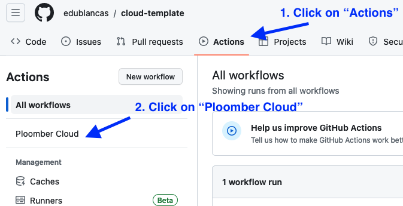

Then, click on the most recent run, and you'll see the logs:

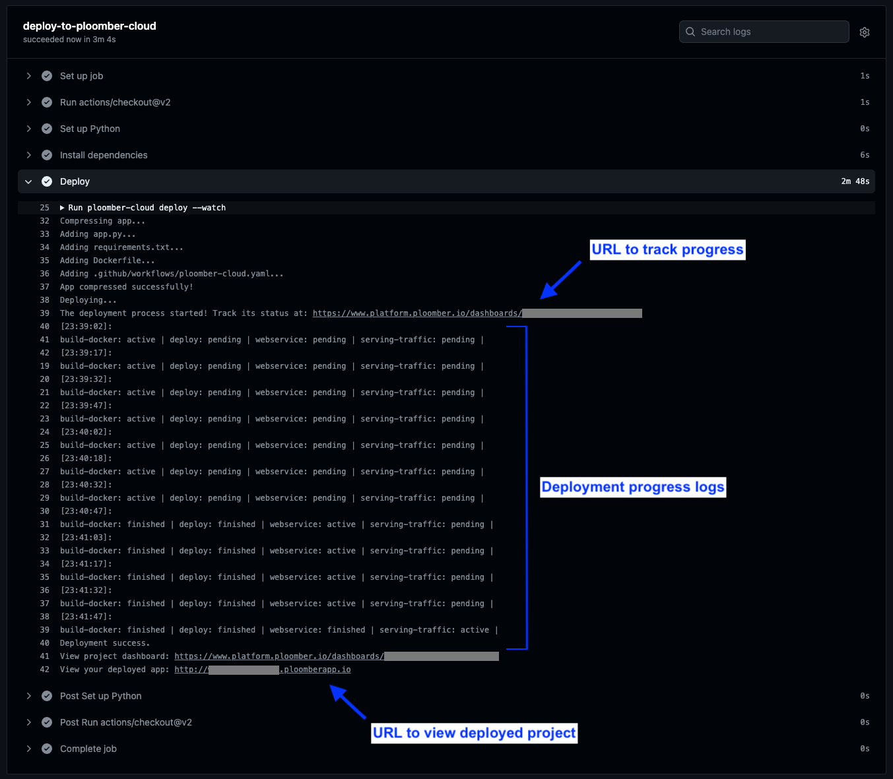

In the logs, you will see updates on the progress of the deployment. You'll also see a URL to your application where you can check its status.
Once the deployment has succeeded, it will return a URL to view your deployed project.

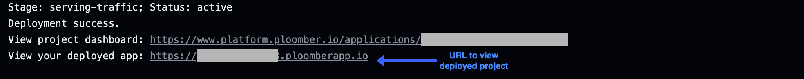

If you would prefer to track progress only through the application UI, you can remove `--watch-incremental` from the `deploy` command in your `ploomber-cloud.yaml`:

```yaml
 - name: Deploy
        env:
          PLOOMBER_CLOUD_KEY: ${{ secrets.PLOOMBER_CLOUD_KEY }}
        run: |
          ploomber-cloud deploy # removed '--watch-incremental' here
```

Removing `--watch-incremental` means deployment updates won't be output to the logs, but you will still be able to track its progress through the URL.

Without `--watch-incremental`, the logs will look like this:

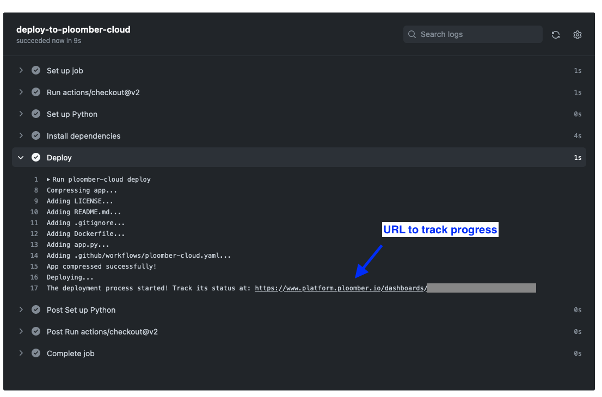

A complete sample project is [available here.](https://github.com/edublancas/cloud-template)

## Configure action through CLI

If your project is already hosted on GitHub, running `ploomber-cloud github` inside your repository folder will prompt configuring a GitHub action for project deployment.
On confirming with `y` the CLI will create a `ploomber-cloud.yaml` file in the path `.github/workflows`.
Ensure that the Ploomber Cloud API Key is set as described in [this section](set-key).

```bash
Please confirm that you want to generate a GitHub workflow file [y/N]: y
'ploomber-cloud.yaml' file created in the path .github/workflows.
Please add, commit and push this file along with the 'ploomber-cloud.json' file to trigger an action.
For details on configuring a GitHub secret please refer: https://docs.cloud.ploomber.io/en/latest/user-guide/github.html
```

To trigger an action for deploying the project using GitHub actions you need to add, commit and push this file along with the `ploomber-cloud.json`.

Once done, you can monitor progress as discussed [above](monitor).

In case the [workflow template](https://github.com/edublancas/cloud-template/blob/main/.github/workflows/ploomber-cloud.yaml) has been updated, running `ploomber-cloud github` will prompt the user to confirm updating the file:

```bash
Please confirm that you want to update the GitHub workflow file [y/N]:
```

On confirming with `y` the CLI will replace the workflow file with the updated one.

Additionally, users are also notified of GitHub workflow file creation or updation as needed while initializing or deploying a project.

If no workflow file is present, running `ploomber-cloud init` or `ploomber-cloud deploy` would display the following information:

```bash
You may create a GitHub workflow file for deploying your application by running 'ploomber-cloud github'.
To learn more about GitHub actions refer: https://docs.cloud.ploomber.io/en/latest/user-guide/github.html
```

If workflow needs an update a relevant message will be displayed:

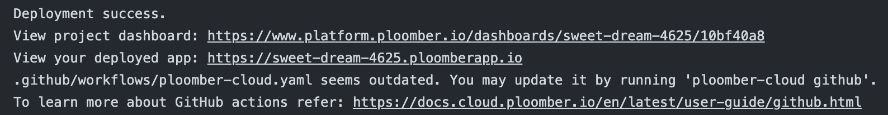

Please review the workflow file and update if needed.

## Secrets

To avoid uploading an `.env` file to GitHub, you may define them in your `ploomber-cloud.json` and Ploomber Cloud will read them from your repository secrets. Here are the steps:

1. List the secret keys in `ploomber-cloud.json` under `secret-keys`
2. Set the secrets in your GitHub repository and define them in your `ploomber-cloud.yaml` file
3. Push your code to deploy

For example, if you had two secrets, `key1` and `key2`, you should edit your `ploomber-cloud.json` to look like this:

```json
{
  "id": "project-id-1999",
  "type": "project-type",
  "secret-keys": ["key1", "key2"]
}
```

Set `key1` and `key2` as secrets in your GitHub repository using the same method you did for your [API key.](#set-github-secret) Now make sure to define them in your `ploomber-cloud.yaml` file. Here's an example snippet:

```yaml
- name: Deploy
    env:
      PLOOMBER_CLOUD_KEY: ${{ secrets.PLOOMBER_CLOUD_KEY }}
      key1: ${{ secrets.key1 }}
      key2: ${{ secrets.key2 }}
    run: |
      ploomber-cloud deploy --watch-incremental
```

Finally, push your code. In your deployment logs, when `ploomber-cloud deploy` is ran, you should see the secrets included with this message:

```
Adding the following secrets to the app: key1, key2,
```

Some important notes:

- `secret-keys` should be defined as a list of strings that only includes the keys (not the values) of each secret
- If your secrets are defined in both an `.env` and `secret-keys`, the deployment will fail. You may only use one method.
- Make sure to define each secret in GitHub, mention it in `ploomber-cloud.yaml`, AND mention it in `ploomber-cloud.json`. 
    - If a secret is defined in `ploomber-cloud.json` but isn't set as a GitHub secret, the deployment will fail. 
    - If a secret is set in GitHub but isn't defined in `ploomber-cloud.json`, that secret won't be included in the deployment.


## Deployment environments

For simple scenarios, you can opt for the basic deployment strategy outlined in [this section](monitor).
If you need separate deployment environments with their own protection rules and secrets, you can use GitHub [environments](https://docs.github.com/en/actions/deployment/targeting-different-environments/using-environments-for-deployment).
Here's a step-by-step guide to configuring two environments `dev` and `prod`. `dev` deployments happen automatically whenever code changes are pushed to the `main` branch. However, `prod` deployments are started only when `dev` deployments are successful and the deployment has been approved by a reviewer.


### Create environment

Navigate to the repository `Settings` page and then `Environments`. Click on `New Environment`:

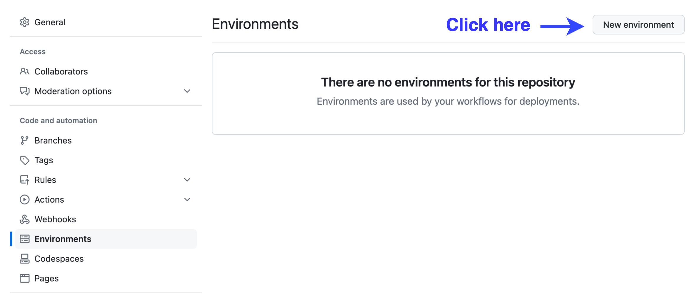

Name the environment as `prod` and click on `Configure environment`:

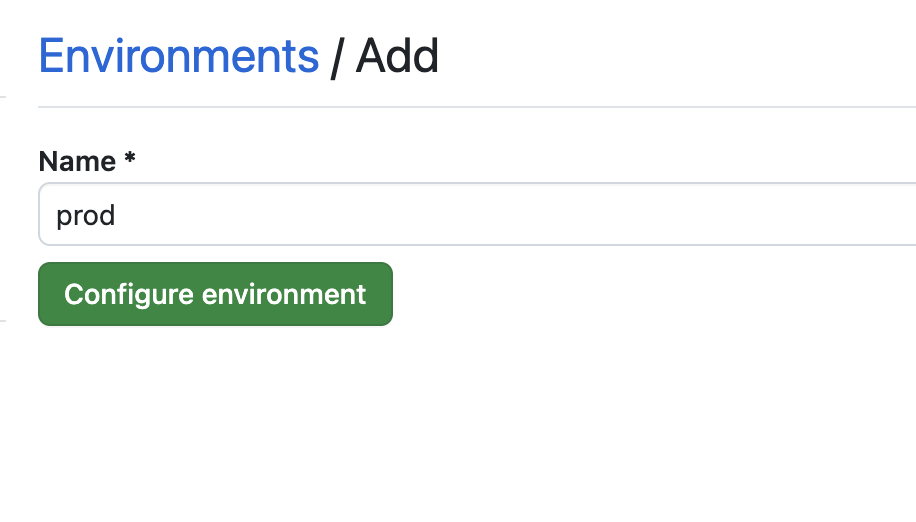

Add usernames of reviewers who can approve the production deployments:

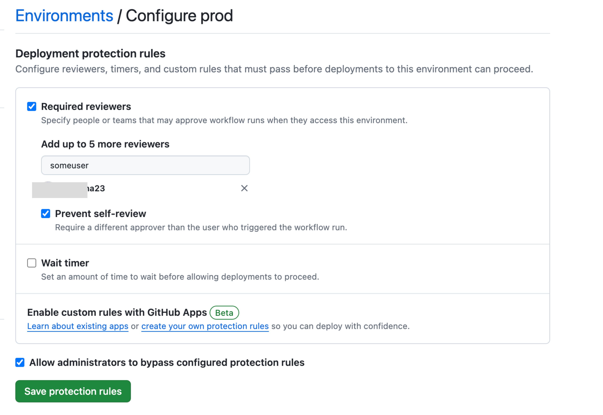

You also need to add the `PLOOMBER_CLOUD_KEY` as an environment secret. Refer to the [API key](../quickstart/apikey.md) guide for more information.

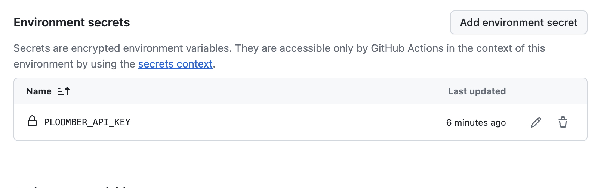

Once the environment is configured it should look like this:

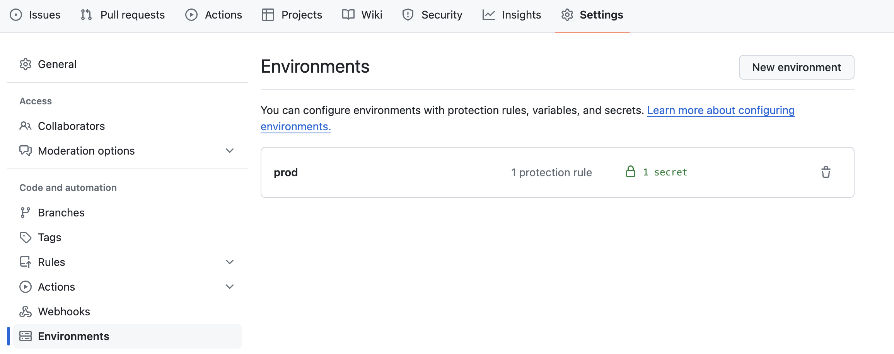

### Configuration files

Next we will create two separate config files `ploomber-cloud.dev.json` and `ploomber-cloud.prod.json`:

```sh 
ploomber-cloud init --config ploomber-cloud.dev.json
```

```sh 
ploomber-cloud init --config ploomber-cloud.prod.json
```

You may configure special resources for the production environment by running:

```sh 
ploomber-cloud resources
```

To learn more about configuration files click [here](https://docs.cloud.ploomber.io/en/latest/user-guide/cli.html#switching-the-configuration-file).

### Configure deployment

Next, we will configure `dev` and `prod` deployments by adding a workflow file to the path `.github/workflows` in the repository's root folder. You can use this [template](https://github.com/edublancas/cloud-template/blob/main/.github/workflows/ploomber-cloud-env.yaml).
We have added two jobs for `dev` and `prod` respectively for demonstration purposes. But you may add as many jobs as needed, one for each environment.
If you create config files with different names ensure to pass them correctly using the `--config` flag.

Once the workflow file has been pushed to GitHub, the `dev` deployment will be triggered. If the `dev` deployment is completed successfully, the `prod` deployment will be marked for approval from reviewers.

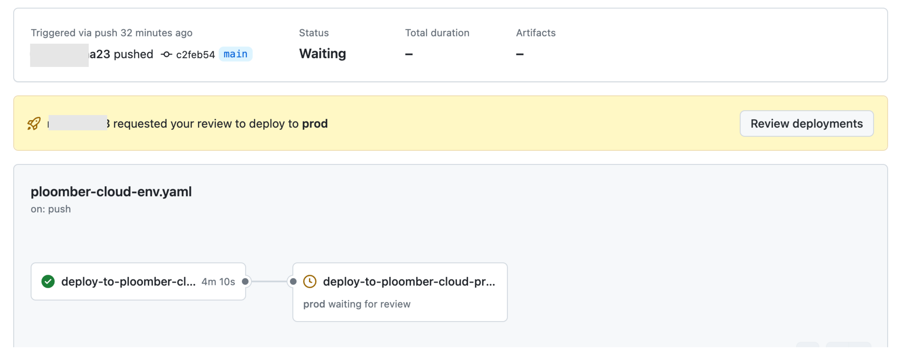

The reviewer needs to click on `Approve and Deploy` for the deployment to get triggered.

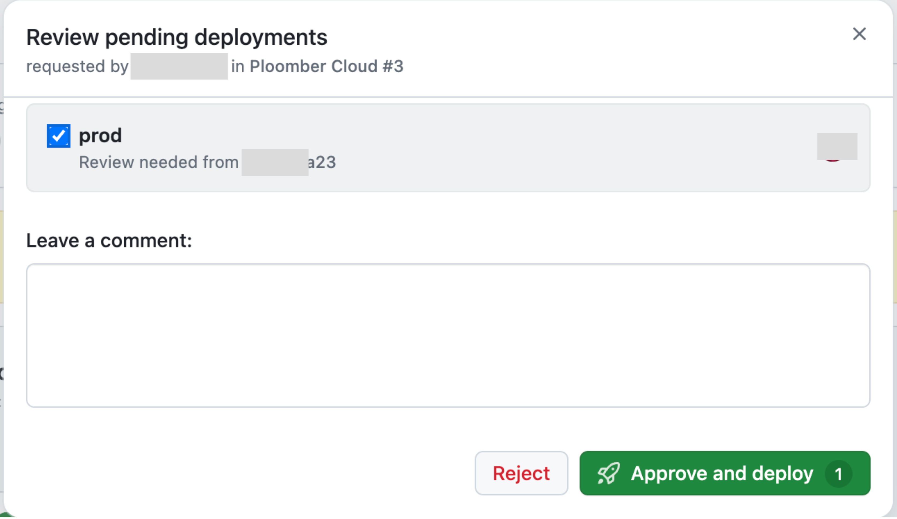


