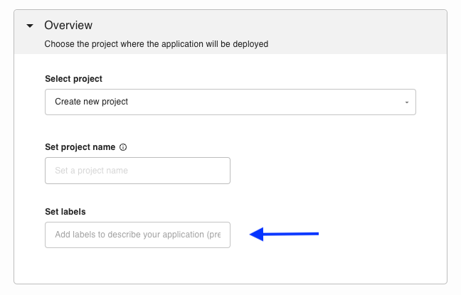
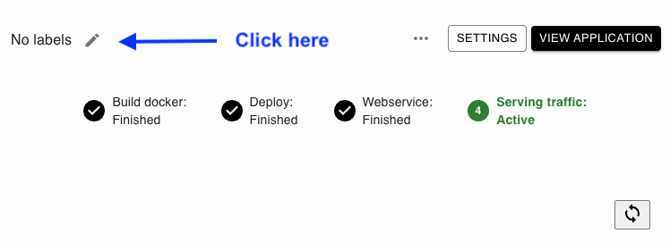
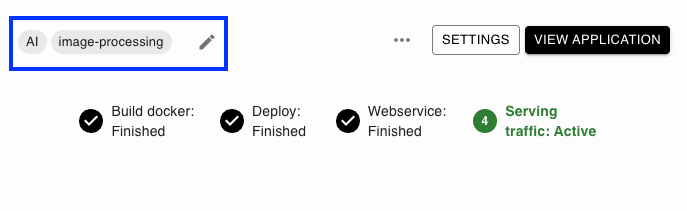
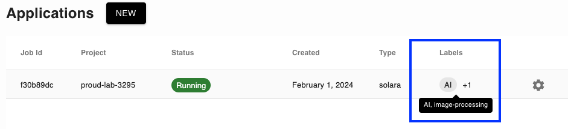
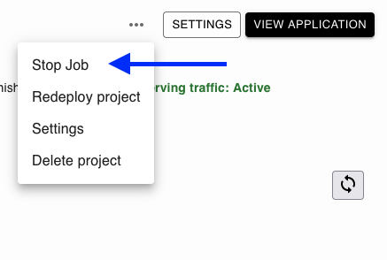

# Managing applications

## Labels

Labels can help you organize and identify your apps. You can add them during creation:

Or add them from the application status page:

You may add as many labels as you want. Once you've added some labels, they will show up on the status page and the main Applications page:

(stop-application)=
## Stop application

If you want to stop your application, you can do so by opening the detailed view, clicking in the three dots (`...`) and then `Stop Job`:

