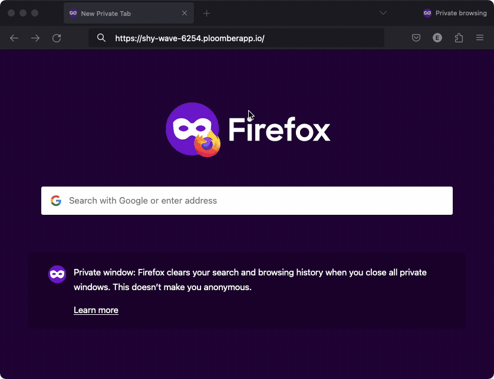
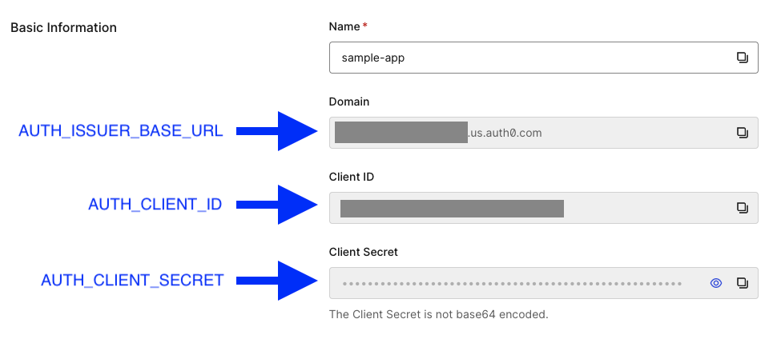
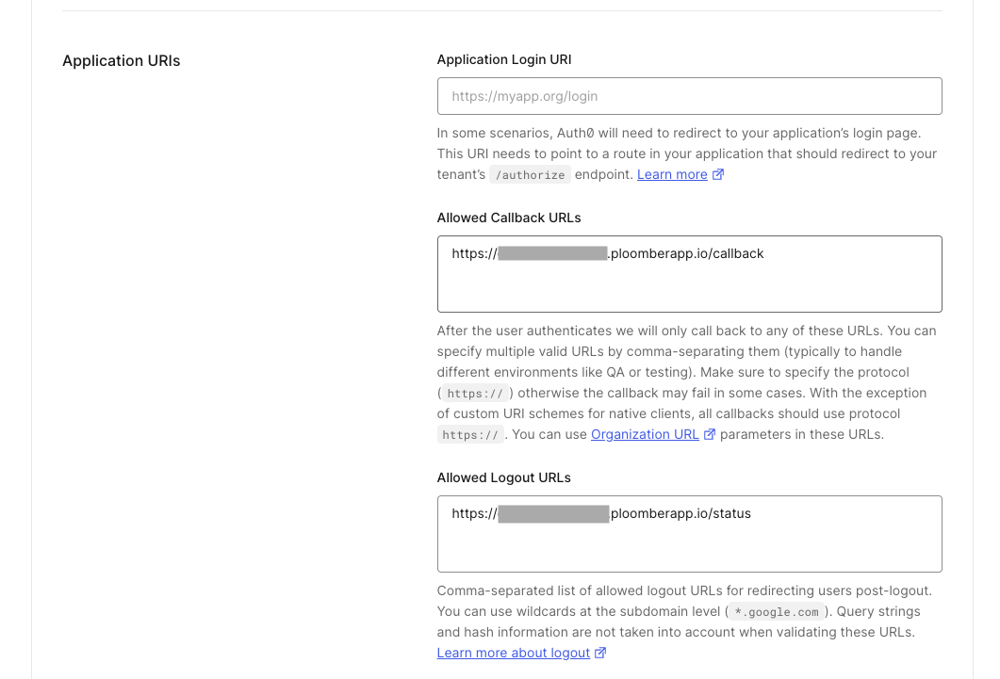
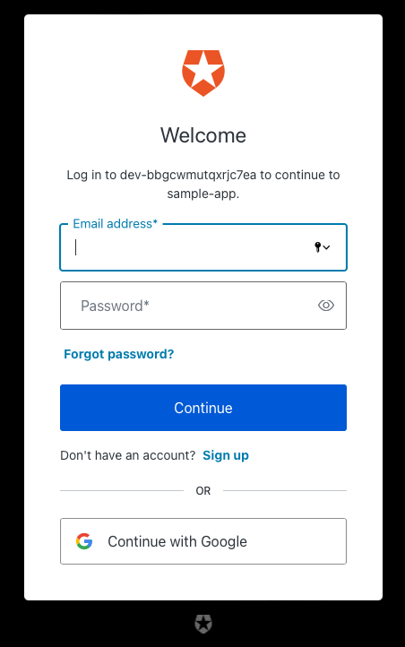

# Password protection

```{important}
Password protection is only available for Pro users.
```

Ploomber Cloud allows you to protect your apps with a password; our solution is
compatible with most web frameworks.



```{note}
To enable password protection for Chainlit apps, see [here.](../apps/chainlit.md)
```

To enable it, simply turn the option on and set a user and a password:


```{important}
Your password isn't visible after deployment so write it down!
```


## Auth0 authentication

```{important}
The Auth0 integration is only available for customers in the Teams plan. If you're
interested in learning more, contact us at [contact@ploomber.io](mailto:contact@ploomber.io)
```

The password protection feature allows a single set of credentials
(username and password); for a more scalable authentication solution, we provide
an integration with [Auth0](https://auth0.com/). The authentication layer is
transparent to your application (there is no need to modify your code), and you
only need to supply your Auth0 configuration parameters.

### Using the CLI

To configure Auth0 via the CLI, navigate to the folder where your project files are and make sure you've set your [API key.](../quickstart/apikey.md) Now run:

```sh
ploomber-cloud templates auth0
```

The Auth0 template requires your project to be initialized. If it hasn't been initialized yet, you can initialize it on the spot. You should see something like this:

```sh
Project must be initialized to continue. Would you like to initialize? [y/N]: y
Initializing new project...
Inferred project type: 'your-project-type'
Is this correct? [y/N]: y
Your app 'project-name-1999' has been configured successfully!
To configure resources for this project, run 'ploomber-cloud resources' or to deploy with default configurations, run 'ploomber-cloud deploy'
```

If your project has already been initialized, you won't see this. You'll then be prompted to enter three credentials from Auth0:

1. `AUTH_SECRET`
2. `AUTH_CLIENT_ID`
3. `AUTH_ISSUER_BASE_URL`

These can be obtained from your Auth0 application page. If you haven't yet created an application, log into Auth0 and create one. Then find the credentials here:



Once you've entered your credentials, you should see a confirmation like this:

```sh
Successfully configured auth0. To deploy, run 'ploomber-cloud deploy'
```

```{note}
If you already created an `.env` file, these credentials have been be saved there (along with your other secrets). If you haven't, one has been be created for you with the credentials saved.
```

Now, run `ploomber-cloud deploy` to deploy your project.

### Set /callback and /status URLs

Almost done! We just need to set the `callback` and `logout` URLs for your Auth0 app. Navigate to your Ploomber project's application page and copy the application URL. It should look like `https://application-name-1999.ploomberapp.io`.

Now, go back to the Auth0 application page and scroll down to `Application URIs`. Set these values:

- Allowed Callback URLs: `https://application-name-1999.ploomberapp.io/callback`
- Allows Logout URLs: `https://application-name-1999.ploomberapp.io/status`

It should look like this:



```{tip}
If you ever re-initialize and deploy your app under a different name, you'll have to update these URLs.
```

You're all set! Once your application has finished deploying, click `View Application`. You should be met with Auth0 authentication:



Simply login and you'll be re-directed to your application.


