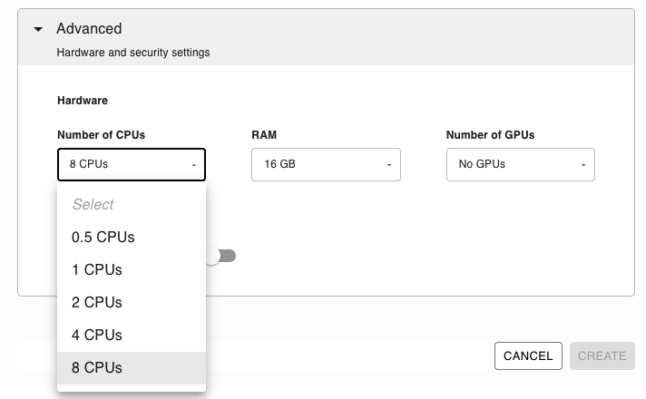
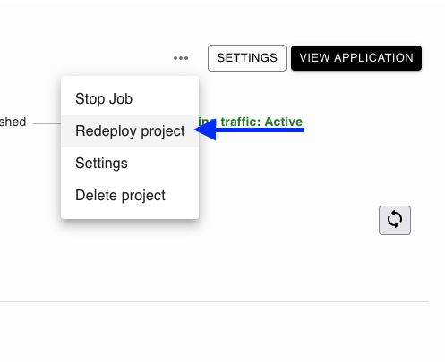

# Provisioning resources

```{important}
Some resources are billed per-second so ensure you only provision the resources you
need.
```

When deploying an application for the first time, you can choose how many CPUs and
RAM you want to provide.



## Updating an existing application

If you want to increase or reduce the resources provisioned for an existing application, open the detailed view, click on the three dots (`...`) next to the `ANALYTICS REPORT` button and then click on `Redeploy Application`:



You'll need to provide the source code again. In the last section, you'll be able to choose the resources to provision.

## Configure via the CLI

To configure resources via the command-line interface, first set your API key and initialize your project:

```sh
ploomber-cloud key YOURKEY
ploomber-cloud init
```

Then simply run:

```sh
ploomber-cloud resources
```

Finally deploy your project and see that your resources have been customized:

```sh
ploomber-cloud deploy --watch
```

For more info on configuring resources in the CLI, [click here](../user-guide/cli.md#configure-resources)