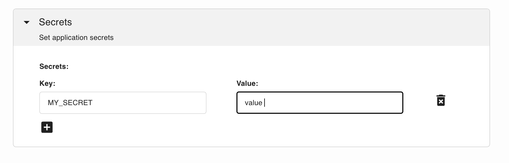
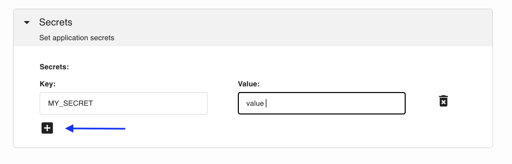

# Secrets

```{tip}
You can safely store API keys as secrets as all values are encrypted.
```

If your application requires secrets, you can define them when
deploying it. To expand the section click on the triangle to the left:


Then, add the secrets keys and values:



To add more, click on the button below:




```{tip}
You can also define secrets using the [command-line interface.](./cli.md)
```

## Reading secrets

To read the secrets, use the following Python code:

```python
from os import environ

value = environ.get("MY_SECRET")

if value is None:
    print("MY_SECRET is undefined!")
else:
    print(f"MY_SECRET: {value}")
```


A complete example is available [here.](https://github.com/ploomber/doc/blob/main/examples/voila/env-variable/app.ipynb)