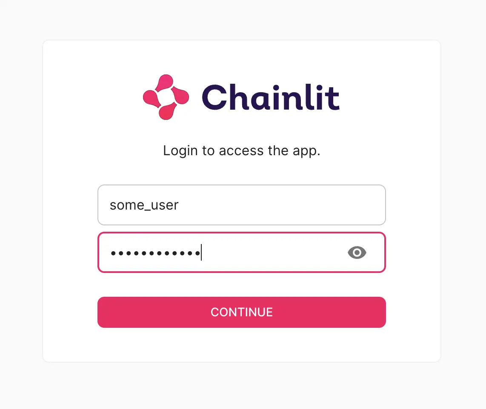

# Chainlit with password

A Chainlit application with user authentication.



## Environment setup

Run the below command to generate a JWT secret:

```bash
chainlit create-secret
```

Copy the generated secret into a `.env` file.

Set environment variables for username and password:

```bash
export CHAINTLIT_USERNAME=<username>
export CHAINTLIT_PASSWORD=<password>
```

## Testing locally

Run the below command to start the up and provide the credentials set in the above step:

```bash
chainlit run app.py 
```