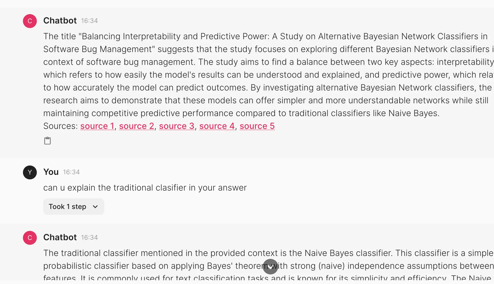

# Chat with PDF

A Chainlit application for chatting with a PDF file.



## Set key

To run this example you need to set the `OPENAI_API_KEY` environment variable.

```bash
export OPENAI_API_KEY=<your_api_key> 
```

## Testing locally

Run the below command to start the app:

```bash
chainlit run app.py 
```

## Deployment

* Create a zip of `app.py`, `chainlit.md`, `requirements.txt` and `Dockerfile`.
* Follow the instructions for deploying a [Chainlit](https://docs.cloud.ploomber.io/en/latest/apps/chainlit.html) application.
* You also need to set a couple of [environment variables](https://docs.cloud.ploomber.io/en/latest/user-guide/secrets.html) while deploying the application.
    * `OPENAI_API_KEY`
    * `PLOOMBER_CLOUD_KEY`: Refer to [documentation](https://docs.cloud.ploomber.io/en/latest/quickstart/apikey.html)