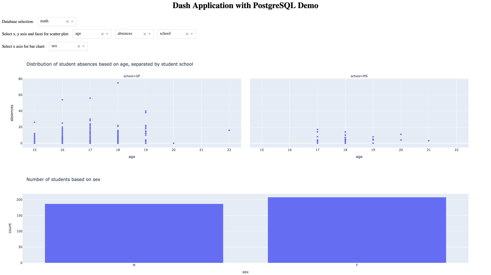

# Dash App Connected to PostgreSQL Database

Interactive Dash Application, connected to PostgreSQL database.



## Set up local testing environment
To use the app, store the below information locally into your `.env` for `upload.py`. These variables can be found on the `Parameters only` section under `connection details` from your [Neon](https://console.neon.tech/) PostgreSQL dashboard.
```
PGHOST='YOUR_HOST'
PGDATABASE='test'
PGUSER='test_owner'
PGPASSWORD='your_password'
```

Run `python -m pip install -r requirements.txt` to install all necessary packages.

## Upload dataset to your Postgres server
Run `python upload.py` locally to upload the datasets to your PostgreSQL.

## Local testing
Run `python app.py`. You should be able to access the app on your localhost at port 8000.

## Upload to Ploomber Cloud
Compress and upload the below files for deployment. Make sure to specify the above environment variables in your [secrets](https://docs.cloud.ploomber.io/en/latest/user-guide/secrets.html). For more details, please check our tutorial on how to deploy a [Dash application](https://docs.cloud.ploomber.io/en/latest/apps/dash.html)
- app.py
- assets/style.css
- requirements.txt
