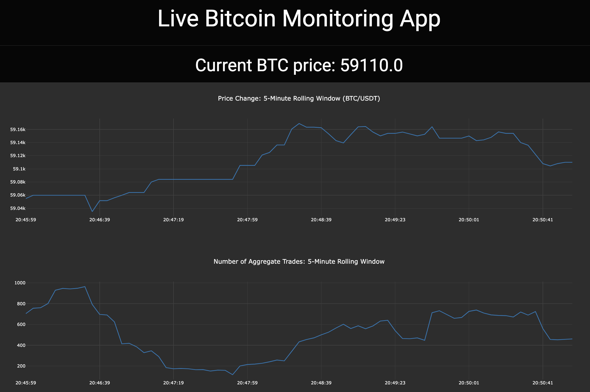
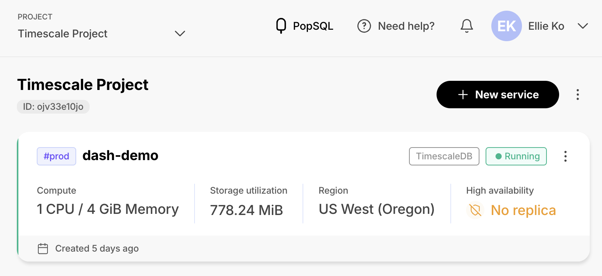
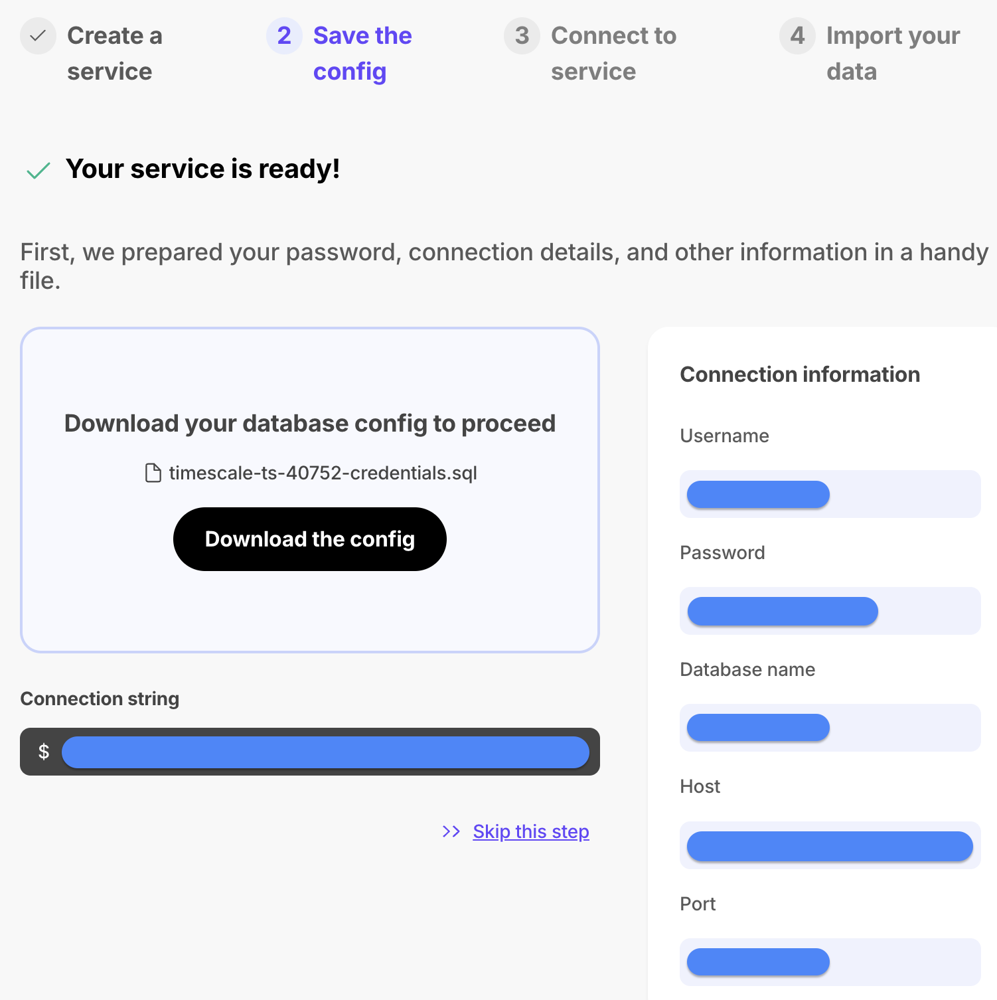
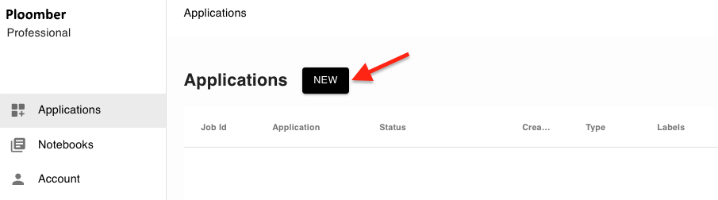
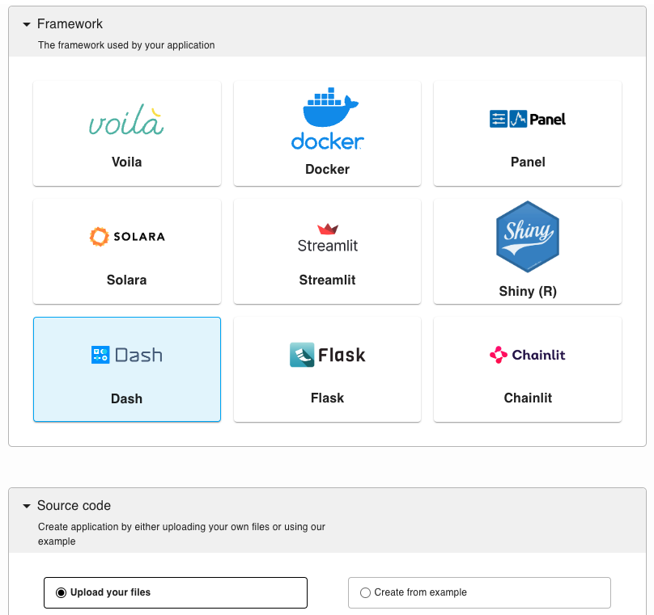
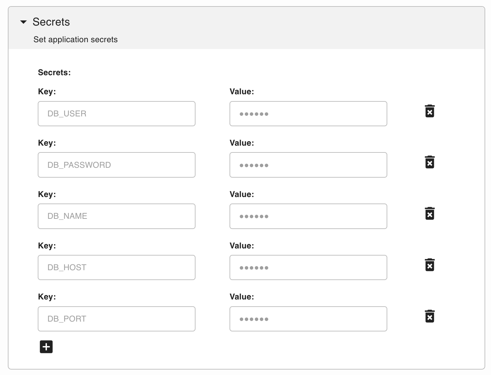

# Real-Time Bitcoin Monitoring App with Dash and WebSocket API 

Explore how to display real-time, time-series data using Dash and a PostgreSQL extension, TimescaleDB, to dynamically update Bitcoin prices and aggregate trades fetched via the Binance WebSocket API.



## Architecture
Our Bitcoin trade monitoring app consists of two main components:

- **Backend (Data Fetching and Storage)**: This component connects to the [Binance WebSocket API](https://developers.binance.com/docs/binance-spot-api-docs/web-socket-streams) to receive real-time trade data for Bitcoin (BTC/USDT). It processes the incoming data and stores it in a PostgreSQL database equipped with the TimescaleDB extension for efficient time-series data management. The backend functionality is implemented in `websocket_backend.py`.

- **Frontend (Real-time Monitoring Dash App)**: This component establishes a Dash application to visualize the Bitcoin trade data stored in the database. It utilizes Dash’s `dcc.Interval` component to periodically fetch the latest data and update the graph. The frontend is implemented in `app.py`.

Note: `rest_api_dash.py` is an example code that uses the Binance REST API to fetch data and display it immediately without the need for a database. However, due to its slower update rate, this approach was not adopted.

## Steps for Testing Locally

### Development Environment Setup
```sh
conda create --name YOUR_ENV_NAME python=3.11
conda activate YOUR_ENV_NAME
pip install -r requirements.txt
```

### Backend for Data Fetching and Storage
#### 1. Database Setup
`websocket_backend.py` uses [Timescale Database](https://www.timescale.com/) (a PostgreSQL extension). As of August 2024, TimescaleDB offers a 30-day free trial, so you can follow this tutorial using it without the code modification, or adapt the steps and update `websocket_backend.py` for a DB of your choice. The steps and coding approach will remain similar regardless of the database used.

To start with Timescale DB, sign up [here](https://console.cloud.timescale.com/signup), and click `New service` in your dashboard.



Configure your service:


Now save your connection information. This is crucial as you will need this information to connect both your backend and frontend scripts to the database.



You can either manually set your connection details as environment variables using `export DB_USER=<USERNAME>`, or utilize a `.env` file in your working directory and load it via `load_dotenv(".env")` at the beginning of each file. Your `.env` file should be formatted as follows:

```
DB_USER=<USERNAME>
DB_PASSWORD=<PASSWORD>
DB_NAME=<DATABASE_NAME>
DB_HOST=<HOST>
DB_PORT=<PORT>
```

After setup, your [dashboard](https://console.cloud.timescale.com/dashboard/services) will display your new service. If you haven't saved your connection details, click on your service and scroll to the bottom to find them, and save them via the mentioned method above.


#### 2. Update `websocket_backend.py` 
After ensuring all environment variables are set, update `websocket_backend.py` accordingly if you are using different database than TimescaleDB.

#### 3. Run `websocket_backend.py` 
Run the backend script and see if it's successfully printing out the real-time data.
```sh
python websocket_backend.py
```

### Frontend for Real-time Monitoring Dash App

Run the frontend script to start the Dash application:
```sh
python app.py
```

### Deployment on Ploomber Cloud

Ploomber Cloud supports two deployment methods:
- Graphical User Interface (GUI)
- Command Line Interface (CLI)

To deploy your Dash app on Ploomber Cloud, you need:

- `app.py`
- `requirements.txt`
- `.env` (only for CLI method)

`requirements.txt` in this directory includes all libraries you need for both backend and Dash app. To deploy your Dash app, delete libraries from requirements.txt that are not needed. Your `requirements.txt` should be: 
```
dash
dash-bootstrap-components
psycopg2-binary
```

#### Graphical User Interface (GUI)

Log into your [Ploomber Cloud account](https://www.platform.ploomber.io/applications).

Click the NEW button:



Select the Dash option, and upload your code (`app.py` and `requirements.txt`) as a zip file in the source code section:



In the secret section, add your database's connection details as environment variables required for our app.



After optionally customizing some settings, click `CREATE`.

#### Command Line Interface (CLI)
Make sure you have a `.env` file for your DB connection information.

If you haven't installed `ploomber-cloud`, run:
```sh
pip install ploomber-cloud
```

Set your API key following [this documentation](https://docs.cloud.ploomber.io/en/latest/quickstart/apikey.html).
```sh
ploomber-cloud key YOURKEY
```

Run the following commands:
```sh
cd <project-name>
ploomber-cloud init
ploomber-cloud deploy
```

For more details about the CLI method, see this [documentation](https://docs.cloud.ploomber.io/en/latest/user-guide/cli.html).