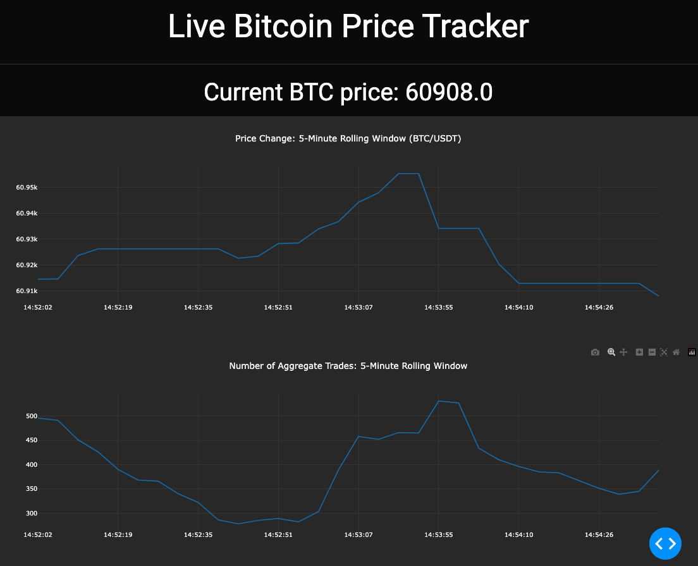

# Real-Time Bitcoin Tracker with Dash and WebSocket API 

Explore how to display real-time, time-series data using Dash and a PostgreSQL extension, TimescaleDB, to dynamically update Bitcoin prices and aggregate trades fetched via the Binance WebSocket API.



## Steps for Testing Locally

### 1. Development Environment Setup
```sh
conda create --name YOUR_ENV_NAME python=3.11
conda activate YOUR_ENV_NAME
pip install -r requirements.txt
```

### 2. Save Database Connection Details as Environment Variables
```
DB_USER=<USERNAME>
DB_PASSWORD=<PASSWORD>
DB_NAME=<DATABASE_NAME>
DB_HOST=<HOST>
DB_PORT=<PORT>
```

### 3. Backend Setup
`websocket_backend.py`: connects to the Binance WebSocket API to receive real-time trade data for Bitcoin (BTC/USDT), and stores it in a PostgreSQL database equipped with the TimescaleDB extension.

For local testing, you need to modify `websocket_backend.py` according to your database type. By default, it uses TimescaleDB (a PostgreSQL extension).

If you prefer to use SQLite, you can modify the script to use `asyncio`, `aiosqlite`, and `sqlite3` libraries, along with SQL statements. If needed, an alternative script with SQLite can be added.

Run the backend script:
```sh
python websocket_backend.py
```

### 4. Frontend Setup
`app.py`: establishes a Dash application to visualize the Bitcoin trade data stored in the database.

Run the frontend script to start the Dash application:
```sh
python app.py
```

