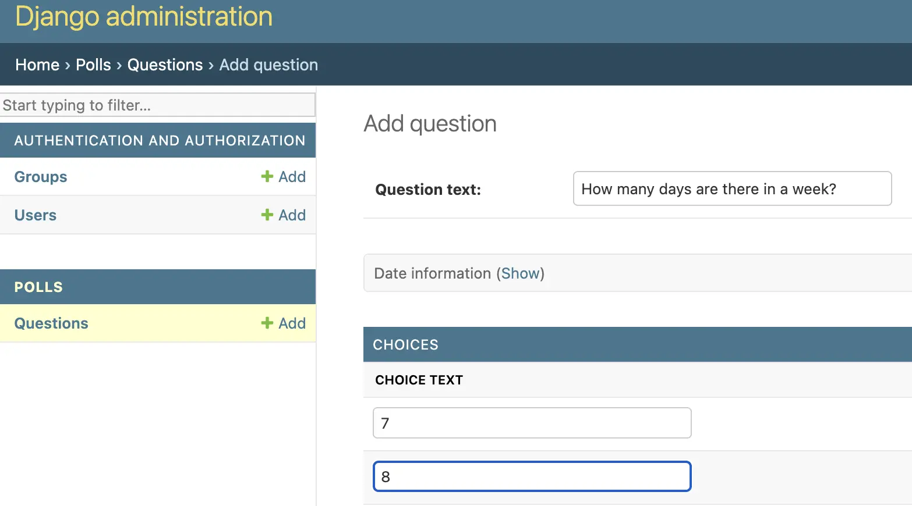

# Django polls app

A Django polls application, as seen in the introductory [tutorial.](https://docs.djangoproject.com/en/5.0/intro/tutorial01/)



## Running locally

```sh
# generate database tables
python manage.py migrate

# create admin user
DJANGO_SUPERUSER_USERNAME=user \
DJANGO_SUPERUSER_PASSWORD=pass \
DJANGO_SUPERUSER_EMAIL="admin@example.com" \
python manage.py createsuperuser --noinput

python manage.py runserver 0.0.0.0:5000
```

If you prefer to run with docker:

```sh
docker build . -t django-basicapp
docker run -p 5000:80 django-basicapp
```

Then, open: http://0.0.0.0:5000/

## Notes

- The application is configured to server files with `gunicorn`, this is ok only for low-traffic sites
- `ALLOWED_HOSTS` in `settings.py` is set to `*`
