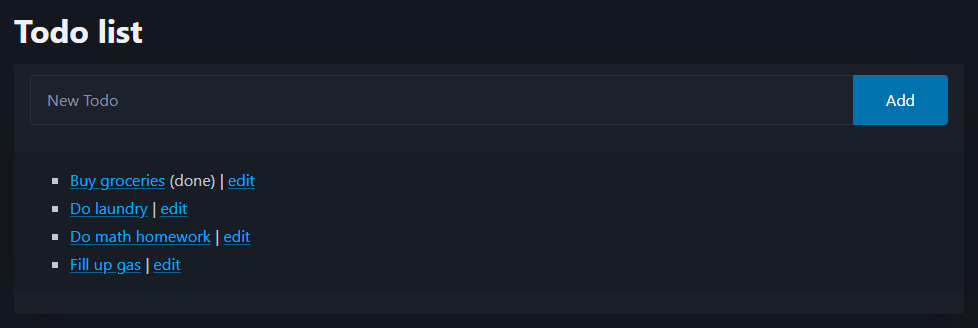

# Docker Deployment with FastHTML App

Example Dockerfile and FastHTML app to deploy on Ploomber Cloud. The fastHTML app code was obtained from the [FastHTML examples repository](https://github.com/AnswerDotAI/fasthtml/tree/main/examples). This app is a basic todo list item tracker. To deploy your own fastHTML app, replace the `app.py` code with your code and add any Python libraries used to `requirements.txt`. 

