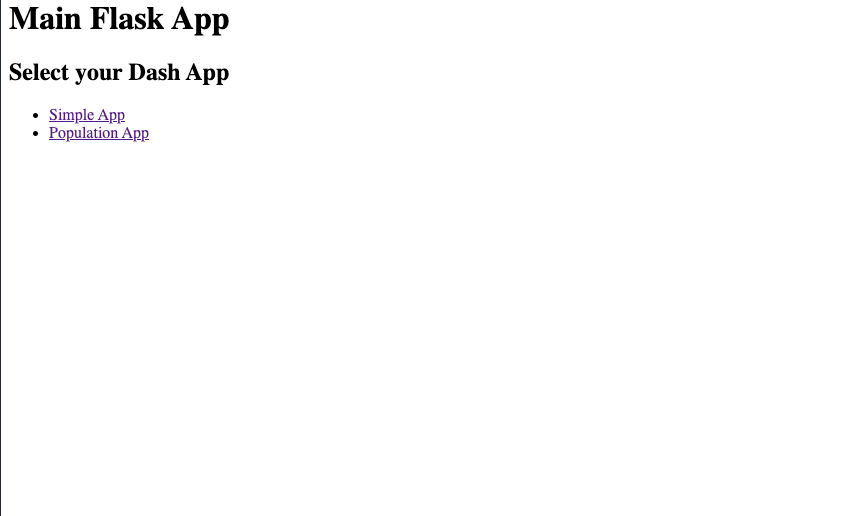

# Integrating Dash apps into a Flask app

Interactive Flask application, with Dash applications integrated using:
- App context: By passing the Flask instance directly into each Dash app and incorporating them into the context of our Flask app, we allow the Dash apps to share data and other resources belonging to the Flask app. However, since each of these app is a component of the main Flask app, adding too many Dash app components may overload the Flask server. See `app_ctx.py` for implementation. For more information, see the [documentation](https://flask.palletsprojects.com/en/2.3.x/appcontext/).
- Middleware: Using middleware decouples each Dash app from the Flask app and each other, meaning they will be considered independent apps. This allows better horizontal scaling if we need to add a large amount of Dash apps, but resource sharing between apps may take extra steps compared to using app context. See `app_middleware.py` for implementation. For more information, see the [documentation](https://flask.palletsprojects.com/en/2.3.x/patterns/appdispatch/).


||
|:--:| 
| *Main page* |

||
|:--:| 
| *Dash App 1 (Simple App)* |

||
|:--:| 
|*Dash App 2 (Population App)*|

## Local testing

Run `gunicorn app_ctx:app run --bind 0.0.0.0:80`. Replace `app_ctx` with `app_middleware` if you want to run the middleware version. You should be able to access the app at `0.0.0.0:80`.

## Upload to Ploomber Cloud

To upload either application on Ploomber, first copy their content to `app.py`, For example
```bash
cp app_ctx.py app.py
```

### Command line

Go to your app folder and set your API key: `ploomber-cloud key YOURKEY`. Next, initialize your app: `ploomber-cloud init`. Once `ploomber-cloud.json` is generated, add an `ignore` field for both `app_ctx.py` and `app_middleware.py`, as we already have an `app.py`.
```json
{
    "ignore": [
        "app_ctx.py",
        "app_middleware.py"
    ]
}
```

We can now run `ploomber-cloud deploy` to deploy the app. For more details, please refer to our [documentation](https://docs.cloud.ploomber.io/en/latest/user-guide/cli.html).

### GUI

Zip `app.py` together with `utils.py`, `requirements.txt` and `dash_apps` folder, and upload to Ploomber Cloud. For more details, please refer to our [Flask deployment guide](https://docs.cloud.ploomber.io/en/latest/apps/flask.html).

## Adding your own Dash app

To test using your own Dash app, ensure that your dash app (e.g. `dash.py`) is in the `dash_app` folder. Make sure to format `dash.py` as below:
```python
from dash import Dash, html, dcc, callback, Output, Input
import plotly.express as px
import pandas as pd
from flask import g # If you want to use Flask context global value

def init_app(url_path, server=None):
    # Initialize Dash app with or without specifying flask server
    app =  Dash(server=server, url_base_pathname=url_path) if server else Dash(requests_pathname_prefix=url_path)

    app.title = "Your Dash App"

    app.layout = html.Div("Write your Dash app layout here.")

    init_callbacks(app)
    return app.server


def your_update_func(input):
    pass

def init_callbacks(app):
    app.callback(
        Output("your-output-id", "output"), 
        Input("your-input-id", "input")
    )(your_update_func)
```

Next, in `utils.py`, import your app and add it to `DASH_APPS_`. 
```python
from dash_apps import dash

DASH_APPS_ = {
    ...,
    '/your_app_url': (dash.init_app, "Your app name")
}
```

Re-run the Flask application, and you will see your app's URL added to the HTML display.
