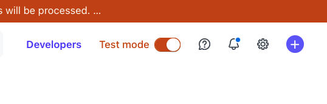
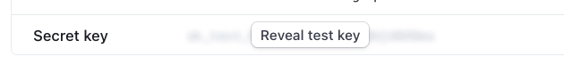
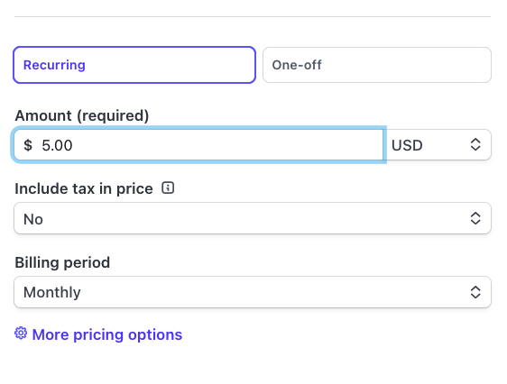
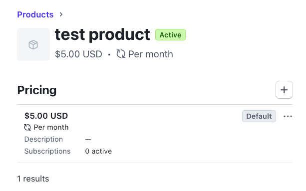
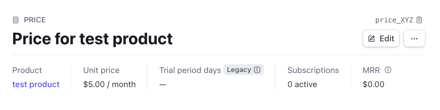
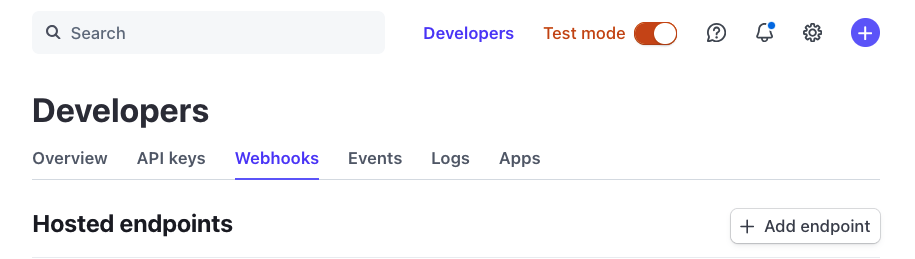
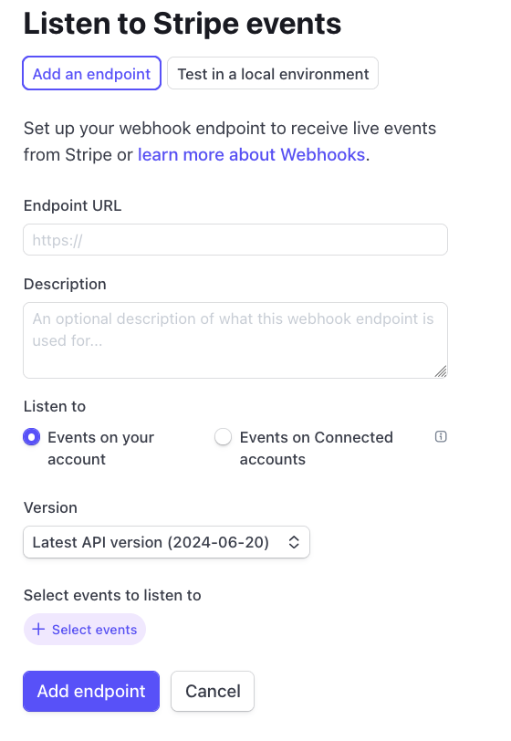
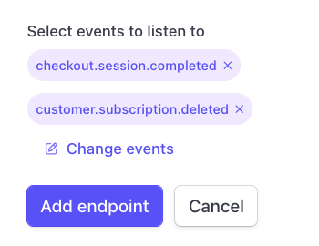
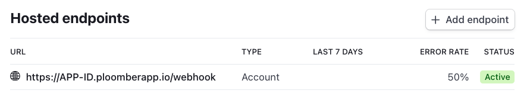
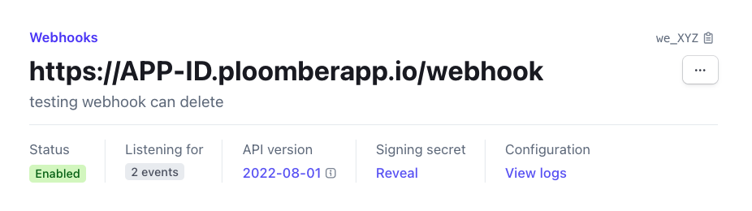

# Integrating Stripe in a Flask Application

A Flask app that can receive payments via Stripe.

## Deployment

```sh
# install ploomber cloud cli
pip install ploomber-cloud

# download example
ploomber-cloud examples flask/flask-stripe
cd flask-stripe
```

Note that you'll need a [Ploomber Cloud](https://www.platform.ploomber.io/register) account
to continue:

```sh
# initialize the project
ploomber-cloud init
```

You'll be prompted to confirm that this is a Flask project, type `y` and press `Enter`,
then, you'll see the `APP-ID`:

```txt
Inferred project type: 'flask'
Is this correct? [y/N]: y
Your app 'APP-ID' has been configured successfully!
```

Store the `APP-ID`, you'll need it later.

Before deploying the app, we need three environment variables. Create
an `.env` file and paste the following (we'll replace it for the
actual values in the next sections):

```txt
STRIPE_SECRET_KEY=sk_test_XYZ
STRIPE_PRICE_ID=price_XYZ
STRIPE_WEBHOOK_SECRET=whsec_XYZ
```

I highly recommend you using `Test mode`:



### `STRIPE_SECRET_KEY`

To get the `STRIPE_SECRET_KEY`, go to `Developers` -> `API keys` (or
[click here](https://dashboard.stripe.com/test/apikeys)):


Then, reveal your `Secret key`, copy it and put it in your `.env` file:



### `STRIPE_PRICE_ID`

In order to get a price ID, you first need to create a product, click on `Product catalog`
on the left bar, then, `+ Add product`. Fill out the form and remember to select `Recurring` and add a price:



Once you save the product, you'll see the detailed view, click on the row that appears below the `Pricing` table header:



This will take you to the price detailed view, you can find the price ID on the top right (the string that begins with `price_`), copy it, and put it in your `.env` file:



### `STRIPE_WEBHOOK_SECRET`

Now we need to create the webhook, click `Developers` -> `Webhooks` (or [click here](https://dashboard.stripe.com/test/webhooks)):



Then, click on `+ Add endpoint`:


You'll see something like this:



In `Endpoint URL`, enter the following: `https://APP-ID.ploomberapp.io/webhook`, where
`APP-ID` is the one you got when you initialized the app via `ploomber-cloud init`.

Then, click on `+ Select events`, you'll see a search bar, select the following events:

- `checkout.session.completed`
- `customer.subscription.deleted`

The form will look like this:



Click on `Add endpoint`.

You'll see the new endpoint:



Click on it to see the details:



You'll see a `Signing secret` section, click on `Reveal`, this is your `STRIPE_WEBHOOK_SECRET`, put it in your `.env` file.

### Deploying the app

Once the `.env` is ready, deploy your app with the following command:

```sh
ploomber-cloud deploy
```
