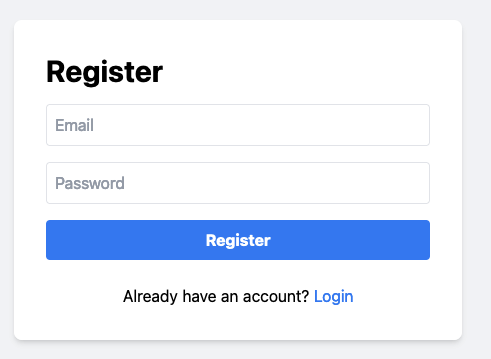
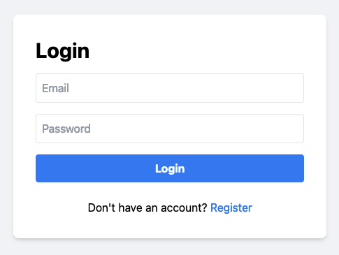
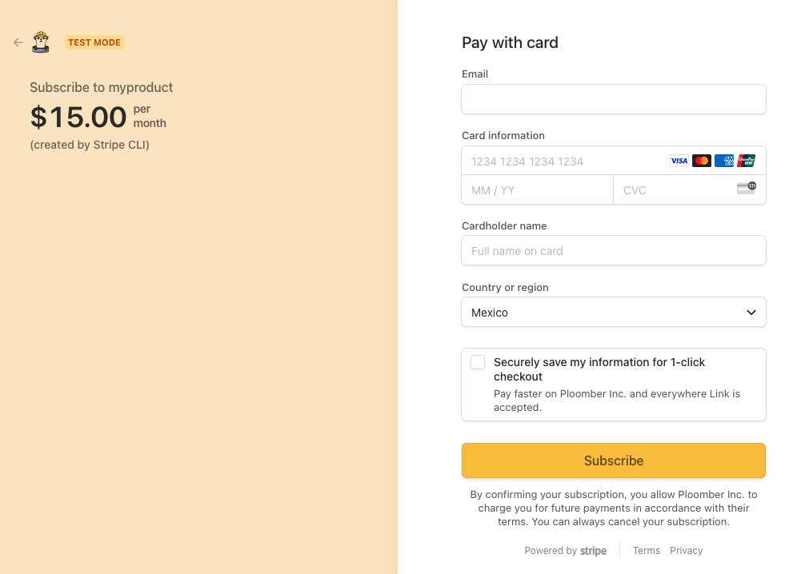

# Integrating Stripe in a Flask Application: A Step-by-step Guide


In this beginner-friendly tutorial, we'll walk you through the process of integrating
Stripe into your Flask app. Don't worry if you're new to payment processing or feel
intimidated by the prospect of handling transactions – we've got you covered. We'll
break down each step, from setting up your Stripe account to processing your first
payment, using clear explanations and a handy template you can start using right
away. By the end of this guide, you'll have the knowledge and tools to start
monetizing your software with confidence. So, let's dive in and get your Flask app
ready to accept payments!

The only prerequisite for this tutorial is having a Stripe account. If you don't have
one yet, you can easily sign up for free at [stripe.com](https://stripe.com).


We'll explain the most relevant parts of the code, you can review the full source
code. If you want to see it up and running, skip to the deployment section.

If you need help adding a production-grade Stripe integration into your app contact us.

## Authentication

Before we dive into integrating Stripe for payments and subscriptions, it's essential
to understand why user authentication is a critical component of this process. When
users create accounts and log in, we can associate their payment information and
subscription status with their unique profiles. This allows us to track who has paid,
manage subscription renewals, and provide access to premium content based on a user's
subscription status. Moreover, authentication ensures that only authorized users can
access paid features. In our Flask application, we've implemented a basic
authentication system using Flask-Login, which will serve as the backbone for our
Stripe integration. However, you can use any authentication system that suits your needs.

### Registering users



The registration process is handled by the `register` function, which is decorated
with `@app.route("/register", methods=["GET", "POST"])`. This means it responds to
both GET and POST requests to the `/register` endpoint. Here's how it works:

1. When a `POST` request is received (i.e., when a user submits the registration form):
   - It retrieves the email and password from the form data.
   - It checks if a user with the given email already exists in the database.
   - If the email exists, it flashes an error message and redirects back to the registration page.
   - If the email is new, it creates a new user with the provided email and a hashed version of the password.
   - After successful registration, it flashes a success message and redirects to the login page.

2. For GET requests, it simply renders the registration form template.


```python
@app.route("/register", methods=["GET", "POST"])
def register():
    if request.method == "POST":
        email = request.form.get("email")
        password = request.form.get("password")

        with db.Session(db.engine) as session:
            user = session.query(db.User).filter_by(email=email).first()

        if user:
            flash("Email already exists", "error")
            return redirect(url_for("register"))

        with db.Session(db.engine) as session:
            new_user = db.User(email=email, password=generate_password_hash(password))
            session.add(new_user)
            session.commit()

        flash("Registration successful. Please log in.", "success")
        return redirect(url_for("login"))

    return render_template("register.html")
```


### Logging in



The login process is handled by the `login` function, which is decorated with
`@app.route("/login", methods=["GET", "POST"])`. This function handles both GET and
POST requests to the `/login` endpoint. Here's a breakdown of how it works:

1. When a POST request is received (i.e., when a user submits the login form):
   - It retrieves the email and password from the form data.
   - It queries the database for a user with the provided email.
   - If a user is found, it checks if the provided password matches the hashed password stored in the database using `check_password_hash`.
   - If the credentials are valid, it logs in the user using `login_user` and redirects to the home page.
   - If the credentials are invalid, it flashes an error message.

2. For GET requests, it simply renders the login form template.

Here's the code for the login function:

```python
@app.route("/login", methods=["GET", "POST"])
def login():
    if request.method == "POST":
        email = request.form.get("email")
        password = request.form.get("password")

        with db.Session(db.engine) as session:
            user = session.query(db.User).filter_by(email=email).first()

        if user and check_password_hash(user.password, password):
            login_user(user)
            return redirect(url_for("home"))
        else:
            flash("Invalid email or password", "error")

    return render_template("login.html")
```

## Stripe subscriptions



After implementing user authentication, the next step is to allow users to subscribe
to premium content using Stripe. The subscription is triggered when authenticated
user click on a "Subscribe button". It works as follows:

1. User clicks "Subscribe" button, triggering a POST request to `/create-checkout-session`.
2. `create_checkout_session` function (with `@login_required`) creates a Stripe Checkout Session.
3. Session includes payment details, and user ID.
4. User is redirected to Stripe's checkout page on success.
5. After successful payment, Stripe redirects the user back to our success page.

However, it's important to note that this redirection doesn't include user ID details. This is where Stripe webhooks come into play. Webhooks are crucial for handling asynchronous events and updating our database with subscription information.

## The webhook

Here's how the webhook works:

1. Stripe sends a request (a webhook event) to our `/webhook` endpoint when certain events occur (like successful subscription creation).
2. Our webhook handler processes these events and updates the user's subscription status in our database.
3. This ensures that even if the user closes their browser during the checkout process, their subscription will still be properly recorded.

The webhook handling is implemented in the `webhook` function:

```python
@app.route("/webhook", methods=["POST"])
def webhook():
    print("Webhook received")
    payload = request.data
    sig_header = request.headers.get("Stripe-Signature")

    try:
        event = stripe.Webhook.construct_event(
            payload, sig_header, environ.get("STRIPE_WEBHOOK_SECRET")
        )
    except ValueError:
        print("Invalid payload")
        return "Invalid payload", 400
    except stripe.error.SignatureVerificationError:
        print("Invalid signature")
        return "Invalid signature", 400

    # Handle the event
    if event["type"] == "checkout.session.completed":
        session = event["data"]["object"]
        user_id = session["client_reference_id"]
        subscription_id = session["subscription"]
        db.set_stripe_subscription_id(user_id, subscription_id)

    elif event["type"] == "customer.subscription.deleted":
        subscription = event["data"]["object"]
        subscription_id = subscription["id"]
        db.set_stripe_subscription_id(user_id, None)

    return "", 200
```


This webhook function handles two crucial events in the subscription process:

1. **When a user completes a payment**:
   - The function receives a `checkout.session.completed` event from Stripe.
   - It extracts the user ID and new subscription ID from the session data.
   - It then calls `db.set_stripe_subscription_id(user_id, subscription_id)` to update the user's subscription status in the database.
   - This ensures that the user's account is properly marked as subscribed after successful payment.

2. **When a user cancels their subscription**:
   - The function receives a `customer.subscription.deleted` event from Stripe.
   - It extracts the subscription ID from the event data.
   - It then calls `db.set_stripe_subscription_id(user_id, None)` to remove the subscription ID from the user's account in the database.
   - This action effectively marks the user's account as no longer subscribed.

In both cases, the `set_stripe_subscription_id` function in our database module is responsible for updating the user's subscription status. This setup allows our application to maintain accurate subscription information for each user, even when these changes occur asynchronously through Stripe's system.

## Restricting access to premium users

Our application implements two endpoints to demonstrate the difference between free and premium content.

### Free content endpoint


```python
@app.route("/free", methods=["POST"])
@login_required
def free_content():
    return "This is free content available to all users."
```

- Users trigger a call to this endpoint by clicking on the `Free` button.
- This endpoint is accessible to all authenticated users.
- It returns a simple message indicating that the content is free.
- No subscription check is required to access this endpoint.

### Premium Content Endpoint


```python
@app.route("/premium", methods=["POST"])
@login_required
def premium_content():
    if current_user.stripe_subscription_id:
        return "This is premium content for subscribed users. Enjoy your exclusive access!"
    else:
        return "Sorry, this content is only available to subscribed users. Please subscribe to access premium content."
```

- Users trigger a call to this endpoint by clicking on the `Premium` button.
- This endpoint is protected by the `@login_required` decorator, ensuring that only authenticated users can access it.
- It checks if the current user has an active subscription by looking at their `stripe_subscription_id`.
- If the user has an active subscription, they receive the premium content message.
- If the user is logged in but doesn't have an active subscription, they receive a message prompting them to subscribe.

These endpoints demonstrate a basic implementation of content restriction based on user authentication and subscription status. In a real-world application, you would replace the simple string returns with more complex logic to serve actual premium content or features.

## Deployment

Use the following commands to deploy the application ([source code here](https://github.com/ploomber/doc/tree/main/examples/flask/flask-stripe)):

```sh
# install ploomber cloud cli
pip install ploomber-cloud

# download example
ploomber-cloud examples flask/flask-stripe
cd flask-stripe
```

Note that you'll need a [Ploomber Cloud](https://www.platform.ploomber.io/register) account
to continue:

```sh
# initialize the project
ploomber-cloud init
```

You'll be prompted to confirm that this is a Flask project, type `y` and press `Enter`,
then, you'll see the `APP-ID`:

```txt
Inferred project type: 'flask'
Is this correct? [y/N]: y
Your app 'APP-ID' has been configured successfully!
```

Store the `APP-ID`, you'll need it later.

Before deploying the app, we need three environment variables. Create
an `.env` file and paste the following (we'll replace it for the
actual values in the next sections):

```txt
STRIPE_SECRET_KEY=sk_test_XYZ
STRIPE_PRICE_ID=price_XYZ
STRIPE_WEBHOOK_SECRET=whsec_XYZ
```

I highly recommend you using `Test mode`:


### `STRIPE_SECRET_KEY`

To get the `STRIPE_SECRET_KEY`, go to `Developers` -> `API keys` (or
[click here](https://dashboard.stripe.com/test/apikeys)):


Then, reveal your `Secret key`, copy it and put it in your `.env` file:


### `STRIPE_PRICE_ID`

In order to get a price ID, you first need to create a product, click on `Product catalog`
on the left bar, then, `+ Add product`. Fill out the form and remember to select `Recurring` and add a price:


Once you save the product, you'll see the detailed view, click on the row that appears below the `Pricing` table header:


This will take you to the price detailed view, you can find the price ID on the top right (the string that begins with `price_`), copy it, and put it in your `.env` file:


### `STRIPE_WEBHOOK_SECRET`

Now we need to create the webhook, click `Developers` -> `Webhooks` (or [click here](https://dashboard.stripe.com/test/webhooks)):


Then, click on `+ Add endpoint`:


You'll see something like this:


In `Endpoint URL`, enter the following: `https://APP-ID.ploomberapp.io/webhook`, where
`APP-ID` is the one you got when you initialized the app via `ploomber-cloud init`.

Then, click on `+ Select events`, you'll see a search bar, select the following events:

- `checkout.session.completed`
- `customer.subscription.deleted`

The form will look like this:


Click on `Add endpoint`.

You'll see the new endpoint:


Click on it to see the details:


You'll see a `Signing secret` section, click on `Reveal`, this is your `STRIPE_WEBHOOK_SECRET`, put it in your `.env` file.

### Deploying the app

Once the `.env` is ready, deploy your app with the following command:

```sh
ploomber-cloud deploy
```

Once the process is finished, you can test the end-to-end subscription flow, you can
use [test credit card data.](https://docs.stripe.com/testing)

## Limitations

This blog post provided a full example to get Stripe working with Flask; however, it
has some limitations:

- The Stripe integration is basic: it doesn't handle common issues such as webhook failures. If you're looking for a production-grade solution, [contact us.](/contact)
- The authentication system only allows email and password; you might want to allow user to sign up with their existing accounts (such as Google). Check out our [authentication](https://docs.cloud.ploomber.io/en/latest/user-guide/password.html#auth0-authentication) integration
- Uses SQLite as a database; you might use other databases such as PostgreSQL
- There is no email verification; to prevent fraud and abuse, we highly recommend you verifying user's email addresses before allowing them to log in


