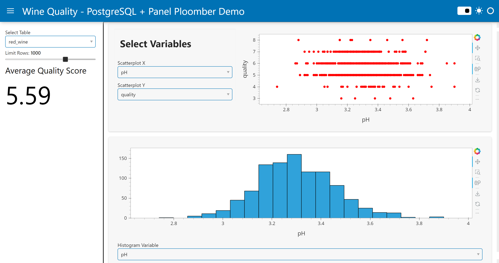

# Panel Wine Quality EDA App Connected to PostgreSQL 

In this application, we use Panel to create a basic EDA dashboard for the Wine Quality dataset that we first uploaded to a PostgreSQL database. The app uses the `pn.bind` method, which executes functions if a bounded variable is modified, to add interactivity with the database. For example, the `Select Table` and `Limit Rows` widgets are bound to our get_data function and wine_data variable, meaning that whenever we change the table or row limit, the wine_data is updated with the result of the new get_data call. 



You can try out the app [here]().

You can find the corresponding blog post [here](https://panel-postgres-demo.ploomberapp.io/). 

## Running the App Locally
To run this app locally ensure you replace `YOUR_DB_URI` in 
```Python 
DB_URI = "YOUR_DB_URI" 
``` 
with the URI corresponding to your personal database. 

Make sure you have installed all the packages listed in requirements.txt. To do this, you can run `pip install -r requirements.txt`. 

Then, execute `panel serve app.py --autoreload` in your command line. The `autoreload` flag reruns the application each time `app.py` is modified. 

## Deploy on Ploomber Cloud
When deploying this app on Ploomber Cloud you should omit your personal DB URI from your `app.py` file so it doesn't get exposed. You can do this by replacing `YOUR_DB_URI` with `environ["DB_URI"]`.

```Python
DB_URI = environ["DB_URI]
```

To access our URI, we instead need to set the `DB_URI` as a secret in the deployment environment. Refer to the [documentation](https://docs.cloud.ploomber.io/en/latest/user-guide/secrets.html) or [blog post](https://ploomber.io/blog/panel-postgres/) to learn more. 