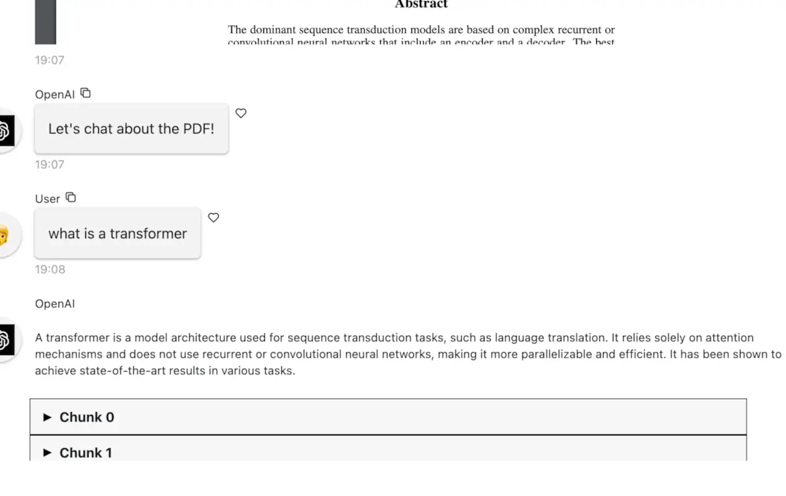

# Chat with a PDF

A Panel app that allows users to chat with a PDF document.

This app was [originally developed](https://github.com/holoviz-topics/panel-chat-examples/blob/main/docs/examples/langchain/langchain_pdf_assistant.py) by [Andrew Huang](https://github.com/ahuang11),
and [Marc Skov Madsen](https://github.com/MarcSkovMadsen).

[Click here](https://docs.cloud.ploomber.io/en/latest/apps/panel.html) to see deployment instructions.