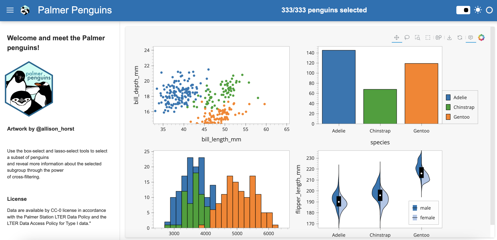

# Penguin Crossfilter

A Panel app that uses the box-select and lasso-select tools to select a subset of penguins and reveal more information about the selected subgroup through the power of cross-filtering.

