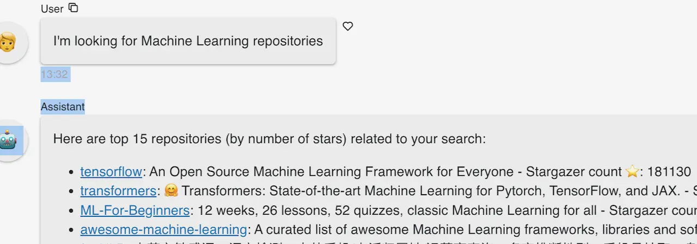
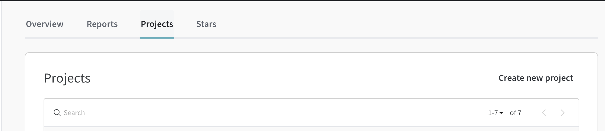
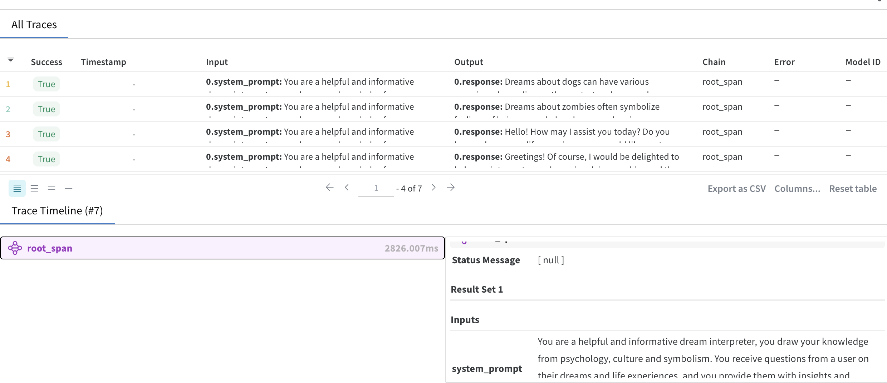

# Connect your Panel app to Weights and Biases

This example demonstrates how to connect your Panel app to Weights and Biases. We will use the [Weights and Biases](https://www.wandb.com/) API to track several metrics when making prompts against a GPT model from OpenAI. The final application enables you to monitor token usage, prompt length, and the number of tokens generated during a user session of the application running while it is deployed. 



## Account setup

### Weights and Biases

To run this example, you will need to create an account in Weights and Biases. You can do this by visiting the [Weights and Biases website sign up page - it's free](https://wandb.ai/site/). You will need to generate an API key, which you can obtain after you log in by visiting [https://wandb.ai/authorize](https://wandb.ai/authorize). 

Once you log in, you can create a new project by visiting your user profile, selecting the project tab, and clicking on the "New Project" button. 



The app assumes the following environment variable names. Please store them somewhere safe, as you will need them later. You can set them as environment variables. 

```bash
WANDB_API_KEY=your_api_key
WANDB_PROJECT=your_project_name
WANDB_ENTITY=your_user_name
```

### OpenAI

You will also need to create an account in OpenAI. You can do this by visiting the [OpenAI website](https://platform.openai.com/account/). Once you have an account, you will need to generate an API key, which you can obtain by visiting the [API keys page](https://platform.openai.com/api-keys).

Save the API key in an environment variable. You can set it as an environment variable with the following name:

```bash
OPENAI_API_KEY=your_api_key
```

We are now ready to run the application.

## Running this application locally

To run this example locally, you can clone the repository and install the requirements.

### Install the requirements

To run this example, you will need to install the required libraries. You can do this by running the following commands:

```bash
git clone https://github.com/ploomber/doc.git
cd examples/panel/weights-and-biases-llm
conda env create --name wandbllm python=3.10
conda activate wandbllm
pip install -r requirements.txt
```

### Run the application locally

To run this example locally, you can use the following command:

```bash
panel serve app.py --autoreload --show
```

## Deploying the application on Ploomber Cloud 

To deploy this application on Ploomber Cloud, you will need to create an account in Ploomber. You can do this by visiting the [Ploomber website](https://www.platform.ploomber.io/). Once you have an account, you will need to generate an API key. For detailed information, [visit this guide](https://docs.cloud.ploomber.io/en/latest/quickstart/apikey.html).

Once that is complete, you can follow the Panel guide to deploy the application. You can find the guide [here](https://docs.cloud.ploomber.io/en/latest/apps/panel.html).

### Adding your secret variables

Before deploying the application, you will need to add the secret variables to your project. [Here](https://docs.cloud.ploomber.io/en/latest/user-guide/env-vars.html) you can find a step by step guide on how to do this. Ensure that you add the following secret variables:

- WANDB_API_KEY
- WANDB_PROJECT
- WANDB_ENTITY
- OPENAI_API_KEY

That's it! You can follow the deployment progress on the Ploomber Cloud dashboard. Once the deployment is complete, you can visit the application by clicking on the link provided in the dashboard. You can monitor the metrics in the Weights and Biases dashboard by visiting the project page in the Weights and Biases website.

