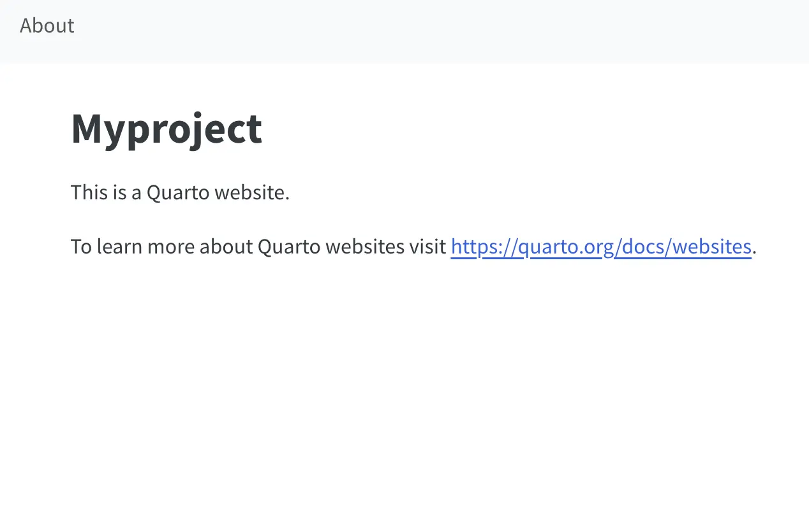

# Quarto

Sample Quarto website with `Dockerfile` for Ploomber Cloud deployment.

This example does not require you to run `quarto render`, your documents will be rendered on
Ploomber Cloud, you don't even need to have quarto installed!

To deploy:

1. Create a zip file with all your contents
2. Deploy via the UI or CLI